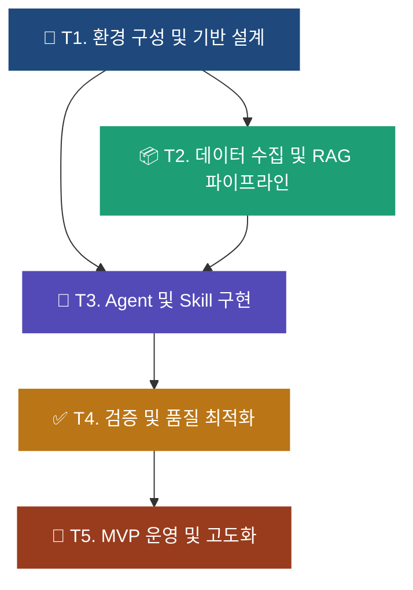
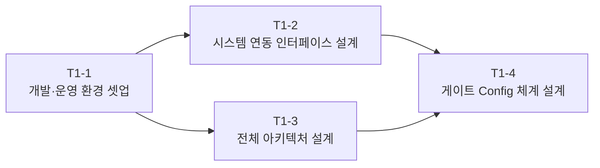
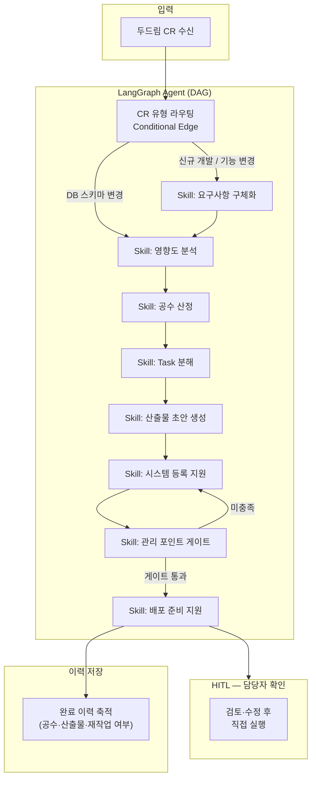
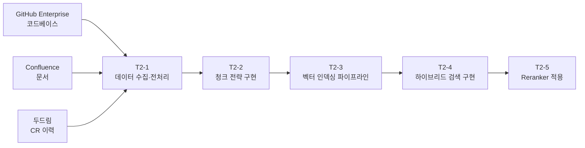
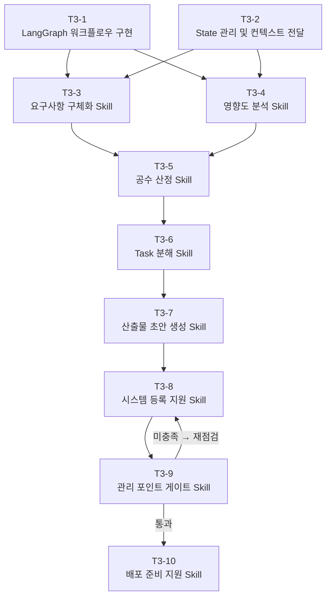
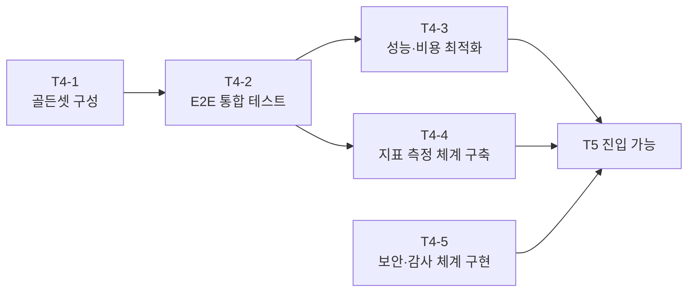
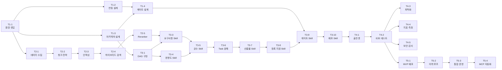

# 프로그램 개발 전주기 지원 AI Agent — Task 목록

> **과제**: AI 인증 3단계 — AI기반 개발/운영업무 생산성 향상  
> **부서**: 중공업IT파트  
> **환경**: 삼성SDS 사내망 (SCP/VDI) · AI Pro LLM · Febrix 벡터DB · GitHub Enterprise · Confluence · Oracle 19c  
> **총 Task**: 5개 대분류 / 28개 세부 작업

---

## 전체 진행 흐름



> **병행 가능**: T1 완료 후 T2(데이터·RAG)와 T3(Skill 뼈대)는 동시 착수 가능.  
> T3 Skill 구현 시 T2 Mock 데이터로 선행 개발 후 실 데이터 교체.

---

## T1. 환경 구성 및 기반 설계

> **목적**: 사내망 제약 환경에서 AI Agent 실행에 필요한 모든 기반 컴포넌트를 설치·연동하고, 전체 아키텍처를 확정한다.



### T1-1. 개발·운영 환경 셋업

- **목표**: LLM API, LangGraph, 벡터DB, 임베딩 모델 설치 및 연동 확인
- **산출물**: `requirements.txt`, `.env`, `config/config.yaml`, 스모크 테스트 통과
- **수행 가이드**: [`T1-1_환경셋업_가이드.md`](./T1-1_환경셋업_가이드.md)

| 항목 | 내용 |
|------|------|
| LLM | 삼성 AI Pro API — `BaseChatModel` 커스텀 래퍼 구현 |
| 임베딩 | AI Pro 임베딩 엔드포인트 — `Embeddings` 커스텀 래퍼 구현 |
| 벡터DB | Febrix API — `VectorStore` 커스텀 래퍼 구현 |
| 오케스트레이션 | LangGraph 0.2+ 설치, 사내 PyPI 미러 경유 |
| 패키지 관리 | `pip` + 사내 PyPI 미러 (`pip.conf` 설정) |

**완료 기준**:
- [ ] AI Pro LLM 호출 성공
- [ ] Febrix 컬렉션 생성·적재·검색 성공
- [ ] 임베딩 벡터 반환 확인 (차원 실측)
- [ ] LangGraph 기본 DAG 실행 성공
- [ ] `tests/test_smoke.py` 5개 전원 통과

---

### T1-2. 시스템 연동 인터페이스 설계

- **목표**: 사내 시스템(GitHub Enterprise, Confluence, JSM, Oracle 19c, 두드림, 자체 관리 시스템) API 연동 설계 및 인터페이스 정의
- **산출물**: `src/connectors/` 모듈 뼈대, 각 시스템 연동 인터페이스 명세

| 연동 시스템 | 용도 | 인터페이스 방식 |
|------------|------|----------------|
| GitHub Enterprise | 코드베이스 검색, PR 생성 | REST API (PAT 인증) |
| Confluence | 문서 검색, 산출물 초안 저장 | REST API (API Token) |
| JSM | 변경 등록 입력값 초안 생성 | REST API |
| 두드림 | CR 접수·처리 이력 조회 | REST API (또는 DB 직접 조회) |
| Oracle 19c | 딕셔너리 뷰 조회 (영향도 분석) | `cx_Oracle` (Read-only) |
| 프로그램마스터 | 등록 여부 조회·입력 초안 | REST API (자체 개발) |
| 테이블마스터 | 등록 여부 조회·입력 초안 | REST API (자체 개발) |
| 용어사전·단어사전 | 미등록 용어 감지·신규 등록 안내 | REST API (자체 개발) |

**완료 기준**:
- [ ] 각 시스템 연동 클라이언트 인터페이스(`ABC`) 정의
- [ ] Mock 클라이언트 구현 (T3 선행 개발용)
- [ ] 실 연동 클라이언트 최소 1개 이상 동작 확인

---

### T1-3. 전체 아키텍처 설계

- **목표**: LangGraph DAG 구조, State 스키마, Skill 인터페이스를 확정하여 T3 구현의 기준을 정의
- **산출물**: `docs/architecture.md`, `src/agent/state.py`, Skill 인터페이스 명세



**완료 기준**:
- [ ] `AgentState` TypedDict 스키마 확정
- [ ] Skill 인터페이스(`BaseSkill`) 추상 클래스 정의
- [ ] CR 유형별 Conditional Routing 로직 설계 완료
- [ ] 아키텍처 문서 Confluence 등록

---

### T1-4. 게이트 Config 체계 설계

- **목표**: 각 단계 완료 조건을 코드가 아닌 Config로 정의하여, 프로세스 변경 시 코드 수정 없이 갱신 가능한 체계 구축
- **산출물**: `config/gate_rules.yaml`, 게이트 판별 모듈

```yaml
# config/gate_rules.yaml 예시 구조
gates:
  requirement:
    required_fields: [cr_id, requirement_text, target_system]
    min_length:
      requirement_text: 50
  impact_analysis:
    required_fields: [affected_tables, affected_programs]
    oracle_check: true
  artifact:
    required_files: [requirement_doc, impact_doc, test_definition]
  master_registration:
    checks:
      - program_master: true
      - table_master: true
      - term_dictionary: true
      - oracle_consistency: true
  deploy:
    required_files: [pr_url, test_result_mail, release_attachment]
```

**완료 기준**:
- [ ] 전체 8단계 게이트 조건 정의 완료
- [ ] Config 로더 모듈 구현
- [ ] 게이트 판별 엔진 단위 테스트 통과

---

## T2. 데이터 수집 및 RAG 파이프라인 구축

> **목적**: GitHub, Confluence, 두드림 이력을 수집·정제·인덱싱하여 Skill에서 검색 가능한 상태로 만든다.



### T2-1. 데이터 수집 및 전처리

- GitHub Enterprise API로 레포지토리 코드 수집
- Confluence API로 운영 문서·산출물 수집
- 두드림 API(또는 DB)로 과거 CR 처리 이력 수집
- 노이즈 제거(주석, 공백, 바이너리 파일 등) 및 메타데이터 정규화

**완료 기준**:
- [ ] 3개 소스 데이터 수집 파이프라인 구현
- [ ] 원시 데이터 → 정제 데이터 변환 로직 완성
- [ ] 메타데이터 스키마 확정 (source, type, cr_id, date 등)

---

### T2-2. 청크 전략 구현

파일 유형별로 의미 단위가 다르므로 분할 방식을 달리한다.

| 소스 | 청크 단위 | 근거 |
|------|-----------|------|
| GitHub 코드 | 함수·클래스 단위 | 함수가 검색의 최소 의미 단위 |
| Confluence 문서 | 섹션(H2~H3) 단위 | 문단 단위 검색 정밀도 향상 |
| 두드림 CR 이력 | CR 1건 단위 | 하나의 CR이 완결된 컨텍스트 |

**완료 기준**:
- [ ] 3종 청크 분할기 구현 및 단위 테스트 통과
- [ ] 청크 메타데이터 포함 여부 확인 (출처 추적용)

---

### T2-3. 벡터 인덱싱 파이프라인

- 청크 → AI Pro 임베딩 → Febrix 3개 컬렉션에 적재
- 증분 업데이트 지원 (변경된 파일·문서만 재인덱싱)
- 배치 처리로 API 호출 비용 절감

**완료 기준**:
- [ ] 초기 전체 인덱싱 실행 완료
- [ ] 증분 업데이트 파이프라인 동작 확인
- [ ] Febrix 3개 컬렉션 적재 건수 확인

---

### T2-4. 하이브리드 검색 구현

- **BM25** (키워드 검색) + **Dense** (벡터 검색) 병행
- RRF(Reciprocal Rank Fusion) 또는 가중 합산으로 결과 병합
- `config.yaml`의 `bm25_weight` / `dense_weight`로 비율 조정

**완료 기준**:
- [ ] BM25 인덱스 구축 완료
- [ ] 하이브리드 검색 파이프라인 구현
- [ ] 순수 벡터 검색 대비 재현율 향상 확인

---

### T2-5. Reranker 적용

- 하이브리드 검색 결과(Top-10)를 Cross-encoder로 재정렬
- 사내망 환경에서 사용 가능한 Reranker 모델 확인 (AI Pro 제공 여부 먼저 확인)
- 미제공 시 LLM-as-Reranker 방식으로 대체 구현

**완료 기준**:
- [ ] Reranker 모듈 구현
- [ ] 재정렬 전후 검색 품질 비교 (샘플 쿼리 기준)
- [ ] 최종 Top-k 반환 파이프라인 완성

---

## T3. Agent 및 Skill 구현

> **목적**: LangGraph DAG 위에 8개 Skill을 구현하고, 게이트 로직과 HITL 연동을 완성한다.  
> **선행 조건**: T1 완료, T2 Mock 데이터 또는 실 데이터 준비



### T3-1. LangGraph 워크플로우 구현

- CR 전주기 DAG 노드·엣지 정의
- CR 유형별 Conditional Edge 구현 (`new_dev`, `feature_change`, `db_change`)
- 무한루프 방지 (`max_steps` 제한)

**완료 기준**:
- [ ] 전체 8단계 노드 등록 완료
- [ ] 3가지 CR 유형 라우팅 테스트 통과
- [ ] 게이트 실패 시 이전 단계 재수행 분기 동작 확인

---

### T3-2. State 관리 및 컨텍스트 전달

- `AgentState` TypedDict 구현 (T1-3에서 설계된 스키마 기반)
- 단계 간 산출물·게이트 결과 누적 전달
- 실행 이력 로그 기록

**완료 기준**:
- [ ] State 직렬화/역직렬화 정상 동작
- [ ] 단계별 State 스냅샷 저장 (감사 추적용)

---

### T3-3. 요구사항 구체화 Skill

- **기술**: RAG (Febrix 검색) + AI Pro LLM
- **입력**: 두드림 CR 원문
- **출력**: 요구사항 구체화 초안, 담당자 확인 질문 리스트
- **연동**: GitHub, Confluence, 두드림 이력 검색

```
처리 흐름:
CR 원문 입력
  → 하이브리드 검색 (유사 CR, 관련 코드, 관련 문서)
  → 컨텍스트 조합
  → LLM: 요구사항 구체화 초안 + 확인 질문 생성
  → 담당자 HITL 확인
  → State 업데이트
```

**완료 기준**:
- [ ] RAG 검색 → LLM 생성 파이프라인 동작
- [ ] 골든셋 3건 이상 정확도 확인
- [ ] 담당자 HITL 확인 인터페이스 연동

---

### T3-4. 영향도 분석 Skill

- **기술**: Oracle 19c 딕셔너리 연동 + 코드 의존성 분석
- **입력**: 대상 테이블·프로그램명
- **출력**: 영향 테이블 목록, 영향 프로그램 목록, DB 작업 포함 여부

```sql
-- Oracle 딕셔너리 활용 예시
-- 영향 테이블 조회
SELECT referenced_name, type
FROM all_dependencies
WHERE name = :program_name
  AND type = 'PROCEDURE';

-- 컬럼 변경 영향 조회
SELECT table_name, column_name, data_type
FROM all_tab_columns
WHERE table_name = :table_name;
```

**완료 기준**:
- [ ] Oracle 19c 딕셔너리 Read-only 연동 완료
- [ ] 영향도 분석 결과 JSON 스키마 확정
- [ ] 테스트 케이스 5건 이상 검증

---

### T3-5. 공수 산정 Skill

- **기술**: 유사 CR 벡터 검색 + LLM 산정 보조
- **입력**: 요구사항 구체화 결과, 영향도 분석 결과
- **출력**: 화면 본수 추정, 개발 기간 추정, DB 작업 추가 공수

**완료 기준**:
- [ ] 유사 CR 이력 기반 산정 로직 구현
- [ ] DB 작업 포함 시 추가 공수 자동 반영
- [ ] 산정 결과 근거 출처(유사 CR ID) 포함 출력

---

### T3-6. Task 분해 Skill

- **기술**: LLM + Config 기반 체크리스트
- **입력**: 요구사항 확정본, CR 유형
- **출력**: 단위 Task 목록, 진행 체크리스트

**완료 기준**:
- [ ] CR 유형별 기본 Task 템플릿 정의
- [ ] LLM이 CR 특성에 맞게 Task 추가·제거
- [ ] 체크리스트 Confluence 저장 연동

---

### T3-7. 산출물 초안 생성 Skill

- **기술**: LLM + Confluence 표준 템플릿
- **입력**: 요구사항, 영향도, Task 목록
- **출력**: 요구사항 분석서 초안, 영향도 분석서 초안, 테스트 정의서 초안

**완료 기준**:
- [ ] 3종 산출물 초안 자동 생성
- [ ] Confluence 표준 양식 준수 확인
- [ ] 담당자 검토 후 Confluence 저장 플로우 완성

---

### T3-8. 시스템 등록 지원 Skill

- **기술**: Tool Calling + 각 시스템 API
- **입력**: 산출물 초안, 영향도 분석 결과
- **출력**: JSM·프로그램마스터·테이블마스터·용어사전·단어사전 입력 초안, 미등록 항목 경고

**완료 기준**:
- [ ] 5개 시스템 입력 초안 자동 생성
- [ ] 미등록 항목 감지 및 경고 메시지 출력
- [ ] 담당자 확인 후 실제 등록은 직접 수행 (HITL 원칙)

---

### T3-9. 관리 포인트 게이트 Skill

- **기술**: Config 기반 Rule 엔진 (LLM 판단 의존 금지)
- **입력**: 현재 State (등록 완료 여부, 산출물 완비 여부)
- **출력**: 게이트 통과/차단, 미충족 항목 목록

> **핵심 설계 원칙**: 게이트 판별은 LLM에 의존하지 않고 Config에 정의된 확정적 Rule로 처리.  
> LLM은 판단 결과 설명(담당자 안내 메시지)에만 활용.

**완료 기준**:
- [ ] 전체 게이트 Rule Config 로드 정상 동작
- [ ] 미충족 시 차단 및 구체적 안내 메시지 출력
- [ ] 게이트 통과 이력 State에 기록

---

### T3-10. 배포 준비 지원 Skill

- **기술**: GitHub API + LLM
- **입력**: 개발 완료 State, 산출물 완비 여부
- **출력**: PR 본문 초안, 현업 테스트 요청 메일 초안, Release 첨부물 완비 체크리스트

**완료 기준**:
- [ ] GitHub Enterprise PR 본문 자동 생성
- [ ] Release 첨부물 3종 완비 여부 자동 점검
- [ ] 담당자 확인 후 PR 발행은 직접 수행 (HITL 원칙)

---

## T4. 검증 및 품질 최적화

> **목적**: 구현된 Agent·Skill의 품질을 정량 측정하고, 성능·비용·안전성을 최적화한다.  
> **선행 조건**: T3 전체 Skill 구현 완료



### T4-1. 골든셋 구성

- CR 유형별 (신규 개발 / 기능 변경 / DB 스키마 변경) 대표 케이스 선별
- 정답 산출물(요구사항 분석서, 영향도 분석서, 공수 산정) 수기 작성
- 하드 케이스(비표준 요청, 복합 변경) 포함

**완료 기준**:
- [ ] CR 유형별 최소 3건, 총 10건 이상 골든셋 구성
- [ ] 정답 기준 명문화 (채점 기준 문서화)

---

### T4-2. E2E 통합 테스트

- 골든셋 기준 전주기(접수 → 배포 준비) 실행 검증
- 게이트 동작 시나리오 테스트 (누락 감지, 차단, 재수행)
- CR 유형별 라우팅 정확도 확인

**완료 기준**:
- [ ] 골든셋 전건 E2E 실행 통과
- [ ] 게이트 차단 시나리오 정상 동작 확인
- [ ] 비정상 입력(빈 요구사항, 미등록 시스템) 예외 처리 확인

---

### T4-3. 성능·비용 최적화

| 최적화 항목 | 방법 |
|------------|------|
| RAG Top-k 튜닝 | CR 복잡도별 Top-k 동적 조정 (`config.yaml`) |
| 캐시 전략 | Oracle 딕셔너리·코드베이스 반복 조회 결과 캐싱 |
| 토큰 절감 | 검색 결과 하위 항목 컷오프, 프롬프트 구조화 |
| 응답 속도 | 독립 Skill 병렬 실행 가능 구간 식별 및 적용 |

**완료 기준**:
- [ ] 건당 평균 처리 시간 측정 및 목표치 확인
- [ ] LLM 호출 횟수·토큰 사용량 측정
- [ ] 최적화 전후 비교 수치 기록

---

### T4-4. 지표 측정 체계 구축

과제 평가 지표(Pain point별 성과 측정)를 자동으로 기록·집계하는 체계를 구현한다.

| 지표 | 측정 방법 | 저장 위치 |
|------|-----------|-----------|
| 건당 부대업무 소요 시간 | CR 접수 timestamp → 산출물 완비 timestamp | 완료 이력 DB |
| 관리 포인트 누락률 | 게이트 차단 건수 / 전체 처리 건수 | 게이트 로그 |
| 운영 반영 후 재작업 건수 | 반영 후 30일 이내 동일 CR 재접수 건수 | 두드림 연동 |
| 산출물 표준 준수율 | 필수 항목 충족 건수 / 전체 생성 건수 | 산출물 생성 로그 |

**완료 기준**:
- [ ] 4개 지표 자동 집계 파이프라인 구현
- [ ] 지표 대시보드(또는 주기 리포트) 출력 확인

---

### T4-5. 보안·감사 체계 구현

- 전 Skill 실행 이력 (입력·출력·판단 근거·게이트 결과) 구조화 로그 저장
- 민감 정보 (접속 토큰, 개인정보) LLM 전달 전 마스킹
- 자동 실행 금지 원칙 코드 레벨 강제 (외부 영향 행위 → 반드시 HITL 플래그 확인 후 실행)

**완료 기준**:
- [ ] 감사 로그 스키마 확정 및 저장 파이프라인 구현
- [ ] 마스킹 모듈 단위 테스트 통과
- [ ] HITL 우회 불가능 구조 코드 리뷰 완료

---

## T5. MVP 운영 및 고도화

> **목적**: 실 운영 환경에 단계적으로 배포하고, 이력 축적을 통한 자기 개선 루프를 가동한다.  
> **선행 조건**: T4 E2E 테스트 통과, 보안 검토 완료


### T5-1. 1단계 MVP 배포

- 빈발 CR 유형(신규 화면 개발) 대상으로 Skill 개별 호출 방식으로 시작
- 담당자 직접 사용 피드백 수집
- 지표 측정 체계 가동 (T4-4)

**완료 기준**:
- [ ] 실 CR 3건 이상 Skill 적용 완료
- [ ] 지표 측정값 최초 기록
- [ ] 담당자 피드백 수집 및 개선 사항 Backlog 등록

---

### T5-2. 이력 축적 루프 구현

- 완료 CR의 실적 공수·산출물·재작업 여부를 구조화 저장
- 공수 산정 Skill의 유사 이력 풀(Pool) 자동 갱신
- 담당자 승인/반려 피드백 → Reranker 재학습 데이터 축적

**완료 기준**:
- [ ] 완료 CR 자동 저장 파이프라인 동작
- [ ] 이력 풀 갱신 후 공수 산정 정확도 변화 측정
- [ ] Reranker 피드백 데이터 누적 체계 구현

---

### T5-3. 2단계 Agent 통합 운영

- 전주기 오케스트레이션 전환 (개별 Skill 호출 → Agent 자동 순서 제어)
- 전 유형 CR(기능 변경, DB 스키마 변경 포함) 확대 적용
- 목표 수치 달성 여부 검증 (T4-4 지표 기준)

**완료 기준**:
- [ ] Agent 통합 운영 전환 완료
- [ ] 관리 포인트 누락률 90% 이상 감소 확인
- [ ] 건당 부대업무 시간 50% 이상 절감 확인

---

### T5-4. 3단계 MCP 기반 연동 자동화

- 두드림, JSM, 프로그램마스터, Oracle 19c 딕셔너리 MCP 서버 구축
- Agent에서 MCP Tool로 직접 조회·초안 적재 자동화
- 담당자 최종 확인·등록은 여전히 HITL 유지

**완료 기준**:
- [ ] MCP 서버 최소 2개 이상 구현·연동
- [ ] MCP Tool 호출 감사 로그 포함
- [ ] 추가 자동화 적용 후 처리 시간 추가 단축 확인

---

## 프로젝트 디렉토리 구조

```
dev-lifecycle-agent/
├── config/
│   ├── config.yaml                # 전체 설정
│   └── gate_rules.yaml            # 게이트 완료 조건 Config
├── src/
│   ├── llm/
│   │   ├── aiPro_client.py        # AI Pro LLM 클라이언트
│   │   └── embedding_client.py    # AI Pro 임베딩 클라이언트
│   ├── vectordb/
│   │   ├── febrix_client.py       # Febrix VectorStore 클라이언트
│   │   └── collections.py         # 컬렉션 정의
│   ├── connectors/
│   │   ├── github_client.py       # GitHub Enterprise 연동
│   │   ├── confluence_client.py   # Confluence 연동
│   │   ├── jsm_client.py          # JSM 연동
│   │   ├── doodream_client.py     # 두드림 연동
│   │   ├── oracle_client.py       # Oracle 19c 딕셔너리 연동
│   │   └── master_client.py       # 자체 관리 시스템 연동
│   ├── agent/
│   │   ├── state.py               # AgentState TypedDict
│   │   ├── workflow.py            # LangGraph DAG 조립
│   │   ├── router.py              # CR 유형별 Conditional Routing
│   │   └── scaffold.py            # 뼈대 (T1-1 검증용)
│   ├── skills/
│   │   ├── base.py                # BaseSkill 추상 클래스
│   │   ├── s01_requirement.py     # 요구사항 구체화
│   │   ├── s02_impact.py          # 영향도 분석
│   │   ├── s03_estimation.py      # 공수 산정
│   │   ├── s04_task_breakdown.py  # Task 분해
│   │   ├── s05_artifact.py        # 산출물 초안 생성
│   │   ├── s06_registration.py    # 시스템 등록 지원
│   │   ├── s07_gate.py            # 관리 포인트 게이트
│   │   └── s08_deploy.py          # 배포 준비 지원
│   ├── rag/
│   │   ├── chunker.py             # 청크 전략
│   │   ├── indexer.py             # 벡터 인덱싱 파이프라인
│   │   ├── retriever.py           # 하이브리드 검색
│   │   └── reranker.py            # Reranker
│   ├── gate/
│   │   ├── engine.py              # 게이트 판별 엔진
│   │   └── loader.py              # gate_rules.yaml 로더
│   └── utils/
│       ├── logger.py              # 구조화 로그
│       ├── masker.py              # 민감 정보 마스킹
│       └── metrics.py             # 지표 측정·저장
├── tests/
│   ├── test_smoke.py              # T1-1 전체 연동 스모크 테스트
│   ├── test_llm.py
│   ├── test_embedding.py
│   ├── test_febrix.py
│   ├── test_scaffold.py
│   ├── test_skills/               # Skill별 단위 테스트
│   └── golden_set/                # T4-1 골든셋 데이터
├── docs/
│   ├── architecture.md            # 아키텍처 문서
│   └── task_guides/               # Task별 수행 가이드
│       ├── T1-1_환경셋업_가이드.md
│       └── ...
├── .env                           # 환경변수 (형상관리 제외)
├── .gitignore
├── requirements.txt
└── README.md
```

---

## 의존성 요약



---

## 작업 현황 트래킹

| Task | 상태 | 수행 가이드 | 완료일 |
|------|------|------------|--------|
| T1-1 개발·운영 환경 셋업 | ✅ 가이드 작성 완료 | [T1-1_환경셋업_가이드.md](./T1-1_환경셋업_가이드.md) | - |
| T1-2 시스템 연동 인터페이스 설계 | ⬜ 대기 | - | - |
| T1-3 전체 아키텍처 설계 | ⬜ 대기 | - | - |
| T1-4 게이트 Config 체계 설계 | ⬜ 대기 | - | - |
| T2-1 데이터 수집 및 전처리 | ⬜ 대기 | - | - |
| T2-2 청크 전략 구현 | ⬜ 대기 | - | - |
| T2-3 벡터 인덱싱 파이프라인 | ⬜ 대기 | - | - |
| T2-4 하이브리드 검색 구현 | ⬜ 대기 | - | - |
| T2-5 Reranker 적용 | ⬜ 대기 | - | - |
| T3-1 LangGraph 워크플로우 구현 | ⬜ 대기 | - | - |
| T3-2 State 관리 및 컨텍스트 전달 | ⬜ 대기 | - | - |
| T3-3 요구사항 구체화 Skill | ⬜ 대기 | - | - |
| T3-4 영향도 분석 Skill | ⬜ 대기 | - | - |
| T3-5 공수 산정 Skill | ⬜ 대기 | - | - |
| T3-6 Task 분해 Skill | ⬜ 대기 | - | - |
| T3-7 산출물 초안 생성 Skill | ⬜ 대기 | - | - |
| T3-8 시스템 등록 지원 Skill | ⬜ 대기 | - | - |
| T3-9 관리 포인트 게이트 Skill | ⬜ 대기 | - | - |
| T3-10 배포 준비 지원 Skill | ⬜ 대기 | - | - |
| T4-1 골든셋 구성 | ⬜ 대기 | - | - |
| T4-2 E2E 통합 테스트 | ⬜ 대기 | - | - |
| T4-3 성능·비용 최적화 | ⬜ 대기 | - | - |
| T4-4 지표 측정 체계 구축 | ⬜ 대기 | - | - |
| T4-5 보안·감사 체계 구현 | ⬜ 대기 | - | - |
| T5-1 1단계 MVP 배포 | ⬜ 대기 | - | - |
| T5-2 이력 축적 루프 구현 | ⬜ 대기 | - | - |
| T5-3 2단계 Agent 통합 운영 | ⬜ 대기 | - | - |
| T5-4 3단계 MCP 연동 자동화 | ⬜ 대기 | - | - |

---

*작성일: 2026-06 | 버전: v1.0 | 담당: 중공업IT파트*  
*Claude Code에서 활용 시: 각 Task 가이드 파일을 `docs/task_guides/` 디렉토리에 위치시키고, `TASK_LIST.md`를 프로젝트 루트에 배치하여 참조.*