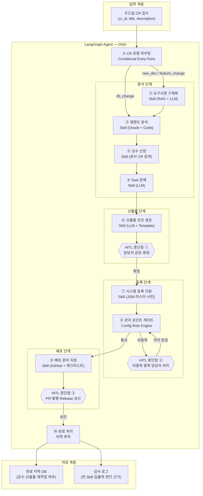
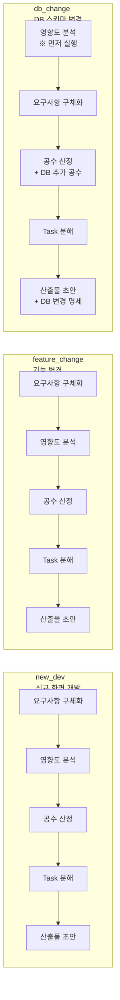
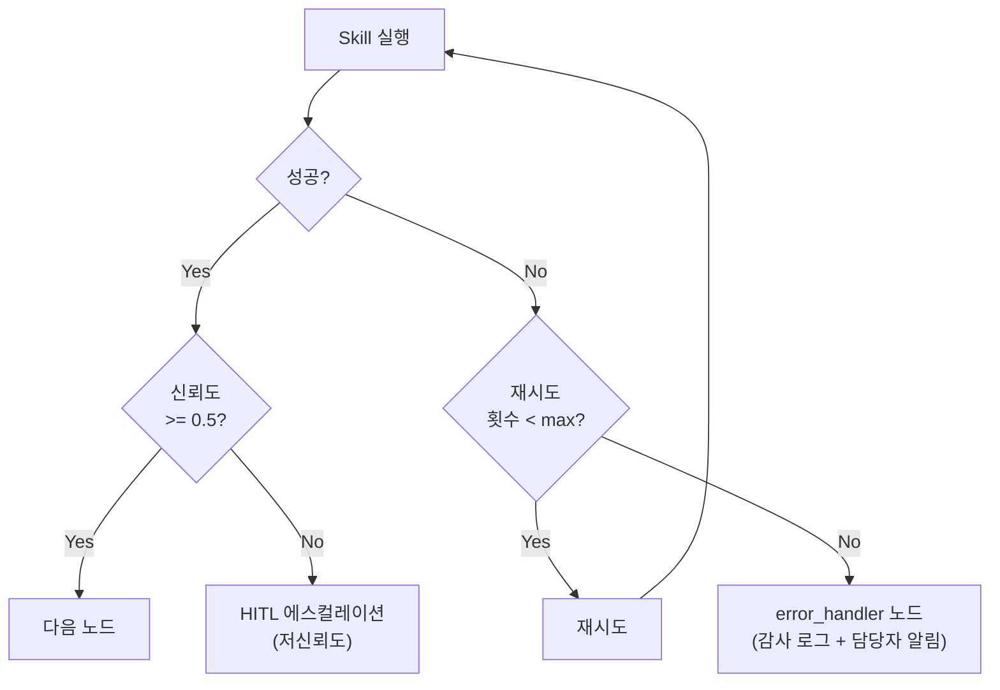

# T1-3. 전체 아키텍처 설계 — 수행 가이드

> **과제**: 프로그램 개발 전주기 지원 AI Agent  
> **Task**: T1-3. LangGraph DAG 구조, State 스키마, Skill 인터페이스 정의  
> **환경**: 삼성SDS 사내망 (SCP/VDI) · AI Pro LLM · LangGraph 0.2+  
> **선행 조건**: T1-1 완료 (환경 셋업) · T1-2 완료 (커넥터 인터페이스)

---

## 1. 개요

### 1.1 목적

본 Task는 프로그램 개발 전주기 지원 AI Agent의 **설계도**를 완성하는 단계다.  
T3에서 구현할 8개 Skill의 기반이 되는 세 가지 핵심 산출물을 정의한다.

| 산출물 | 파일 | 역할 |
|--------|------|------|
| `AgentState` | `src/agent/state.py` | 전체 Skill이 공유하는 상태 스키마 — CR 정보, 산출물, 게이트 결과를 단계 간 전달 |
| `BaseSkill` | `src/skills/base.py` | T3 Skill 구현의 표준 인터페이스 — 모든 Skill이 동일한 시그니처를 가짐 |
| LangGraph DAG | `src/agent/workflow.py` | CR 전주기 처리 흐름 — 노드·엣지·Conditional Routing·게이트 전체 구조 |

### 1.2 설계 원칙

1. **State 중심 설계**: Skill 간 데이터 전달은 반드시 `AgentState`를 통해서만 이루어짐. Skill끼리 직접 참조 금지
2. **Skill = 순수 함수**: `(AgentState) → AgentState`. 부작용(외부 시스템 쓰기)은 HITL 승인 후에만 허용
3. **게이트 = Config Rule**: 게이트 판별은 LLM에 위임하지 않고 `gate_rules.yaml`의 확정적 조건으로 처리
4. **HITL 명시적 중단**: 담당자 확인이 필요한 지점에서 LangGraph `interrupt()`를 호출하여 흐름을 중단
5. **오류 격리**: 개별 Skill 실패가 전체 Agent 중단으로 이어지지 않도록 Retry + Fallback 패턴 적용

### 1.3 완료 기준 (Definition of Done)

- [ ] `AgentState` TypedDict 전체 스키마 확정 및 코드 작성 완료
- [ ] `BaseSkill` ABC 및 `SkillResult` 데이터 모델 정의 완료
- [ ] LangGraph DAG 전체 노드·엣지 구현 완료
- [ ] CR 유형 3가지(`new_dev` / `feature_change` / `db_change`) Conditional Routing 동작 확인
- [ ] 게이트 노드 Config 기반 판별 로직 구현 완료
- [ ] HITL `interrupt()` 지점 3개 이상 구현 및 재개(resume) 동작 확인
- [ ] 아키텍처 단위 테스트 통과 (`tests/agent/test_workflow.py`)
- [ ] `docs/architecture.md` Confluence 등록 완료

---

## 2. 전체 아키텍처 개요

### 2.1 시스템 구성도



### 2.2 CR 유형별 처리 흐름 차이



> **`db_change` 특이사항**: DB 스키마 변경은 영향도 분석(Oracle 딕셔너리 조회)을 요구사항 구체화보다 먼저 수행하여, 변경 영향 범위를 파악한 후 요구사항을 확정한다.

---

## 3. AgentState 스키마 설계

`AgentState`는 Agent의 모든 정보를 담는 단일 진실 공급원(Single Source of Truth)이다.  
Skill은 이 State를 읽고 업데이트하며, LangGraph가 노드 간 전달을 자동 관리한다.

```python
# src/agent/state.py
from __future__ import annotations
from typing import Annotated, Any, Dict, List, Optional
from typing_extensions import TypedDict
from dataclasses import dataclass, field
from enum import Enum
from langgraph.graph.message import add_messages
from langchain_core.messages import BaseMessage


# ── Enum 정의 ─────────────────────────────────────────────────

class CRType(str, Enum):
    NEW_DEV        = "new_dev"        # 신규 화면 개발
    FEATURE_CHANGE = "feature_change" # 기능 변경
    DB_CHANGE      = "db_change"      # DB 스키마 변경


class StepName(str, Enum):
    """Agent 처리 단계 이름 — 게이트·로그에서 참조"""
    INIT             = "init"
    REQUIREMENT      = "requirement"       # 요구사항 구체화
    IMPACT_ANALYSIS  = "impact_analysis"   # 영향도 분석
    ESTIMATION       = "estimation"        # 공수 산정
    TASK_BREAKDOWN   = "task_breakdown"    # Task 분해
    ARTIFACT         = "artifact"          # 산출물 초안 생성
    REGISTRATION     = "registration"      # 시스템 등록 지원
    GATE_CHECK       = "gate_check"        # 관리 포인트 게이트
    DEPLOY           = "deploy"            # 배포 준비 지원
    DONE             = "done"              # 완료


class HITLStatus(str, Enum):
    """HITL 중단점 상태"""
    NOT_REACHED  = "not_reached"
    WAITING      = "waiting"      # 담당자 확인 대기 중
    APPROVED     = "approved"     # 담당자 승인
    REJECTED     = "rejected"     # 담당자 반려 → 재수행


# ── 하위 데이터 모델 ──────────────────────────────────────────

@dataclass
class CRInfo:
    """두드림 CR 원본 정보"""
    cr_id: str
    title: str
    description: str
    cr_type: CRType
    requester: str
    assignee: str
    created_at: str
    affected_systems: List[str] = field(default_factory=list)
    tags: List[str] = field(default_factory=list)
    raw_data: Dict[str, Any] = field(default_factory=dict)


@dataclass
class RequirementResult:
    """요구사항 구체화 Skill 결과"""
    structured_requirement: str       # 구체화된 요구사항 본문
    clarification_questions: List[str] # 담당자 확인 질문 목록
    similar_cr_ids: List[str]          # 참조한 유사 CR ID
    related_docs: List[str]            # 참조한 Confluence 문서 URL
    confirmed: bool = False            # 담당자 확인 완료 여부


@dataclass
class ImpactAnalysisResult:
    """영향도 분석 Skill 결과"""
    affected_tables: List[str]        # 영향받는 테이블 목록
    affected_programs: List[str]      # 영향받는 프로그램 목록
    has_db_schema_change: bool        # DB 스키마 변경 포함 여부
    oracle_consistency_issues: List[str]  # Oracle 정합성 이슈
    impact_summary: str               # 영향도 요약 텍스트


@dataclass
class EstimationResult:
    """공수 산정 Skill 결과"""
    estimated_screens: int            # 화면 본수 추정
    estimated_hours: float            # 총 개발 시간 추정
    db_extra_hours: float             # DB 작업 추가 공수
    basis_cr_ids: List[str]           # 산정 근거 유사 CR ID
    confidence: str                   # "high" | "medium" | "low"
    breakdown: Dict[str, float]       # {"분석": 4.0, "개발": 16.0, "테스트": 4.0}


@dataclass
class TaskBreakdownResult:
    """Task 분해 Skill 결과"""
    tasks: List[Dict[str, Any]]       # [{id, title, description, estimated_hours, done}]
    checklist_url: Optional[str]      # Confluence 저장 URL


@dataclass
class ArtifactResult:
    """산출물 초안 Skill 결과"""
    requirement_doc: Optional[str]    # 요구사항 분석서 (마크다운/HTML)
    impact_doc: Optional[str]         # 영향도 분석서
    test_definition_doc: Optional[str] # 테스트 정의서
    confluence_pages: Dict[str, str]  # {doc_type: page_url}
    confirmed: bool = False


@dataclass
class RegistrationResult:
    """시스템 등록 지원 Skill 결과"""
    jsm_draft: Optional[Dict[str, Any]]           # JSM 등록 초안
    program_master_draft: Optional[Dict[str, Any]] # 프로그램마스터 초안
    table_master_drafts: List[Dict[str, Any]]      # 테이블마스터 초안 목록
    unregistered_terms: List[str]                  # 미등록 용어 목록
    term_drafts: List[Dict[str, Any]]              # 용어 등록 초안


@dataclass
class GateResult:
    """관리 포인트 게이트 결과"""
    passed: bool
    checked_at: str
    passed_items: List[str]           # 통과한 점검 항목
    failed_items: List[str]           # 미충족 항목 (빈 리스트 = 전체 통과)
    gate_version: str                 # gate_rules.yaml 버전


@dataclass
class DeployResult:
    """배포 준비 지원 Skill 결과"""
    pr_body_draft: Optional[str]          # PR 본문 초안
    test_request_mail_draft: Optional[str] # 현업 테스트 요청 메일 초안
    release_checklist: Dict[str, bool]     # {항목: 완료여부}
    all_attachments_ready: bool            # Release 첨부물 3종 완비 여부
    pr_url: Optional[str] = None          # PR 생성 후 URL (HITL 승인 후 채움)


@dataclass
class SkillExecutionLog:
    """Skill 실행 감사 로그 단건"""
    step: StepName
    started_at: str
    ended_at: str
    elapsed_ms: float
    success: bool
    error: Optional[str]
    input_summary: str    # LLM 전달 전 민감정보 마스킹된 입력 요약
    output_summary: str   # 출력 요약


# ── AgentState TypedDict (LangGraph 핵심) ─────────────────────

class AgentState(TypedDict):
    """
    프로그램 개발 전주기 지원 AI Agent 전역 상태.

    LangGraph가 노드(Skill) 실행 시 이 TypedDict를 전달하고,
    각 노드가 반환한 업데이트를 누적·병합한다.

    ⚠️  규칙:
    - Skill은 자신이 담당하는 필드만 업데이트한다
    - messages 필드는 add_messages reducer로 누적 (덮어쓰지 않음)
    - cr_info, cr_id, cr_type 은 초기 입력 후 변경 금지
    """

    # ── 기본 메시지 이력 (LangGraph 표준) ──────────────────────
    messages: Annotated[List[BaseMessage], add_messages]

    # ── CR 기본 정보 (초기 설정 후 불변) ───────────────────────
    cr_id:   str
    cr_type: CRType
    cr_info: Optional[CRInfo]

    # ── 처리 단계 추적 ─────────────────────────────────────────
    current_step:    StepName
    completed_steps: List[StepName]
    step_count:      int          # 무한루프 방지 카운터

    # ── HITL 상태 ──────────────────────────────────────────────
    hitl_status:   HITLStatus
    hitl_point:    Optional[str]  # 현재 중단된 HITL 지점 이름
    hitl_feedback: Optional[str]  # 담당자 피드백 메시지

    # ── Skill 결과 누적 ────────────────────────────────────────
    requirement_result:    Optional[RequirementResult]
    impact_result:         Optional[ImpactAnalysisResult]
    estimation_result:     Optional[EstimationResult]
    task_breakdown_result: Optional[TaskBreakdownResult]
    artifact_result:       Optional[ArtifactResult]
    registration_result:   Optional[RegistrationResult]
    gate_result:           Optional[GateResult]
    deploy_result:         Optional[DeployResult]

    # ── 게이트 이력 (재시도 추적) ──────────────────────────────
    gate_attempts:  int           # 게이트 재시도 횟수
    gate_history:   List[GateResult]

    # ── 오류 상태 ──────────────────────────────────────────────
    error_step:    Optional[StepName]   # 오류 발생 단계
    error_message: Optional[str]
    retry_count:   int

    # ── 감사 로그 ──────────────────────────────────────────────
    execution_logs: List[SkillExecutionLog]

    # ── 최종 산출물 레지스트리 ─────────────────────────────────
    artifacts: Dict[str, Any]     # {artifact_type: content_or_url}


def create_initial_state(
    cr_id: str,
    cr_type: CRType,
    cr_info: Optional[CRInfo] = None,
) -> AgentState:
    """
    AgentState 초기값 생성 헬퍼.
    두드림에서 CR 수신 시 이 함수로 초기 State를 만든다.

    사용 예:
        state = create_initial_state(
            cr_id="CR-2026-0001",
            cr_type=CRType.NEW_DEV,
            cr_info=CRInfo(...),
        )
        result = app.invoke(state)
    """
    from langchain_core.messages import HumanMessage
    import datetime

    return AgentState(
        messages=[HumanMessage(content=f"CR 처리 시작: {cr_id}")],
        cr_id=cr_id,
        cr_type=cr_type,
        cr_info=cr_info,
        current_step=StepName.INIT,
        completed_steps=[],
        step_count=0,
        hitl_status=HITLStatus.NOT_REACHED,
        hitl_point=None,
        hitl_feedback=None,
        requirement_result=None,
        impact_result=None,
        estimation_result=None,
        task_breakdown_result=None,
        artifact_result=None,
        registration_result=None,
        gate_result=None,
        deploy_result=None,
        gate_attempts=0,
        gate_history=[],
        error_step=None,
        error_message=None,
        retry_count=0,
        execution_logs=[],
        artifacts={},
    )
```

### 3.1 State 업데이트 패턴

Skill은 자신이 담당하는 필드만 반환한다. LangGraph가 나머지 필드는 기존 값을 유지한다.

```python
# ✅ 올바른 패턴: 담당 필드만 업데이트
def requirement_skill_node(state: AgentState) -> dict:
    # ... Skill 로직 ...
    return {
        "requirement_result": RequirementResult(...),
        "current_step": StepName.REQUIREMENT,
        "completed_steps": state["completed_steps"] + [StepName.REQUIREMENT],
        "step_count": state["step_count"] + 1,
    }

# ❌ 잘못된 패턴: 전체 State 반환 (다른 Skill 결과 덮어씀)
def requirement_skill_node(state: AgentState) -> AgentState:
    state["requirement_result"] = ...
    return state  # 금지: add_messages reducer 우회, 다른 필드 덮어쓰기 위험
```

---

## 4. BaseSkill ABC 설계

모든 T3 Skill이 구현해야 하는 표준 인터페이스다.  
LangGraph 노드 함수는 `BaseSkill.run()`을 호출하는 얇은 래퍼로 구성된다.

```python
# src/skills/base.py
from __future__ import annotations
from abc import ABC, abstractmethod
from dataclasses import dataclass, field
from typing import Any, Dict, Optional
from enum import Enum
import time
import logging
import traceback

from src.agent.state import AgentState, StepName, SkillExecutionLog
from src.connectors.factory import ConnectorFactory
from src.llm.aiPro_client import AiProChatModel
from src.llm.embedding_client import AiProEmbeddings
from src.vectordb.febrix_client import FebrixVectorStore

logger = logging.getLogger(__name__)


class SkillStatus(str, Enum):
    SUCCESS  = "success"
    PARTIAL  = "partial"    # 일부 성공 (재시도 불필요)
    RETRY    = "retry"      # 재시도 권장
    FAILED   = "failed"     # 실패 (에스컬레이션 필요)


@dataclass
class SkillResult:
    """
    모든 Skill의 반환 타입.
    state_updates: AgentState에 병합할 dict
    """
    status:        SkillStatus
    state_updates: Dict[str, Any]
    message:       str = ""
    confidence:    float = 1.0     # 0.0 ~ 1.0 (낮으면 에스컬레이션)
    elapsed_ms:    float = 0.0


class BaseSkill(ABC):
    """
    프로그램 개발 전주기 지원 AI Agent — Skill 표준 인터페이스.

    구현 규칙:
    1. execute() 내에서 외부 시스템 쓰기 작업 금지 (읽기만 허용)
    2. 반환값은 SkillResult — state_updates에 담당 필드만 포함
    3. 오류 발생 시 예외를 던지지 말고 SkillResult(status=FAILED) 반환
    4. 신뢰도(confidence) 0.5 미만 시 에스컬레이션 처리됨
    """

    # 서브클래스에서 반드시 정의
    skill_name: str = ""
    step:       StepName = StepName.INIT
    max_retries: int = 2

    def __init__(self):
        self._llm        = AiProChatModel()
        self._embeddings = AiProEmbeddings()
        self._connectors = ConnectorFactory()

    @abstractmethod
    def execute(self, state: AgentState) -> SkillResult:
        """
        핵심 Skill 로직. 서브클래스에서 구현.

        Args:
            state: 현재 AgentState (읽기 전용으로 취급)

        Returns:
            SkillResult: state_updates에 변경할 필드만 포함
        """
        ...

    def run(self, state: AgentState) -> dict:
        """
        LangGraph 노드 함수에서 호출하는 진입점.
        - 실행 시간 측정
        - 재시도 로직
        - 신뢰도 기반 에스컬레이션
        - 감사 로그 기록
        """
        started_at = _now_iso()
        start_time = time.monotonic()
        result: Optional[SkillResult] = None

        for attempt in range(self.max_retries + 1):
            try:
                result = self.execute(state)
                if result.status != SkillStatus.RETRY:
                    break
                logger.warning(f"[{self.skill_name}] Retry {attempt + 1}/{self.max_retries}")
            except Exception as e:
                logger.error(f"[{self.skill_name}] Exception: {e}\n{traceback.format_exc()}")
                result = SkillResult(
                    status=SkillStatus.FAILED,
                    state_updates={},
                    message=str(e),
                    confidence=0.0,
                )
                break

        elapsed_ms = (time.monotonic() - start_time) * 1000
        ended_at   = _now_iso()

        if result is None:
            result = SkillResult(
                status=SkillStatus.FAILED,
                state_updates={},
                message="재시도 초과",
                confidence=0.0,
            )

        # 신뢰도 기반 에스컬레이션 처리
        if result.confidence < 0.5:
            result.state_updates["hitl_status"]   = "waiting"
            result.state_updates["hitl_point"]    = f"{self.skill_name}_low_confidence"
            result.state_updates["hitl_feedback"] = None
            logger.warning(f"[{self.skill_name}] 저신뢰도 에스컬레이션: {result.confidence:.2f}")

        # 오류 상태 기록
        if result.status == SkillStatus.FAILED:
            result.state_updates["error_step"]    = self.step
            result.state_updates["error_message"] = result.message

        # 감사 로그 추가
        log_entry = SkillExecutionLog(
            step        = self.step,
            started_at  = started_at,
            ended_at    = ended_at,
            elapsed_ms  = elapsed_ms,
            success     = result.status in (SkillStatus.SUCCESS, SkillStatus.PARTIAL),
            error       = result.message if result.status == SkillStatus.FAILED else None,
            input_summary  = _summarize_state_input(state, self.step),
            output_summary = result.message[:200],
        )
        existing_logs = list(state.get("execution_logs", []))
        result.state_updates["execution_logs"] = existing_logs + [log_entry]

        return result.state_updates


# ── 유틸리티 ─────────────────────────────────────────────────

def _now_iso() -> str:
    import datetime
    return datetime.datetime.now().isoformat()


def _summarize_state_input(state: AgentState, step: StepName) -> str:
    """감사 로그용 입력 요약 — 민감정보 마스킹"""
    cr_id = state.get("cr_id", "")
    title = ""
    if state.get("cr_info"):
        title = state["cr_info"].title[:50]
    return f"cr_id={cr_id}, step={step}, title={title}"
```

### 4.1 Skill 구현 예시 (T3 참조용)

T3에서 각 Skill을 구현할 때 따라야 하는 최소 패턴이다.

```python
# 예시: src/skills/s01_requirement.py (T3-3에서 완성)
from src.skills.base import BaseSkill, SkillResult, SkillStatus
from src.agent.state import AgentState, StepName, RequirementResult


class RequirementSkill(BaseSkill):
    skill_name  = "requirement_skill"
    step        = StepName.REQUIREMENT
    max_retries = 2

    def execute(self, state: AgentState) -> SkillResult:
        cr_info = state.get("cr_info")
        if not cr_info:
            return SkillResult(
                status=SkillStatus.FAILED,
                state_updates={},
                message="cr_info가 없습니다",
            )

        # ① RAG 검색 (T3-3에서 구현)
        github     = self._connectors.github()
        confluence = self._connectors.confluence()
        doodream   = self._connectors.doodream()

        code_results  = github.search_code(cr_info.title, top_k=3)
        doc_results   = confluence.search_pages(cr_info.description[:100], top_k=3)
        cr_history    = doodream.search_cr_history(cr_info.title, cr_type=cr_info.cr_type, top_k=5)

        # ② LLM으로 요구사항 구체화 (T3-3에서 구현)
        # context = build_context(code_results, doc_results, cr_history)
        # structured = self._llm.invoke(REQUIREMENT_PROMPT.format(...))

        # ③ 결과 반환 (현재는 Stub)
        result_data = RequirementResult(
            structured_requirement="[T3-3에서 구현]",
            clarification_questions=["[T3-3에서 구현]"],
            similar_cr_ids=[cr.cr_id for cr in (cr_history.data or [])[:3]],
            related_docs=[doc.url for doc in (doc_results.data or [])[:3]],
        )

        return SkillResult(
            status=SkillStatus.SUCCESS,
            state_updates={
                "requirement_result": result_data,
                "current_step": StepName.REQUIREMENT,
                "completed_steps": list(state.get("completed_steps", [])) + [StepName.REQUIREMENT],
                "step_count": state.get("step_count", 0) + 1,
            },
            message="요구사항 구체화 완료",
            confidence=0.85,
        )
```

---

## 5. LangGraph DAG 구현

### 5.1 전체 워크플로우 조립

```python
# src/agent/workflow.py
from __future__ import annotations
from typing import Literal
from langgraph.graph import StateGraph, END
from langgraph.checkpoint.memory import MemorySaver

from src.agent.state import AgentState, StepName, CRType, HITLStatus
from src.agent.router import route_by_cr_type, check_gate_result, check_hitl_status
from src.agent.nodes import (
    node_requirement,
    node_impact_analysis,
    node_estimation,
    node_task_breakdown,
    node_artifact,
    node_registration,
    node_gate_check,
    node_deploy,
    node_done,
    node_error_handler,
    node_hitl_wait,
)

MAX_STEPS = 25  # 무한루프 방지


def build_workflow() -> StateGraph:
    """
    프로그램 개발 전주기 지원 AI Agent — LangGraph DAG 조립.

    노드 구성:
        requirement       → 요구사항 구체화 (T3-3)
        impact_analysis   → 영향도 분석 (T3-4)
        estimation        → 공수 산정 (T3-5)
        task_breakdown    → Task 분해 (T3-6)
        artifact          → 산출물 초안 생성 (T3-7)
        hitl_artifact     → HITL 중단점 ① (산출물 담당자 확인)
        registration      → 시스템 등록 지원 (T3-8)
        gate_check        → 관리 포인트 게이트 (T3-9)
        hitl_gate         → HITL 중단점 ② (게이트 미충족 항목 처리)
        deploy            → 배포 준비 지원 (T3-10)
        hitl_deploy       → HITL 중단점 ③ (PR 발행·Release 상신)
        done              → 완료 처리 및 이력 축적
        error_handler     → 오류 처리 및 에스컬레이션
    """
    graph = StateGraph(AgentState)

    # ── 노드 등록 ─────────────────────────────────────────────
    graph.add_node("requirement",     node_requirement)
    graph.add_node("impact_analysis", node_impact_analysis)
    graph.add_node("estimation",      node_estimation)
    graph.add_node("task_breakdown",  node_task_breakdown)
    graph.add_node("artifact",        node_artifact)
    graph.add_node("hitl_artifact",   node_hitl_wait("hitl_artifact"))
    graph.add_node("registration",    node_registration)
    graph.add_node("gate_check",      node_gate_check)
    graph.add_node("hitl_gate",       node_hitl_wait("hitl_gate"))
    graph.add_node("deploy",          node_deploy)
    graph.add_node("hitl_deploy",     node_hitl_wait("hitl_deploy"))
    graph.add_node("done",            node_done)
    graph.add_node("error_handler",   node_error_handler)

    # ── 진입점: CR 유형에 따라 첫 노드 결정 ──────────────────
    graph.set_conditional_entry_point(
        route_by_cr_type,
        {
            "requirement":     "requirement",
            "impact_analysis": "impact_analysis",
        },
    )

    # ── 분석 단계 엣지 ────────────────────────────────────────
    # new_dev / feature_change: requirement → impact_analysis → estimation → task_breakdown
    graph.add_conditional_edges(
        "requirement",
        _check_error_or_next("impact_analysis"),
        {"impact_analysis": "impact_analysis", "error_handler": "error_handler"},
    )
    graph.add_conditional_edges(
        "impact_analysis",
        _check_error_or_next("estimation"),
        {"estimation": "estimation", "error_handler": "error_handler"},
    )
    graph.add_conditional_edges(
        "estimation",
        _check_error_or_next("task_breakdown"),
        {"task_breakdown": "task_breakdown", "error_handler": "error_handler"},
    )
    graph.add_conditional_edges(
        "task_breakdown",
        _check_error_or_next("artifact"),
        {"artifact": "artifact", "error_handler": "error_handler"},
    )

    # ── 산출물 단계 엣지 + HITL ①  ────────────────────────────
    graph.add_edge("artifact", "hitl_artifact")
    graph.add_conditional_edges(
        "hitl_artifact",
        check_hitl_status,
        {
            "approved":  "registration",
            "rejected":  "artifact",       # 반려 시 재생성
            "waiting":   "hitl_artifact",  # 계속 대기 (외부에서 resume)
        },
    )

    # ── 등록 단계 엣지 ────────────────────────────────────────
    graph.add_conditional_edges(
        "registration",
        _check_error_or_next("gate_check"),
        {"gate_check": "gate_check", "error_handler": "error_handler"},
    )

    # ── 게이트 엣지 + HITL ② ─────────────────────────────────
    graph.add_conditional_edges(
        "gate_check",
        check_gate_result,
        {
            "passed":   "deploy",
            "failed":   "hitl_gate",       # 미충족 → 담당자 처리 대기
        },
    )
    graph.add_conditional_edges(
        "hitl_gate",
        check_hitl_status,
        {
            "approved":  "gate_check",     # 처리 완료 → 게이트 재검사
            "rejected":  "registration",   # 등록부터 재수행
            "waiting":   "hitl_gate",
        },
    )

    # ── 배포 단계 엣지 + HITL ③ ──────────────────────────────
    graph.add_edge("deploy", "hitl_deploy")
    graph.add_conditional_edges(
        "hitl_deploy",
        check_hitl_status,
        {
            "approved":  "done",
            "rejected":  "deploy",         # 배포 준비 재수행
            "waiting":   "hitl_deploy",
        },
    )

    # ── 완료 ─────────────────────────────────────────────────
    graph.add_edge("done",          END)
    graph.add_edge("error_handler", END)

    return graph


def build_app(use_checkpointer: bool = True):
    """
    컴파일된 LangGraph 앱 반환.
    use_checkpointer=True: 메모리 체크포인터 사용 (HITL resume 지원)
    """
    graph    = build_workflow()
    checkpointer = MemorySaver() if use_checkpointer else None
    return graph.compile(
        checkpointer=checkpointer,
        interrupt_before=["hitl_artifact", "hitl_gate", "hitl_deploy"],
    )


def _check_error_or_next(next_node: str):
    """오류 발생 여부에 따라 다음 노드를 결정하는 라우터 생성 함수"""
    def router(state: AgentState) -> str:
        if state.get("error_step") and state.get("error_message"):
            return "error_handler"
        if state.get("step_count", 0) >= MAX_STEPS:
            return "error_handler"
        return next_node
    return router
```

---

### 5.2 노드 함수 구현

```python
# src/agent/nodes.py
from __future__ import annotations
from typing import Callable
from langgraph.types import interrupt

from src.agent.state import AgentState, StepName, HITLStatus


# ── 각 Skill 노드 함수 ────────────────────────────────────────
# 노드 함수는 Skill.run()을 호출하는 얇은 래퍼.
# T3에서 실 Skill 구현이 완성되면 import만 교체.

def node_requirement(state: AgentState) -> dict:
    from src.skills.s01_requirement import RequirementSkill
    return RequirementSkill().run(state)


def node_impact_analysis(state: AgentState) -> dict:
    from src.skills.s02_impact import ImpactAnalysisSkill
    return ImpactAnalysisSkill().run(state)


def node_estimation(state: AgentState) -> dict:
    from src.skills.s03_estimation import EstimationSkill
    return EstimationSkill().run(state)


def node_task_breakdown(state: AgentState) -> dict:
    from src.skills.s04_task_breakdown import TaskBreakdownSkill
    return TaskBreakdownSkill().run(state)


def node_artifact(state: AgentState) -> dict:
    from src.skills.s05_artifact import ArtifactSkill
    return ArtifactSkill().run(state)


def node_registration(state: AgentState) -> dict:
    from src.skills.s06_registration import RegistrationSkill
    return RegistrationSkill().run(state)


def node_gate_check(state: AgentState) -> dict:
    from src.skills.s07_gate import GateSkill
    return GateSkill().run(state)


def node_deploy(state: AgentState) -> dict:
    from src.skills.s08_deploy import DeploySkill
    return DeploySkill().run(state)


def node_done(state: AgentState) -> dict:
    """완료 처리 — 이력 저장, 메트릭 기록"""
    import datetime
    from src.utils.metrics import record_completion
    record_completion(state)
    return {
        "current_step": StepName.DONE,
        "completed_steps": list(state.get("completed_steps", [])) + [StepName.DONE],
    }


def node_error_handler(state: AgentState) -> dict:
    """오류 처리 — 감사 로그 기록, 담당자 알림"""
    import logging
    logger = logging.getLogger(__name__)
    logger.error(
        "Agent 오류 발생",
        extra={
            "cr_id":         state.get("cr_id"),
            "error_step":    state.get("error_step"),
            "error_message": state.get("error_message"),
            "step_count":    state.get("step_count"),
        },
    )
    return {
        "current_step": StepName.DONE,
    }


def node_hitl_wait(hitl_point_name: str) -> Callable:
    """
    HITL 중단점 노드 생성 팩토리.
    interrupt()를 호출하여 흐름을 중단하고 담당자 입력을 기다린다.

    resume 방법:
        app.invoke(
            Command(resume="approved"),   # 또는 "rejected"
            config={"configurable": {"thread_id": thread_id}},
        )
    """
    def _node(state: AgentState) -> dict:
        if state.get("hitl_status") == HITLStatus.WAITING:
            # 이미 대기 중 — resume 값 확인
            return {}

        # 중단점 도달 → interrupt() 호출
        feedback = interrupt({
            "hitl_point":    hitl_point_name,
            "current_step":  state.get("current_step"),
            "cr_id":         state.get("cr_id"),
            "message":       f"[{hitl_point_name}] 담당자 확인이 필요합니다. 'approved' 또는 'rejected'를 입력하세요.",
        })

        # resume 후 실행됨
        status = HITLStatus.APPROVED if feedback == "approved" else HITLStatus.REJECTED
        return {
            "hitl_status":   status,
            "hitl_point":    hitl_point_name,
            "hitl_feedback": str(feedback),
        }

    _node.__name__ = f"node_{hitl_point_name}"
    return _node
```

---

## 6. CR 유형별 Routing 로직

```python
# src/agent/router.py
from __future__ import annotations
from src.agent.state import AgentState, CRType, HITLStatus


def route_by_cr_type(state: AgentState) -> str:
    """
    진입점 라우터: CR 유형에 따라 첫 번째 실행 노드 결정.

    - new_dev / feature_change: 요구사항 구체화부터 시작
    - db_change:                영향도 분석부터 시작 (DB 변경 범위 먼저 파악)
    """
    cr_type = state.get("cr_type", CRType.NEW_DEV)

    if cr_type == CRType.DB_CHANGE:
        return "impact_analysis"

    # new_dev, feature_change
    return "requirement"


def check_gate_result(state: AgentState) -> str:
    """
    게이트 점검 결과에 따라 분기.
    gate_result.passed == True → 배포 단계 진행
    gate_result.passed == False → HITL 게이트 중단
    gate_attempts >= 3 → 강제 에스컬레이션 (무한 루프 방지)
    """
    gate_result   = state.get("gate_result")
    gate_attempts = state.get("gate_attempts", 0)

    # 게이트 미수행 또는 재시도 초과
    if gate_result is None:
        return "failed"
    if gate_attempts >= 3:
        return "failed"  # 에스컬레이션

    return "passed" if gate_result.passed else "failed"


def check_hitl_status(state: AgentState) -> str:
    """
    HITL 상태에 따라 분기.
    - approved: 다음 단계 진행
    - rejected: 현재 단계 재수행
    - waiting / not_reached: 계속 대기
    """
    status = state.get("hitl_status", HITLStatus.NOT_REACHED)

    if status == HITLStatus.APPROVED:
        return "approved"
    if status == HITLStatus.REJECTED:
        return "rejected"
    return "waiting"
```

---

## 7. 게이트 노드 설계

게이트는 **Config 기반 Rule Engine**으로 동작한다. LLM 판단에 의존하지 않는다.

```python
# src/gate/engine.py
from __future__ import annotations
from typing import Dict, List, Optional
from dataclasses import dataclass, field
import yaml
import datetime
import logging

from src.agent.state import AgentState, GateResult

logger = logging.getLogger(__name__)


@dataclass
class GateRule:
    """단일 게이트 규칙"""
    name:        str
    description: str
    required:    bool = True
    check_fn:    Optional[str] = None  # 함수명 (동적 디스패치)


class GateEngine:
    """
    Config 기반 게이트 판별 엔진.
    gate_rules.yaml을 로드하여 AgentState를 검사한다.

    ⚠️  설계 원칙: LLM 호출 금지.
    모든 판별은 State 값의 존재 여부·길이·플래그만으로 처리.
    """

    def __init__(self, config_path: str = "config/gate_rules.yaml"):
        with open(config_path, encoding="utf-8") as f:
            self._config = yaml.safe_load(f)
        self._version = self._config.get("version", "unknown")

    def check(self, state: AgentState) -> GateResult:
        """
        현재 State에 대해 모든 게이트 규칙을 검사.
        하나라도 실패하면 passed=False 반환.
        """
        passed_items: List[str] = []
        failed_items: List[str] = []

        for rule_cfg in self._config.get("gates", []):
            rule_name = rule_cfg["name"]
            try:
                ok = self._evaluate_rule(rule_cfg, state)
            except Exception as e:
                logger.error(f"게이트 규칙 평가 오류: {rule_name} — {e}")
                ok = False

            if ok:
                passed_items.append(rule_name)
            else:
                if rule_cfg.get("required", True):
                    failed_items.append(rule_name)
                    logger.warning(f"게이트 미충족: {rule_name} — {rule_cfg.get('description', '')}")

        return GateResult(
            passed       = len(failed_items) == 0,
            checked_at   = datetime.datetime.now().isoformat(),
            passed_items = passed_items,
            failed_items = failed_items,
            gate_version = self._version,
        )

    def _evaluate_rule(self, rule_cfg: dict, state: AgentState) -> bool:
        """단일 규칙 평가"""
        check_type = rule_cfg.get("check_type")

        # ── 필드 존재 여부 확인 ──────────────────────────────
        if check_type == "field_exists":
            field_path = rule_cfg["field"]
            return _get_nested(state, field_path) is not None

        # ── 필드 최소 길이 확인 ──────────────────────────────
        if check_type == "min_length":
            field_path = rule_cfg["field"]
            min_len    = rule_cfg["min_length"]
            value      = _get_nested(state, field_path)
            return value is not None and len(str(value)) >= min_len

        # ── 목록 최소 개수 확인 ──────────────────────────────
        if check_type == "list_min_count":
            field_path = rule_cfg["field"]
            min_count  = rule_cfg["min_count"]
            value      = _get_nested(state, field_path)
            return isinstance(value, list) and len(value) >= min_count

        # ── Boolean 플래그 확인 ──────────────────────────────
        if check_type == "bool_flag":
            field_path    = rule_cfg["field"]
            expected_true = rule_cfg.get("expected", True)
            value         = _get_nested(state, field_path)
            return bool(value) == expected_true

        # ── 항목 목록 모두 존재 확인 ─────────────────────────
        if check_type == "all_items_exist":
            field_path = rule_cfg["field"]
            value      = _get_nested(state, field_path)
            if not isinstance(value, dict):
                return False
            required_keys = rule_cfg.get("required_keys", [])
            return all(k in value for k in required_keys)

        logger.warning(f"알 수 없는 check_type: {check_type}")
        return False


def _get_nested(obj, path: str):
    """점(.) 구분 경로로 중첩 딕셔너리/dataclass 값 조회"""
    parts = path.split(".")
    current = obj
    for part in parts:
        if current is None:
            return None
        if isinstance(current, dict):
            current = current.get(part)
        elif hasattr(current, part):
            current = getattr(current, part)
        else:
            return None
    return current
```

### 7.1 gate_rules.yaml 전체 정의

```yaml
# config/gate_rules.yaml
version: "1.0.0"

gates:

  # ── 요구사항 완료 확인 ────────────────────────────────────
  - name: "requirement_confirmed"
    description: "요구사항 구체화 결과 담당자 확인 완료"
    required: true
    check_type: bool_flag
    field: "requirement_result.confirmed"
    expected: true

  - name: "requirement_min_length"
    description: "구체화된 요구사항이 50자 이상"
    required: true
    check_type: min_length
    field: "requirement_result.structured_requirement"
    min_length: 50

  # ── 영향도 분석 완료 확인 ─────────────────────────────────
  - name: "impact_analysis_done"
    description: "영향도 분석 결과 존재"
    required: true
    check_type: field_exists
    field: "impact_result"

  - name: "affected_tables_identified"
    description: "영향 테이블 목록 확인됨"
    required: true
    check_type: field_exists
    field: "impact_result.affected_tables"

  # ── 산출물 완비 확인 ──────────────────────────────────────
  - name: "artifact_requirement_doc"
    description: "요구사항 분석서 초안 생성됨"
    required: true
    check_type: field_exists
    field: "artifact_result.requirement_doc"

  - name: "artifact_impact_doc"
    description: "영향도 분석서 초안 생성됨"
    required: true
    check_type: field_exists
    field: "artifact_result.impact_doc"

  - name: "artifact_test_doc"
    description: "테스트 정의서 초안 생성됨"
    required: true
    check_type: field_exists
    field: "artifact_result.test_definition_doc"

  - name: "artifact_confirmed"
    description: "산출물 담당자 확인 완료 (HITL ①)"
    required: true
    check_type: bool_flag
    field: "artifact_result.confirmed"
    expected: true

  # ── 마스터 등록 확인 ──────────────────────────────────────
  - name: "program_master_draft_ready"
    description: "프로그램마스터 등록 초안 생성됨"
    required: true
    check_type: field_exists
    field: "registration_result.program_master_draft"

  - name: "unregistered_terms_handled"
    description: "미등록 용어 목록 확인됨 (0건 또는 초안 생성됨)"
    required: true
    check_type: field_exists
    field: "registration_result.unregistered_terms"

  # ── Oracle 정합성 확인 ────────────────────────────────────
  - name: "oracle_consistency_clean"
    description: "Oracle 딕셔너리 정합성 이슈 없음"
    required: true
    check_type: list_min_count
    field: "impact_result.oracle_consistency_issues"
    min_count: 0   # 빈 리스트(이슈 없음) = 통과
    # 주의: 이슈가 있으면 목록이 비어있지 않으므로 별도 확인 로직 필요

  # ── 배포 준비 확인 ────────────────────────────────────────
  - name: "deploy_all_attachments_ready"
    description: "Release 첨부물 3종 완비 (요구사항 분석서·테스트 정의서·현업 확인 메일)"
    required: true
    check_type: bool_flag
    field: "deploy_result.all_attachments_ready"
    expected: true
```

---

## 8. 오류 처리 및 복구 전략



```python
# src/utils/error_handler.py
from __future__ import annotations
from src.agent.state import AgentState, StepName
import logging

logger = logging.getLogger(__name__)

# 재시도 정책: Skill별 최대 재시도 횟수
RETRY_POLICY: dict[StepName, int] = {
    StepName.REQUIREMENT:     2,
    StepName.IMPACT_ANALYSIS: 3,  # Oracle 일시 장애 대비
    StepName.ESTIMATION:      2,
    StepName.TASK_BREAKDOWN:  1,
    StepName.ARTIFACT:        2,
    StepName.REGISTRATION:    2,
    StepName.GATE_CHECK:      0,  # 게이트는 재시도 없음 (Config Rule 기반)
    StepName.DEPLOY:          1,
}

# 에스컬레이션 임계값 (신뢰도)
CONFIDENCE_THRESHOLD = 0.5

def should_escalate(confidence: float) -> bool:
    return confidence < CONFIDENCE_THRESHOLD

def build_error_context(state: AgentState) -> dict:
    """에스컬레이션 알림용 컨텍스트 생성"""
    return {
        "cr_id":         state.get("cr_id"),
        "error_step":    state.get("error_step"),
        "error_message": state.get("error_message"),
        "step_count":    state.get("step_count"),
        "retry_count":   state.get("retry_count"),
        "completed":     [s.value for s in state.get("completed_steps", [])],
    }
```

---

## 9. 단위 테스트

```python
# tests/agent/test_workflow.py
"""
T1-3 완료 기준 검증 테스트.
실 Skill 구현(T3) 없이 Stub으로 DAG 구조 전체를 검증한다.
"""
import os
import pytest

os.environ["USE_MOCK_CONNECTORS"] = "true"

from langchain_core.messages import HumanMessage
from src.agent.state import AgentState, CRType, StepName, create_initial_state
from src.agent.router import route_by_cr_type, check_gate_result, check_hitl_status
from src.agent.state import HITLStatus, GateResult
import datetime


# ── State 생성 테스트 ──────────────────────────────────────────

def test_create_initial_state():
    """초기 State 생성 검증"""
    state = create_initial_state(
        cr_id="CR-2026-TEST-001",
        cr_type=CRType.NEW_DEV,
    )
    assert state["cr_id"] == "CR-2026-TEST-001"
    assert state["cr_type"] == CRType.NEW_DEV
    assert state["current_step"] == StepName.INIT
    assert state["completed_steps"] == []
    assert state["step_count"] == 0
    assert state["hitl_status"] == HITLStatus.NOT_REACHED
    assert state["gate_attempts"] == 0
    assert state["execution_logs"] == []
    print("✅ 초기 State 생성 정상")


def test_state_all_fields_present():
    """AgentState 필수 필드 전체 존재 여부"""
    state = create_initial_state("CR-TEST", CRType.DB_CHANGE)
    required_fields = [
        "messages", "cr_id", "cr_type", "cr_info",
        "current_step", "completed_steps", "step_count",
        "hitl_status", "hitl_point", "hitl_feedback",
        "requirement_result", "impact_result", "estimation_result",
        "task_breakdown_result", "artifact_result",
        "registration_result", "gate_result", "deploy_result",
        "gate_attempts", "gate_history",
        "error_step", "error_message", "retry_count",
        "execution_logs", "artifacts",
    ]
    for field in required_fields:
        assert field in state, f"누락된 필드: {field}"
    print(f"✅ 전체 필드 존재 확인: {len(required_fields)}개")


# ── Routing 테스트 ─────────────────────────────────────────────

def test_route_new_dev():
    state = create_initial_state("CR-001", CRType.NEW_DEV)
    assert route_by_cr_type(state) == "requirement"
    print("✅ new_dev 라우팅: requirement")


def test_route_feature_change():
    state = create_initial_state("CR-002", CRType.FEATURE_CHANGE)
    assert route_by_cr_type(state) == "requirement"
    print("✅ feature_change 라우팅: requirement")


def test_route_db_change():
    state = create_initial_state("CR-003", CRType.DB_CHANGE)
    assert route_by_cr_type(state) == "impact_analysis"
    print("✅ db_change 라우팅: impact_analysis (영향도 먼저)")


# ── 게이트 라우터 테스트 ───────────────────────────────────────

def test_gate_passed():
    state = create_initial_state("CR-001", CRType.NEW_DEV)
    state["gate_result"] = GateResult(
        passed=True, checked_at=datetime.datetime.now().isoformat(),
        passed_items=["requirement_confirmed"], failed_items=[], gate_version="1.0"
    )
    state["gate_attempts"] = 0
    assert check_gate_result(state) == "passed"
    print("✅ 게이트 통과 라우팅")


def test_gate_failed():
    state = create_initial_state("CR-001", CRType.NEW_DEV)
    state["gate_result"] = GateResult(
        passed=False, checked_at=datetime.datetime.now().isoformat(),
        passed_items=[], failed_items=["program_master_draft_ready"], gate_version="1.0"
    )
    state["gate_attempts"] = 0
    assert check_gate_result(state) == "failed"
    print("✅ 게이트 실패 라우팅")


def test_gate_max_attempts():
    """게이트 재시도 3회 초과 → 강제 에스컬레이션"""
    state = create_initial_state("CR-001", CRType.NEW_DEV)
    state["gate_result"] = GateResult(
        passed=False, checked_at=datetime.datetime.now().isoformat(),
        passed_items=[], failed_items=["artifact_confirmed"], gate_version="1.0"
    )
    state["gate_attempts"] = 3
    assert check_gate_result(state) == "failed"
    print("✅ 게이트 최대 재시도 초과 → 에스컬레이션")


# ── HITL 라우터 테스트 ─────────────────────────────────────────

def test_hitl_approved():
    state = create_initial_state("CR-001", CRType.NEW_DEV)
    state["hitl_status"] = HITLStatus.APPROVED
    assert check_hitl_status(state) == "approved"
    print("✅ HITL 승인 라우팅")


def test_hitl_rejected():
    state = create_initial_state("CR-001", CRType.NEW_DEV)
    state["hitl_status"] = HITLStatus.REJECTED
    assert check_hitl_status(state) == "rejected"
    print("✅ HITL 반려 라우팅")


def test_hitl_waiting():
    state = create_initial_state("CR-001", CRType.NEW_DEV)
    state["hitl_status"] = HITLStatus.WAITING
    assert check_hitl_status(state) == "waiting"
    print("✅ HITL 대기 라우팅")


# ── BaseSkill 인터페이스 테스트 ────────────────────────────────

def test_base_skill_interface():
    """BaseSkill 구현체가 올바른 인터페이스를 가지는지 확인"""
    from src.skills.base import BaseSkill, SkillResult, SkillStatus

    class TestSkill(BaseSkill):
        skill_name  = "test_skill"
        step        = StepName.REQUIREMENT
        max_retries = 0

        def execute(self, state: AgentState) -> SkillResult:
            return SkillResult(
                status=SkillStatus.SUCCESS,
                state_updates={"current_step": StepName.REQUIREMENT},
                message="테스트 성공",
                confidence=0.9,
            )

    state = create_initial_state("CR-TEST", CRType.NEW_DEV)
    skill = TestSkill()
    result = skill.run(state)

    assert isinstance(result, dict)
    assert "current_step" in result
    assert "execution_logs" in result
    assert len(result["execution_logs"]) == 1
    print("✅ BaseSkill 인터페이스 정상")


def test_low_confidence_escalation():
    """신뢰도 낮으면 HITL 에스컬레이션 처리"""
    from src.skills.base import BaseSkill, SkillResult, SkillStatus

    class LowConfidenceSkill(BaseSkill):
        skill_name  = "low_conf"
        step        = StepName.REQUIREMENT
        max_retries = 0

        def execute(self, state: AgentState) -> SkillResult:
            return SkillResult(
                status=SkillStatus.PARTIAL,
                state_updates={},
                message="불확실한 결과",
                confidence=0.3,   # 임계값(0.5) 미만
            )

    state = create_initial_state("CR-TEST", CRType.NEW_DEV)
    result = LowConfidenceSkill().run(state)

    assert result.get("hitl_status") == "waiting"
    assert result.get("hitl_point") == "low_conf_low_confidence"
    print("✅ 저신뢰도 HITL 에스컬레이션 정상")


# ── 게이트 엔진 테스트 ─────────────────────────────────────────

def test_gate_engine():
    """게이트 엔진 Config 기반 판별"""
    from src.gate.engine import GateEngine

    engine = GateEngine(config_path="config/gate_rules.yaml")
    state  = create_initial_state("CR-TEST", CRType.NEW_DEV)

    # 아무것도 완료 안 된 상태 → 게이트 실패
    result = engine.check(state)
    assert result.passed is False
    assert len(result.failed_items) > 0
    print(f"✅ 빈 State 게이트 실패: {result.failed_items[:3]}...")


# ── DAG 빌드 테스트 ────────────────────────────────────────────

def test_workflow_builds_without_error():
    """LangGraph DAG 빌드 오류 없음 확인"""
    from src.agent.workflow import build_app
    app = build_app(use_checkpointer=True)
    assert app is not None
    print("✅ LangGraph DAG 빌드 성공")


def test_workflow_graph_structure():
    """DAG 노드 구성 확인"""
    from src.agent.workflow import build_workflow
    graph = build_workflow()
    compiled = graph.compile()

    # 그래프 노드 이름 목록 추출
    node_names = set(compiled.nodes.keys())
    expected_nodes = {
        "requirement", "impact_analysis", "estimation",
        "task_breakdown", "artifact", "hitl_artifact",
        "registration", "gate_check", "hitl_gate",
        "deploy", "hitl_deploy", "done", "error_handler",
    }
    for node in expected_nodes:
        assert node in node_names, f"누락된 노드: {node}"
    print(f"✅ DAG 노드 구성 확인: {len(expected_nodes)}개")
```

---

## 10. 디렉토리 구조

```
src/
├── agent/
│   ├── __init__.py
│   ├── state.py          # AgentState TypedDict + 하위 데이터 모델
│   ├── workflow.py       # LangGraph DAG 조립
│   ├── nodes.py          # 노드 함수 (Skill 래퍼)
│   └── router.py         # Conditional Routing 함수

├── skills/
│   ├── __init__.py
│   ├── base.py           # BaseSkill ABC + SkillResult
│   ├── s01_requirement.py    # T3-3에서 구현
│   ├── s02_impact.py         # T3-4에서 구현
│   ├── s03_estimation.py     # T3-5에서 구현
│   ├── s04_task_breakdown.py # T3-6에서 구현
│   ├── s05_artifact.py       # T3-7에서 구현
│   ├── s06_registration.py   # T3-8에서 구현
│   ├── s07_gate.py           # T3-9에서 구현
│   └── s08_deploy.py         # T3-10에서 구현

├── gate/
│   ├── __init__.py
│   ├── engine.py         # Config 기반 Rule Engine
│   └── loader.py         # gate_rules.yaml 로더·캐시

└── utils/
    ├── error_handler.py  # 오류 처리·에스컬레이션
    └── metrics.py        # 완료 이력 기록

config/
├── config.yaml
└── gate_rules.yaml       # 게이트 완료 조건 전체 정의

tests/
└── agent/
    ├── test_workflow.py  # DAG 구조·Routing·HITL 검증
    ├── test_state.py     # State 스키마 검증
    └── test_gate.py      # 게이트 엔진 검증
```

---

## 11. T3 Skill 구현 시 참조 지침

T1-3 완료 후 T3 Skill을 구현할 때 따라야 할 규칙을 정리한다.

```
Skill 구현 체크리스트 (T3 각 Skill 작성 시 확인)

□ BaseSkill 상속 확인
□ skill_name, step, max_retries 클래스 변수 정의
□ execute() 반환 타입이 SkillResult 인지 확인
□ state_updates에 자신의 담당 필드만 포함
□ 외부 시스템 쓰기(HITL 필요 작업) 코드 없음 확인
□ 오류 발생 시 예외 대신 SkillResult(status=FAILED) 반환
□ confidence 값 설정 (불확실하면 0.5 미만 → 에스컬레이션)
□ tests/agent/golden_set/ 에 테스트 케이스 1건 이상 추가
```

---

## 12. Task 완료 체크리스트

```
T1-3 완료 기준

[ ] src/agent/state.py
    [ ] AgentState TypedDict 전체 필드 정의 완료
    [ ] CRInfo, RequirementResult 등 하위 데이터 모델 정의
    [ ] create_initial_state() 헬퍼 함수 구현
    [ ] test_state.py 전원 통과

[ ] src/skills/base.py
    [ ] BaseSkill ABC 및 SkillResult 정의 완료
    [ ] run() 메서드 — 재시도, 에스컬레이션, 감사 로그 구현
    [ ] test_base_skill_interface() 통과
    [ ] test_low_confidence_escalation() 통과

[ ] src/agent/workflow.py + nodes.py + router.py
    [ ] 전체 13개 노드 등록 완료
    [ ] CR 유형 3가지 Conditional Routing 동작 확인
    [ ] HITL interrupt() 지점 3개 동작 확인
    [ ] 게이트 재시도 + 에스컬레이션 경로 확인
    [ ] test_workflow_builds_without_error() 통과
    [ ] test_workflow_graph_structure() 통과

[ ] config/gate_rules.yaml
    [ ] 전체 게이트 규칙 정의 완료 (최소 10개 이상)
    [ ] GateEngine 단위 테스트 통과

[ ] tests/agent/test_workflow.py
    [ ] 전체 테스트 통과 (pytest tests/agent/ -v)

[ ] docs/architecture.md
    [ ] Mermaid 다이어그램 포함 아키텍처 문서 작성
    [ ] Confluence 등록 완료

→ 전원 체크 완료 시 T2(RAG 파이프라인) 및 T3(Skill 구현)으로 진행
→ T3 각 Skill은 이 가이드의 BaseSkill + AgentState를 기준으로 구현
```

---

*작성일: 2026-06 | 버전: v1.0 | 담당: 중공업IT파트*  
*참고: [T1-1_환경셋업_가이드.md](./T1-1_환경셋업_가이드.md) · [T1-2_시스템연동인터페이스_가이드.md](./T1-2_시스템연동인터페이스_가이드.md) · [TASK_LIST.md](../TASK_LIST.md)*