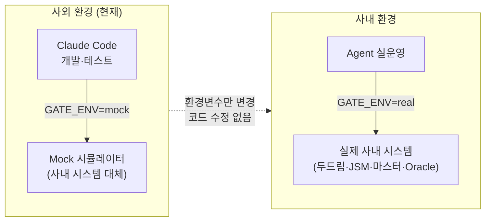

# T1-4. 게이트 Config 체계 설계 — 수행 가이드

> **과제**: 프로그램 개발 전주기 지원 AI Agent  
> **Task**: T1-4. 단계별 완료 조건 정의, Config 구조 설계  
> **현재 작업 환경**: 사외 (인터넷 자유, 사내 시스템 접속 불가)  
> **선행 조건**: T1-1 · T1-2 · T1-3 완료

---

## 1. 개요

### 1.1 목적

게이트(Gate)는 CR 처리의 각 단계가 **실제로 완료됐는지**를 확정적으로 검사하는 체계다.  
이 Task는 다음 세 가지를 완성한다.

| 산출물 | 역할 |
|--------|------|
| `config/gate_rules.yaml` | 8개 처리 단계의 완료 조건을 Config로 정의 |
| `src/gate/` 모듈 | Config를 읽어 AgentState를 검사하는 Rule Engine |
| `src/gate/mock/` 모듈 | 사내 시스템 없이 사외 환경에서 완전히 시뮬레이션 |

**핵심 설계 결정**: 게이트 판별은 **LLM에 위임하지 않는다**.  
모든 판별은 Config에 정의된 규칙으로만 처리한다. LLM은 미충족 항목의 안내 메시지 생성에만 사용한다.

### 1.2 이중 환경 전략 (사외 ↔ 사내)

```
환경변수 GATE_ENV 하나로 전체 동작 모드 전환

GATE_ENV=mock   → 사외 작업 환경 (현재)
                  사내 시스템 없이 Mock으로 완전 시뮬레이션
                  인터넷 연결만 있으면 Claude Code에서 즉시 실행 가능

GATE_ENV=real   → 사내 작업 환경
                  실제 사내 시스템 (두드림, JSM, 마스터, Oracle) 연동
                  Mock과 동일한 인터페이스, 코드 변경 없음
```



### 1.3 완료 기준 (Definition of Done)

- [ ] `config/gate_rules.yaml` — 8단계 × 완료 조건 전체 정의 완료
- [ ] `src/gate/engine.py` — Rule Engine 구현 및 단위 테스트 통과
- [ ] `src/gate/loader.py` — YAML 로더 (캐시 + 핫리로드) 구현
- [ ] `src/gate/mock/simulator.py` — Mock 시뮬레이터 구현
- [ ] `src/gate/mock/scenarios.py` — 시나리오 8종 이상 정의
- [ ] `scripts/gate_check_cli.py` — CLI 도구로 시나리오 실행 확인
- [ ] `tests/gate/` — 전체 테스트 통과 (`GATE_ENV=mock`)
- [ ] 사내 전환 절차 문서화 완료

---

## 2. 디렉토리 구조

```
dev-lifecycle-agent/
├── config/
│   ├── config.yaml
│   └── gate_rules.yaml          ← 핵심: 완료 조건 전체 정의
│
├── src/gate/
│   ├── __init__.py
│   ├── engine.py                ← Rule Engine (LLM 미사용)
│   ├── loader.py                ← YAML 로더 (캐시·핫리로드)
│   ├── validator.py             ← 개별 check_type 구현
│   ├── reporter.py              ← 결과 포매터 (CLI·로그용)
│   └── mock/
│       ├── __init__.py
│       ├── simulator.py         ← 사외 환경 핵심: 전체 흐름 시뮬레이션
│       └── scenarios.py         ← 시나리오별 AgentState 팩토리
│
├── scripts/
│   └── gate_check_cli.py        ← CLI 실행 도구
│
└── tests/gate/
    ├── test_engine.py
    ├── test_loader.py
    ├── test_validator.py
    └── test_scenarios.py
```

---

## 3. gate_rules.yaml — 완료 조건 전체 정의

8개 처리 단계 × 완료 조건을 Config로 정의한다.  
코드 수정 없이 이 파일만 편집하면 조건 추가·변경·비활성화가 가능하다.

```yaml
# config/gate_rules.yaml
# 버전 관리: 조건 변경 시 반드시 version 갱신
version: "1.2.0"
updated_at: "2026-06-24"
updated_by: "중공업IT파트"

# ── 전역 설정 ─────────────────────────────────────────────────
settings:
  max_gate_attempts: 3          # 게이트 최대 재시도 횟수 (초과 시 에스컬레이션)
  confidence_threshold: 0.5     # LLM 신뢰도 임계값 (미만 시 HITL)
  strict_mode: true             # true: required=true 규칙 1개라도 실패 시 전체 차단

# ── 단계별 게이트 규칙 ────────────────────────────────────────
# check_type 종류:
#   field_exists    : 필드가 None이 아님
#   field_not_empty : 필드가 빈 문자열/리스트/딕셔너리가 아님
#   min_length      : 문자열 최소 길이
#   list_not_empty  : 리스트가 비어있지 않음
#   list_max_count  : 리스트 길이 상한 (0이면 빈 리스트 = 통과)
#   bool_true       : 필드가 True
#   bool_false      : 필드가 False (또는 None)
#   dict_has_keys   : 딕셔너리가 지정 키를 모두 포함
#   numeric_gte     : 숫자 >= 기준값
#   numeric_lte     : 숫자 <= 기준값
#   one_of          : 필드 값이 허용 목록에 포함

gates:

  # ════════════════════════════════════════════════════
  # STEP 1: 요구사항 구체화 완료
  # ════════════════════════════════════════════════════
  - id: "REQ-001"
    step: "requirement"
    name: "요구사항 구체화 결과 존재"
    description: "요구사항 구체화 Skill이 실행되어 결과가 생성됨"
    required: true
    check_type: field_exists
    field: "requirement_result"

  - id: "REQ-002"
    step: "requirement"
    name: "구체화된 요구사항 최소 길이"
    description: "구체화된 요구사항 본문이 50자 이상"
    required: true
    check_type: min_length
    field: "requirement_result.structured_requirement"
    min_length: 50

  - id: "REQ-003"
    step: "requirement"
    name: "확인 질문 목록 생성"
    description: "담당자 확인이 필요한 질문이 1개 이상 생성됨"
    required: false          # 권고사항 (차단하지 않음)
    check_type: list_not_empty
    field: "requirement_result.clarification_questions"

  - id: "REQ-004"
    step: "requirement"
    name: "담당자 확인 완료"
    description: "요구사항 구체화 내용을 담당자가 확인·확정함 (HITL)"
    required: true
    check_type: bool_true
    field: "requirement_result.confirmed"

  # ════════════════════════════════════════════════════
  # STEP 2: 영향도 분석 완료
  # ════════════════════════════════════════════════════
  - id: "IMP-001"
    step: "impact_analysis"
    name: "영향도 분석 결과 존재"
    description: "영향도 분석 Skill이 실행되어 결과가 생성됨"
    required: true
    check_type: field_exists
    field: "impact_result"

  - id: "IMP-002"
    step: "impact_analysis"
    name: "영향 테이블 목록 확인"
    description: "영향받는 테이블 목록이 조회됨 (0건도 유효)"
    required: true
    check_type: field_exists
    field: "impact_result.affected_tables"

  - id: "IMP-003"
    step: "impact_analysis"
    name: "영향 프로그램 목록 확인"
    description: "영향받는 프로그램 목록이 조회됨"
    required: true
    check_type: field_exists
    field: "impact_result.affected_programs"

  - id: "IMP-004"
    step: "impact_analysis"
    name: "Oracle 정합성 이슈 없음"
    description: "Oracle 딕셔너리 정합성 이슈 0건 (이슈 있으면 차단)"
    required: true
    check_type: list_max_count
    field: "impact_result.oracle_consistency_issues"
    max_count: 0

  - id: "IMP-005"
    step: "impact_analysis"
    name: "영향도 요약 작성"
    description: "영향도 요약 텍스트가 존재함"
    required: false
    check_type: field_not_empty
    field: "impact_result.impact_summary"

  # ════════════════════════════════════════════════════
  # STEP 3: 공수 산정 완료
  # ════════════════════════════════════════════════════
  - id: "EST-001"
    step: "estimation"
    name: "공수 산정 결과 존재"
    description: "공수 산정 Skill이 실행되어 결과가 생성됨"
    required: true
    check_type: field_exists
    field: "estimation_result"

  - id: "EST-002"
    step: "estimation"
    name: "추정 공수 양수"
    description: "총 개발 시간 추정값이 0보다 큼"
    required: true
    check_type: numeric_gte
    field: "estimation_result.estimated_hours"
    threshold: 0.1

  - id: "EST-003"
    step: "estimation"
    name: "공수 산정 근거 존재"
    description: "산정 근거 유사 CR이 1건 이상 참조됨"
    required: false
    check_type: list_not_empty
    field: "estimation_result.basis_cr_ids"

  # ════════════════════════════════════════════════════
  # STEP 4: Task 분해 완료
  # ════════════════════════════════════════════════════
  - id: "TASK-001"
    step: "task_breakdown"
    name: "Task 목록 생성"
    description: "단위 Task가 1개 이상 도출됨"
    required: true
    check_type: list_not_empty
    field: "task_breakdown_result.tasks"

  # ════════════════════════════════════════════════════
  # STEP 5: 산출물 초안 생성 완료
  # ════════════════════════════════════════════════════
  - id: "ART-001"
    step: "artifact"
    name: "요구사항 분석서 초안 생성"
    description: "요구사항 분석서 초안이 생성됨"
    required: true
    check_type: field_not_empty
    field: "artifact_result.requirement_doc"

  - id: "ART-002"
    step: "artifact"
    name: "영향도 분석서 초안 생성"
    description: "영향도 분석서 초안이 생성됨"
    required: true
    check_type: field_not_empty
    field: "artifact_result.impact_doc"

  - id: "ART-003"
    step: "artifact"
    name: "테스트 정의서 초안 생성"
    description: "테스트 정의서 초안이 생성됨"
    required: true
    check_type: field_not_empty
    field: "artifact_result.test_definition_doc"

  - id: "ART-004"
    step: "artifact"
    name: "산출물 담당자 확인 완료"
    description: "생성된 산출물 초안을 담당자가 검토·확인함 (HITL ①)"
    required: true
    check_type: bool_true
    field: "artifact_result.confirmed"

  # ════════════════════════════════════════════════════
  # STEP 6: 시스템 등록 지원 완료
  # ════════════════════════════════════════════════════
  - id: "REG-001"
    step: "registration"
    name: "JSM 등록 초안 생성"
    description: "JSM 변경 등록 입력값 초안이 생성됨"
    required: true
    check_type: field_exists
    field: "registration_result.jsm_draft"

  - id: "REG-002"
    step: "registration"
    name: "프로그램마스터 초안 생성"
    description: "프로그램마스터 등록 입력값 초안이 생성됨"
    required: true
    check_type: field_exists
    field: "registration_result.program_master_draft"

  - id: "REG-003"
    step: "registration"
    name: "미등록 용어 처리"
    description: "미등록 용어가 없거나, 있으면 등록 초안이 생성됨"
    required: true
    check_type: field_exists
    field: "registration_result.unregistered_terms"

  # ════════════════════════════════════════════════════
  # STEP 7: 게이트 통과 (관리 포인트 최종 확인)
  # 위 REQ ~ REG 규칙이 모두 통과해야 이 단계에 도달
  # ════════════════════════════════════════════════════
  - id: "GATE-001"
    step: "gate_check"
    name: "전체 필수 규칙 통과"
    description: "required=true 규칙이 모두 충족됨"
    required: true
    check_type: bool_true
    field: "_all_required_passed"   # 엔진 내부 집계값

  # ════════════════════════════════════════════════════
  # STEP 8: 배포 준비 완료
  # ════════════════════════════════════════════════════
  - id: "DEP-001"
    step: "deploy"
    name: "PR 본문 초안 생성"
    description: "GitHub PR 본문 초안이 생성됨"
    required: true
    check_type: field_not_empty
    field: "deploy_result.pr_body_draft"

  - id: "DEP-002"
    step: "deploy"
    name: "현업 테스트 요청 메일 초안 생성"
    description: "현업 테스트 요청 메일 초안이 생성됨"
    required: true
    check_type: field_not_empty
    field: "deploy_result.test_request_mail_draft"

  - id: "DEP-003"
    step: "deploy"
    name: "Release 첨부물 3종 완비"
    description: "요구사항 분석서·테스트 정의서·현업 확인 메일 모두 준비됨"
    required: true
    check_type: bool_true
    field: "deploy_result.all_attachments_ready"

  - id: "DEP-004"
    step: "deploy"
    name: "배포 담당자 최종 승인"
    description: "PR 발행·Release 상신을 담당자가 최종 승인함 (HITL ③)"
    required: true
    check_type: field_not_empty
    field: "deploy_result.pr_url"
```

---

## 4. Gate Loader — YAML 로더 (캐시·핫리로드)

```python
# src/gate/loader.py
from __future__ import annotations
import os
import time
import yaml
import threading
from pathlib import Path
from typing import Dict, List, Any, Optional


class GateRulesLoader:
    """
    gate_rules.yaml 로더.
    - 파일 변경 감지 후 자동 리로드 (핫리로드)
    - 스레드 세이프 캐시
    - 사외 환경에서 기본 config 경로 자동 탐색
    """

    _instance: Optional["GateRulesLoader"] = None
    _lock = threading.Lock()

    def __new__(cls, config_path: Optional[str] = None):
        with cls._lock:
            if cls._instance is None:
                cls._instance = super().__new__(cls)
                cls._instance._initialized = False
        return cls._instance

    def __init__(self, config_path: Optional[str] = None):
        if self._initialized:
            return
        self._config_path = Path(config_path or self._find_config())
        self._cache: Optional[Dict[str, Any]] = None
        self._last_mtime: float = 0.0
        self._initialized = True

    @staticmethod
    def _find_config() -> str:
        """프로젝트 루트에서 config/gate_rules.yaml 자동 탐색"""
        candidates = [
            "config/gate_rules.yaml",
            "../config/gate_rules.yaml",
            os.path.join(os.path.dirname(__file__), "../../config/gate_rules.yaml"),
        ]
        for path in candidates:
            if Path(path).exists():
                return path
        # 파일 없으면 기본 경로 반환 (최초 생성 전)
        return "config/gate_rules.yaml"

    def load(self, force_reload: bool = False) -> Dict[str, Any]:
        """
        gate_rules.yaml 로드 (변경 시 자동 리로드).
        파일이 없으면 기본 Config 반환.
        """
        with self._lock:
            try:
                mtime = self._config_path.stat().st_mtime
            except FileNotFoundError:
                return self._default_config()

            if force_reload or self._cache is None or mtime > self._last_mtime:
                with open(self._config_path, encoding="utf-8") as f:
                    self._cache = yaml.safe_load(f)
                self._last_mtime = mtime

            return self._cache

    def get_rules(self, step: Optional[str] = None) -> List[Dict[str, Any]]:
        """게이트 규칙 목록 반환. step 지정 시 해당 단계 규칙만"""
        config = self.load()
        rules = config.get("gates", [])
        if step:
            rules = [r for r in rules if r.get("step") == step]
        return rules

    def get_settings(self) -> Dict[str, Any]:
        return self.load().get("settings", {})

    def get_version(self) -> str:
        return self.load().get("version", "unknown")

    def reload(self) -> str:
        """강제 리로드 후 버전 반환"""
        config = self.load(force_reload=True)
        return config.get("version", "unknown")

    @staticmethod
    def _default_config() -> Dict[str, Any]:
        """gate_rules.yaml 미생성 시 사용할 최소 기본 Config"""
        return {
            "version": "0.0.0-default",
            "settings": {
                "max_gate_attempts": 3,
                "confidence_threshold": 0.5,
                "strict_mode": True,
            },
            "gates": [],
        }
```

---

## 5. Gate Validator — check_type별 구현

```python
# src/gate/validator.py
from __future__ import annotations
from typing import Any, Dict, Optional


def evaluate_rule(rule: Dict[str, Any], state: Dict[str, Any]) -> tuple[bool, str]:
    """
    단일 규칙을 AgentState에 적용하여 통과 여부와 이유를 반환.

    Returns:
        (passed: bool, reason: str)
    """
    check_type = rule.get("check_type", "")
    field      = rule.get("field", "")

    # 특수 필드: 엔진 내부 집계값
    if field == "_all_required_passed":
        return True, "엔진 내부 집계 — GateEngine에서 처리"

    value = _get_nested(state, field)

    # ── check_type별 처리 ────────────────────────────────────

    if check_type == "field_exists":
        passed = value is not None
        reason = f"필드 '{field}' 존재함" if passed else f"필드 '{field}'가 None"
        return passed, reason

    if check_type == "field_not_empty":
        passed = value is not None and value != "" and value != [] and value != {}
        reason = f"필드 '{field}' 값 있음" if passed else f"필드 '{field}'가 비어있음"
        return passed, reason

    if check_type == "min_length":
        min_len = rule.get("min_length", 0)
        actual  = len(str(value)) if value is not None else 0
        passed  = actual >= min_len
        reason  = f"길이 {actual}자 (최소 {min_len}자)" if passed else f"길이 부족: {actual}자 < {min_len}자"
        return passed, reason

    if check_type == "list_not_empty":
        passed = isinstance(value, list) and len(value) > 0
        count  = len(value) if isinstance(value, list) else 0
        reason = f"목록 {count}건" if passed else f"목록이 비어있음 ({count}건)"
        return passed, reason

    if check_type == "list_max_count":
        max_count = rule.get("max_count", 0)
        count     = len(value) if isinstance(value, list) else (0 if value is None else 1)
        passed    = count <= max_count
        reason    = f"항목 {count}건 (최대 {max_count}건 허용)" if passed \
                    else f"항목 초과: {count}건 > {max_count}건"
        return passed, reason

    if check_type == "bool_true":
        passed = bool(value) is True
        reason = "True 확인" if passed else f"True가 아님 (현재값: {value})"
        return passed, reason

    if check_type == "bool_false":
        passed = not bool(value)
        reason = "False/None 확인" if passed else f"False가 아님 (현재값: {value})"
        return passed, reason

    if check_type == "dict_has_keys":
        required_keys = rule.get("required_keys", [])
        if not isinstance(value, dict):
            return False, f"딕셔너리가 아님 (타입: {type(value).__name__})"
        missing = [k for k in required_keys if k not in value]
        passed  = len(missing) == 0
        reason  = f"필수 키 모두 존재: {required_keys}" if passed \
                  else f"누락된 키: {missing}"
        return passed, reason

    if check_type == "numeric_gte":
        threshold = rule.get("threshold", 0)
        try:
            passed = float(value or 0) >= threshold
            reason = f"값 {value} >= {threshold}" if passed else f"값 부족: {value} < {threshold}"
        except (TypeError, ValueError):
            passed, reason = False, f"숫자 변환 불가: {value}"
        return passed, reason

    if check_type == "numeric_lte":
        threshold = rule.get("threshold", 0)
        try:
            passed = float(value or 0) <= threshold
            reason = f"값 {value} <= {threshold}" if passed else f"값 초과: {value} > {threshold}"
        except (TypeError, ValueError):
            passed, reason = False, f"숫자 변환 불가: {value}"
        return passed, reason

    if check_type == "one_of":
        allowed = rule.get("allowed_values", [])
        passed  = value in allowed
        reason  = f"허용값 '{value}'" if passed else f"허용되지 않는 값: '{value}' (허용: {allowed})"
        return passed, reason

    return False, f"알 수 없는 check_type: '{check_type}'"


def _get_nested(obj: Any, path: str) -> Any:
    """점(.) 구분 경로로 중첩 구조에서 값 추출. dataclass·dict 모두 지원."""
    if not path:
        return obj
    parts   = path.split(".")
    current = obj
    for part in parts:
        if current is None:
            return None
        if isinstance(current, dict):
            current = current.get(part)
        elif hasattr(current, part):
            current = getattr(current, part)
        else:
            return None
    return current
```

---

## 6. Gate Engine — Rule Engine 핵심

```python
# src/gate/engine.py
from __future__ import annotations
from dataclasses import dataclass, field
from typing import Any, Dict, List, Optional
import datetime
import logging

from src.gate.loader import GateRulesLoader
from src.gate.validator import evaluate_rule
from src.gate.reporter import GateReporter

logger = logging.getLogger(__name__)


@dataclass
class RuleCheckResult:
    """단일 규칙 검사 결과"""
    rule_id:     str
    rule_name:   str
    step:        str
    passed:      bool
    required:    bool
    reason:      str
    check_type:  str
    field:       str


@dataclass
class GateCheckResult:
    """전체 게이트 검사 결과"""
    passed:       bool
    version:      str
    checked_at:   str
    total_rules:  int
    passed_rules: List[RuleCheckResult] = field(default_factory=list)
    failed_rules: List[RuleCheckResult] = field(default_factory=list)
    warning_rules: List[RuleCheckResult] = field(default_factory=list)  # required=false 실패

    @property
    def failed_required(self) -> List[RuleCheckResult]:
        return [r for r in self.failed_rules if r.required]

    @property
    def summary(self) -> str:
        total   = self.total_rules
        passed  = len(self.passed_rules)
        failed  = len(self.failed_required)
        warning = len(self.warning_rules)
        status  = "✅ 통과" if self.passed else "❌ 차단"
        return (
            f"{status} | 전체 {total}개 규칙 | "
            f"통과 {passed}개 | 필수 실패 {failed}개 | 권고 미충족 {warning}개"
        )


class GateEngine:
    """
    Config 기반 게이트 Rule Engine.

    ⚠️  핵심 원칙:
    - LLM 호출 금지 — 모든 판별은 validator.py의 확정적 로직으로만 처리
    - 규칙 변경은 gate_rules.yaml 편집으로만 — 코드 수정 불필요
    - required=true 규칙 1개 이상 실패 시 passed=False 반환
    """

    def __init__(self, config_path: Optional[str] = None):
        self._loader   = GateRulesLoader(config_path)
        self._reporter = GateReporter()

    def check(self, state: Dict[str, Any], step: Optional[str] = None) -> GateCheckResult:
        """
        AgentState 전체(또는 특정 step)에 대해 게이트 규칙 검사.

        Args:
            state: AgentState dict
            step:  None이면 전체 규칙, 지정하면 해당 step 규칙만

        Returns:
            GateCheckResult
        """
        rules    = self._loader.get_rules(step=step)
        settings = self._loader.get_settings()
        version  = self._loader.get_version()

        passed_rules:  List[RuleCheckResult] = []
        failed_rules:  List[RuleCheckResult] = []
        warning_rules: List[RuleCheckResult] = []

        for rule in rules:
            rule_id    = rule.get("id", "UNKNOWN")
            rule_name  = rule.get("name", "")
            rule_step  = rule.get("step", "")
            required   = rule.get("required", True)
            check_type = rule.get("check_type", "")
            field_path = rule.get("field", "")

            try:
                passed, reason = evaluate_rule(rule, state)
            except Exception as e:
                logger.error(f"규칙 평가 예외: {rule_id} — {e}")
                passed, reason = False, f"평가 오류: {e}"

            result = RuleCheckResult(
                rule_id    = rule_id,
                rule_name  = rule_name,
                step       = rule_step,
                passed     = passed,
                required   = required,
                reason     = reason,
                check_type = check_type,
                field      = field_path,
            )

            if passed:
                passed_rules.append(result)
            elif required:
                failed_rules.append(result)
                logger.warning(f"게이트 필수 규칙 실패: [{rule_id}] {rule_name} — {reason}")
            else:
                warning_rules.append(result)
                logger.info(f"게이트 권고 미충족: [{rule_id}] {rule_name} — {reason}")

        # strict_mode: required=true 하나라도 실패 시 전체 차단
        strict_mode   = settings.get("strict_mode", True)
        overall_passed = len(failed_rules) == 0 if strict_mode else True

        return GateCheckResult(
            passed        = overall_passed,
            version       = version,
            checked_at    = datetime.datetime.now().isoformat(),
            total_rules   = len(rules),
            passed_rules  = passed_rules,
            failed_rules  = failed_rules,
            warning_rules = warning_rules,
        )

    def check_step(self, state: Dict[str, Any], step: str) -> GateCheckResult:
        """특정 단계의 규칙만 검사"""
        return self.check(state, step=step)

    def get_failed_guidance(self, result: GateCheckResult) -> str:
        """
        미충족 항목에 대한 담당자 안내 메시지 생성.
        (LLM 없이 rule_name과 description만으로 구성)
        """
        return self._reporter.format_failed_guidance(result)

    def reload_config(self) -> str:
        """gate_rules.yaml 강제 리로드. 반환값: 새 버전"""
        return self._loader.reload()
```

---

## 7. Gate Reporter — 결과 포매터

```python
# src/gate/reporter.py
from __future__ import annotations
from typing import TYPE_CHECKING

if TYPE_CHECKING:
    from src.gate.engine import GateCheckResult


class GateReporter:
    """게이트 결과를 다양한 형식으로 출력하는 포매터"""

    def format_summary(self, result: "GateCheckResult") -> str:
        """한 줄 요약"""
        return result.summary

    def format_failed_guidance(self, result: "GateCheckResult") -> str:
        """미충족 필수 규칙 안내 메시지 (담당자용)"""
        if result.passed:
            return "✅ 모든 필수 조건이 충족되었습니다."

        lines = ["❌ 다음 항목을 처리한 후 게이트를 재검사하세요.\n"]
        for i, rule in enumerate(result.failed_required, 1):
            lines.append(f"  [{i}] {rule.rule_name}")
            lines.append(f"       → {rule.reason}")
            lines.append(f"       (규칙 ID: {rule.rule_id})\n")

        if result.warning_rules:
            lines.append("⚠️  권고 미충족 항목 (차단하지 않음):")
            for rule in result.warning_rules:
                lines.append(f"  - {rule.rule_name}: {rule.reason}")

        return "\n".join(lines)

    def format_detail(self, result: "GateCheckResult") -> str:
        """전체 규칙 상세 결과"""
        lines = [
            f"게이트 검사 결과 v{result.version}",
            f"검사 시각: {result.checked_at}",
            f"전체: {result.summary}",
            "",
            "── 통과 규칙 ──",
        ]
        for r in result.passed_rules:
            lines.append(f"  ✅ [{r.rule_id}] {r.rule_name}")
        lines.append("")
        lines.append("── 실패 규칙 ──")
        for r in result.failed_required:
            req = "필수" if r.required else "권고"
            lines.append(f"  ❌ [{r.rule_id}][{req}] {r.rule_name}")
            lines.append(f"      {r.reason}")
        if result.warning_rules:
            lines.append("")
            lines.append("── 권고 미충족 ──")
            for r in result.warning_rules:
                lines.append(f"  ⚠️  [{r.rule_id}] {r.rule_name}: {r.reason}")
        return "\n".join(lines)

    def format_json(self, result: "GateCheckResult") -> dict:
        """API 응답용 JSON 구조"""
        return {
            "passed":      result.passed,
            "version":     result.version,
            "checked_at":  result.checked_at,
            "summary":     result.summary,
            "failed":      [
                {"id": r.rule_id, "name": r.rule_name, "reason": r.reason}
                for r in result.failed_required
            ],
            "warnings":    [
                {"id": r.rule_id, "name": r.rule_name, "reason": r.reason}
                for r in result.warning_rules
            ],
        }
```

---

## 8. Mock 시뮬레이터 — 사외 환경 핵심

사외 환경에서 사내 시스템 없이 게이트 전체 흐름을 시뮬레이션한다.

```python
# src/gate/mock/simulator.py
from __future__ import annotations
from typing import Any, Dict, Optional
import os

from src.gate.engine import GateEngine, GateCheckResult
from src.gate.mock.scenarios import MockScenarioFactory, Scenario


class GateMockSimulator:
    """
    사외 환경 게이트 Mock 시뮬레이터.

    GATE_ENV=mock 일 때 GateEngine 대신 이 시뮬레이터를 사용.
    실제 GateEngine을 내부적으로 호출하되, State를 Mock 시나리오로 채워서 전달.

    사용 예:
        sim = GateMockSimulator()

        # 시나리오 실행
        result = sim.run_scenario(Scenario.ALL_PASS)
        print(result.summary)

        # 특정 시나리오 단계별 실행
        result = sim.run_scenario(Scenario.MISSING_PROGRAM_MASTER, step="registration")
    """

    def __init__(self, config_path: Optional[str] = None):
        self._engine   = GateEngine(config_path)
        self._factory  = MockScenarioFactory()

    def run_scenario(
        self,
        scenario: "Scenario",
        step: Optional[str] = None,
    ) -> GateCheckResult:
        """시나리오 이름으로 Mock State 생성 후 게이트 검사"""
        state = self._factory.build(scenario)
        return self._engine.check(state, step=step)

    def run_all_scenarios(self) -> Dict[str, GateCheckResult]:
        """모든 시나리오 일괄 실행"""
        results = {}
        for scenario in Scenario:
            try:
                results[scenario.value] = self.run_scenario(scenario)
            except Exception as e:
                print(f"⚠️  시나리오 오류: {scenario.value} — {e}")
        return results

    def interactive_demo(self) -> None:
        """CLI 대화형 데모 — 시나리오 선택 후 결과 출력"""
        from src.gate.reporter import GateReporter
        reporter = GateReporter()

        print("\n" + "="*60)
        print("  게이트 Config 체계 Mock 시뮬레이터")
        print("  GATE_ENV=mock | 사외 환경용")
        print("="*60)

        scenarios_list = list(Scenario)
        for i, s in enumerate(scenarios_list, 1):
            print(f"  [{i:2d}] {s.value}")
        print("  [ 0] 전체 시나리오 일괄 실행")
        print("  [ q] 종료")

        while True:
            choice = input("\n시나리오 번호 입력: ").strip()
            if choice == "q":
                break
            if choice == "0":
                results = self.run_all_scenarios()
                print("\n── 전체 시나리오 결과 ──")
                for name, result in results.items():
                    icon = "✅" if result.passed else "❌"
                    print(f"  {icon} {name}")
                continue
            try:
                idx = int(choice) - 1
                scenario = scenarios_list[idx]
                result = self.run_scenario(scenario)
                print(f"\n{reporter.format_detail(result)}")
                if not result.passed:
                    print(f"\n{reporter.format_failed_guidance(result)}")
            except (ValueError, IndexError):
                print("올바른 번호를 입력하세요.")


def get_gate_engine() -> GateEngine:
    """
    환경변수 GATE_ENV에 따라 실/Mock 게이트 엔진 반환.
    Skill s07_gate.py에서 이 함수를 호출.
    """
    gate_env = os.getenv("GATE_ENV", "mock").lower()
    if gate_env == "mock":
        # Mock 시뮬레이터가 내부적으로 실제 GateEngine을 사용
        return GateMockSimulator()._engine
    # real: 동일한 GateEngine (실 State가 들어오면 실제 판별)
    return GateEngine()
```

---

## 9. Mock 시나리오 정의

사외 환경에서 검증할 8가지 대표 시나리오를 정의한다.

```python
# src/gate/mock/scenarios.py
from __future__ import annotations
from enum import Enum
from typing import Any, Dict
import datetime


class Scenario(str, Enum):
    ALL_PASS                 = "all_pass"               # 모든 조건 충족 → 게이트 통과
    MISSING_REQUIREMENT      = "missing_requirement"    # 요구사항 미완료
    SHORT_REQUIREMENT        = "short_requirement"      # 요구사항 길이 부족
    ORACLE_ISSUE             = "oracle_issue"           # Oracle 정합성 이슈
    MISSING_ARTIFACT         = "missing_artifact"       # 산출물 미생성
    ARTIFACT_NOT_CONFIRMED   = "artifact_not_confirmed" # 산출물 담당자 미확인
    MISSING_PROGRAM_MASTER   = "missing_program_master" # 프로그램마스터 초안 미생성
    DEPLOY_NOT_READY         = "deploy_not_ready"       # 배포 준비 미완료


class MockScenarioFactory:
    """시나리오 이름에 따라 Mock AgentState dict 생성"""

    def build(self, scenario: Scenario) -> Dict[str, Any]:
        builder = getattr(self, f"_build_{scenario.value.replace('-', '_')}", None)
        if builder is None:
            raise ValueError(f"알 수 없는 시나리오: {scenario}")
        return builder()

    # ── 공통 완전 완료 State ─────────────────────────────────

    @staticmethod
    def _full_state() -> Dict[str, Any]:
        """모든 단계가 완료된 기준 State"""

        class _Obj:
            """dict를 속성 접근으로 사용하기 위한 헬퍼"""
            def __init__(self, **kwargs):
                for k, v in kwargs.items():
                    setattr(self, k, v)
            def get(self, key, default=None):
                return getattr(self, key, default)

        return {
            "cr_id":   "CR-2026-MOCK-001",
            "cr_type": "new_dev",

            "requirement_result": _Obj(
                structured_requirement="선박 수주 현황 조회 화면 개발. 수주번호, 선박명, 발주처, 납기일 기본 정보를 표시하며 부서별 필터 기능을 제공한다.",
                clarification_questions=["납기일 기준이 계약일인지 실제 납기일인지 확인 필요", "부서 코드 체계 확인 필요"],
                similar_cr_ids=["CR-2026-0312", "CR-2025-0198"],
                related_docs=["https://confluence.internal/pages/12345"],
                confirmed=True,
            ),

            "impact_result": _Obj(
                affected_tables=["SHIP_ORDER", "DEPT_MASTER"],
                affected_programs=["PKG_SHIP_ORDER", "V_SHIP_STATUS"],
                has_db_schema_change=False,
                oracle_consistency_issues=[],   # 이슈 없음
                impact_summary="SHIP_ORDER 테이블 조회, DEPT_MASTER 필터 조건 추가. 기존 PKG_SHIP_ORDER 패키지 재사용 가능.",
            ),

            "estimation_result": _Obj(
                estimated_screens=2,
                estimated_hours=24.0,
                db_extra_hours=0.0,
                basis_cr_ids=["CR-2026-0312"],
                confidence="medium",
                breakdown={"분석": 4.0, "개발": 16.0, "테스트": 4.0},
            ),

            "task_breakdown_result": _Obj(
                tasks=[
                    {"id": "T1", "title": "요구사항 분석서 작성", "done": False},
                    {"id": "T2", "title": "화면 설계", "done": False},
                    {"id": "T3", "title": "코드 개발", "done": False},
                    {"id": "T4", "title": "단위 테스트", "done": False},
                ],
                checklist_url="https://confluence.internal/pages/99999",
            ),

            "artifact_result": _Obj(
                requirement_doc="# 요구사항 분석서\n## 개요\n선박 수주 현황 조회 화면...",
                impact_doc="# 영향도 분석서\n## 영향 테이블\n- SHIP_ORDER: 조회 전용...",
                test_definition_doc="# 테스트 정의서\n## 테스트 케이스\nTC-001: 수주 목록 조회...",
                confluence_pages={"requirement": "https://conf/123", "impact": "https://conf/124"},
                confirmed=True,
            ),

            "registration_result": _Obj(
                jsm_draft={"summary": "[NEW_DEV] 선박 수주 현황 조회", "issuetype": "새 기능"},
                program_master_draft={"program_id": "SHI_SHIP_ORDER_01", "program_name": "선박 수주 현황 조회"},
                table_master_drafts=[],
                unregistered_terms=["납기일"],
                term_drafts=[{"term_ko": "납기일", "term_en": "delivery_date"}],
            ),

            "gate_result": None,

            "deploy_result": _Obj(
                pr_body_draft="## 변경 개요\n선박 수주 현황 조회 화면 신규 개발...",
                test_request_mail_draft="안녕하세요. 현업 테스트 요청드립니다...",
                release_checklist={"요구사항 분석서": True, "테스트 정의서": True, "현업 확인 메일": True},
                all_attachments_ready=True,
                pr_url="https://github.internal/org/shic-app/pull/42",
            ),
        }

    # ── 시나리오별 State ─────────────────────────────────────

    def _build_all_pass(self) -> Dict[str, Any]:
        """모든 조건 충족 — 게이트 통과"""
        return self._full_state()

    def _build_missing_requirement(self) -> Dict[str, Any]:
        """요구사항 구체화 미실행"""
        state = self._full_state()
        state["requirement_result"] = None   # Skill 미실행
        return state

    def _build_short_requirement(self) -> Dict[str, Any]:
        """요구사항 길이 부족 (50자 미만)"""
        state = self._full_state()
        state["requirement_result"].structured_requirement = "선박 수주 조회"  # 9자
        return state

    def _build_oracle_issue(self) -> Dict[str, Any]:
        """Oracle 정합성 이슈 발생"""
        state = self._full_state()
        state["impact_result"].oracle_consistency_issues = [
            "SHIP_ORDER 테이블: 테이블마스터 미등록",
            "DEPT_MASTER 테이블: Oracle 컬럼 수 불일치",
        ]
        return state

    def _build_missing_artifact(self) -> Dict[str, Any]:
        """산출물 초안 미생성"""
        state = self._full_state()
        state["artifact_result"].impact_doc = None          # 영향도 분석서 미생성
        state["artifact_result"].test_definition_doc = None # 테스트 정의서 미생성
        state["artifact_result"].confirmed = False
        return state

    def _build_artifact_not_confirmed(self) -> Dict[str, Any]:
        """산출물 생성됐으나 담당자 미확인"""
        state = self._full_state()
        state["artifact_result"].confirmed = False  # HITL 미완료
        return state

    def _build_missing_program_master(self) -> Dict[str, Any]:
        """프로그램마스터 등록 초안 미생성"""
        state = self._full_state()
        state["registration_result"].program_master_draft = None
        return state

    def _build_deploy_not_ready(self) -> Dict[str, Any]:
        """배포 준비 미완료"""
        state = self._full_state()
        state["deploy_result"].all_attachments_ready = False
        state["deploy_result"].pr_url = None
        return state
```

---

## 10. CLI 실행 도구

Claude Code에서 바로 실행 가능한 CLI 도구다.

```python
# scripts/gate_check_cli.py
#!/usr/bin/env python3
"""
게이트 Config 체계 CLI 도구.
사외 환경에서 Mock으로 전체 시나리오를 실행하고 결과를 확인한다.

사용법:
    # 대화형 데모
    python scripts/gate_check_cli.py

    # 특정 시나리오 실행
    python scripts/gate_check_cli.py --scenario all_pass
    python scripts/gate_check_cli.py --scenario oracle_issue

    # 전체 시나리오 일괄 실행
    python scripts/gate_check_cli.py --all

    # 특정 step 규칙만 검사
    python scripts/gate_check_cli.py --scenario all_pass --step artifact

    # Config 리로드 후 버전 확인
    python scripts/gate_check_cli.py --reload

    # 현재 gate_rules.yaml 규칙 목록 출력
    python scripts/gate_check_cli.py --list-rules
"""
import argparse
import os
import sys

# 프로젝트 루트를 Python 경로에 추가
sys.path.insert(0, os.path.join(os.path.dirname(__file__), ".."))
os.environ.setdefault("GATE_ENV", "mock")
os.environ.setdefault("USE_MOCK_CONNECTORS", "true")


def main():
    parser = argparse.ArgumentParser(
        description="게이트 Config 체계 CLI 도구 (사외 Mock 환경)",
        formatter_class=argparse.RawDescriptionHelpFormatter,
        epilog=__doc__,
    )
    parser.add_argument("--scenario", "-s", type=str, help="실행할 시나리오 이름")
    parser.add_argument("--step",     "-t", type=str, help="검사할 단계 (생략 시 전체)")
    parser.add_argument("--all",      "-a", action="store_true", help="전체 시나리오 일괄 실행")
    parser.add_argument("--reload",   "-r", action="store_true", help="Config 리로드")
    parser.add_argument("--list-rules", "-l", action="store_true", help="규칙 목록 출력")
    parser.add_argument("--detail",   "-d", action="store_true", help="상세 결과 출력")
    args = parser.parse_args()

    from src.gate.mock.simulator import GateMockSimulator
    from src.gate.mock.scenarios import Scenario
    from src.gate.loader import GateRulesLoader
    from src.gate.reporter import GateReporter

    sim      = GateMockSimulator()
    loader   = GateRulesLoader()
    reporter = GateReporter()

    # ── Config 리로드 ────────────────────────────────────────
    if args.reload:
        version = loader.reload()
        print(f"✅ Config 리로드 완료 — 버전: {version}")
        return

    # ── 규칙 목록 출력 ───────────────────────────────────────
    if args.list_rules:
        rules = loader.get_rules(step=args.step)
        step_label = f"[{args.step}]" if args.step else "[전체]"
        print(f"\n게이트 규칙 목록 {step_label} (v{loader.get_version()})\n")
        current_step = None
        for rule in rules:
            if rule.get("step") != current_step:
                current_step = rule.get("step")
                print(f"\n── {current_step} ──")
            req   = "필수" if rule.get("required", True) else "권고"
            print(f"  [{rule['id']}][{req}] {rule['name']}")
            print(f"    check_type: {rule['check_type']}  field: {rule['field']}")
        return

    # ── 전체 시나리오 실행 ───────────────────────────────────
    if args.all:
        results = sim.run_all_scenarios()
        print(f"\n{'='*60}")
        print(f"  전체 시나리오 결과 (v{loader.get_version()})")
        print(f"{'='*60}")
        pass_count = sum(1 for r in results.values() if r.passed)
        for name, result in results.items():
            icon = "✅" if result.passed else "❌"
            failed_ids = [r.rule_id for r in result.failed_required]
            suffix = f"  (실패 규칙: {failed_ids})" if failed_ids else ""
            print(f"  {icon} {name}{suffix}")
        print(f"\n{'='*60}")
        print(f"  통과: {pass_count}/{len(results)}")
        return

    # ── 특정 시나리오 실행 ───────────────────────────────────
    if args.scenario:
        try:
            scenario = Scenario(args.scenario)
        except ValueError:
            valid = [s.value for s in Scenario]
            print(f"❌ 알 수 없는 시나리오: '{args.scenario}'")
            print(f"   사용 가능: {valid}")
            sys.exit(1)

        result = sim.run_scenario(scenario, step=args.step)
        step_label = f" [step={args.step}]" if args.step else ""
        print(f"\n시나리오: {scenario.value}{step_label}")
        print(f"Config 버전: {result.version}")
        print(f"\n{reporter.format_summary(result)}")

        if args.detail or not result.passed:
            print(f"\n{reporter.format_detail(result)}")
        if not result.passed:
            print(f"\n{reporter.format_failed_guidance(result)}")
        return

    # ── 기본: 대화형 데모 ────────────────────────────────────
    sim.interactive_demo()


if __name__ == "__main__":
    main()
```

---

## 11. 전체 테스트

```python
# tests/gate/test_engine.py
"""
게이트 Rule Engine 전체 테스트.
GATE_ENV=mock으로 실행 — 사내 시스템 연결 불필요.
"""
import os
import pytest

os.environ["GATE_ENV"] = "mock"
os.environ["USE_MOCK_CONNECTORS"] = "true"

from src.gate.engine import GateEngine, GateCheckResult
from src.gate.mock.simulator import GateMockSimulator
from src.gate.mock.scenarios import MockScenarioFactory, Scenario


@pytest.fixture
def engine():
    return GateEngine()


@pytest.fixture
def sim():
    return GateMockSimulator()


@pytest.fixture
def factory():
    return MockScenarioFactory()


# ── 시나리오 기반 통합 테스트 ──────────────────────────────────

def test_scenario_all_pass(sim):
    result = sim.run_scenario(Scenario.ALL_PASS)
    assert result.passed, f"전체 통과 시나리오에서 실패: {[r.rule_id for r in result.failed_required]}"
    print(f"✅ all_pass: {result.summary}")


def test_scenario_missing_requirement(sim):
    result = sim.run_scenario(Scenario.MISSING_REQUIREMENT)
    assert not result.passed
    failed_ids = [r.rule_id for r in result.failed_required]
    assert "REQ-001" in failed_ids, f"REQ-001 실패 예상, 실제: {failed_ids}"
    print(f"✅ missing_requirement: {result.summary}")


def test_scenario_short_requirement(sim):
    result = sim.run_scenario(Scenario.SHORT_REQUIREMENT)
    assert not result.passed
    failed_ids = [r.rule_id for r in result.failed_required]
    assert "REQ-002" in failed_ids, f"REQ-002 실패 예상, 실제: {failed_ids}"
    print(f"✅ short_requirement: {result.summary}")


def test_scenario_oracle_issue(sim):
    result = sim.run_scenario(Scenario.ORACLE_ISSUE)
    assert not result.passed
    failed_ids = [r.rule_id for r in result.failed_required]
    assert "IMP-004" in failed_ids, f"IMP-004 실패 예상, 실제: {failed_ids}"
    print(f"✅ oracle_issue: {result.summary}")


def test_scenario_missing_artifact(sim):
    result = sim.run_scenario(Scenario.MISSING_ARTIFACT)
    assert not result.passed
    failed_ids = [r.rule_id for r in result.failed_required]
    assert any(r.startswith("ART-") for r in failed_ids), f"ART-* 실패 예상, 실제: {failed_ids}"
    print(f"✅ missing_artifact: {result.summary}")


def test_scenario_artifact_not_confirmed(sim):
    result = sim.run_scenario(Scenario.ARTIFACT_NOT_CONFIRMED)
    assert not result.passed
    failed_ids = [r.rule_id for r in result.failed_required]
    assert "ART-004" in failed_ids, f"ART-004 실패 예상 (HITL 미완료), 실제: {failed_ids}"
    print(f"✅ artifact_not_confirmed: {result.summary}")


def test_scenario_missing_program_master(sim):
    result = sim.run_scenario(Scenario.MISSING_PROGRAM_MASTER)
    assert not result.passed
    failed_ids = [r.rule_id for r in result.failed_required]
    assert "REG-002" in failed_ids, f"REG-002 실패 예상, 실제: {failed_ids}"
    print(f"✅ missing_program_master: {result.summary}")


def test_scenario_deploy_not_ready(sim):
    result = sim.run_scenario(Scenario.DEPLOY_NOT_READY)
    assert not result.passed
    failed_ids = [r.rule_id for r in result.failed_required]
    assert any(r.startswith("DEP-") for r in failed_ids), f"DEP-* 실패 예상, 실제: {failed_ids}"
    print(f"✅ deploy_not_ready: {result.summary}")


# ── 단계별 검사 테스트 ─────────────────────────────────────────

def test_step_check_requirement_only(sim):
    result = sim.run_scenario(Scenario.ALL_PASS, step="requirement")
    assert result.passed
    assert all(r.step == "requirement" for r in result.passed_rules)
    print(f"✅ 단계별 검사 (requirement): {result.summary}")


def test_step_check_deploy_only(sim):
    result = sim.run_scenario(Scenario.ALL_PASS, step="deploy")
    assert result.passed
    print(f"✅ 단계별 검사 (deploy): {result.summary}")


# ── 규칙 수 검증 ─────────────────────────────────────────────

def test_rule_count(engine):
    """gate_rules.yaml의 규칙 수 기준 검증"""
    from src.gate.loader import GateRulesLoader
    loader = GateRulesLoader()
    rules  = loader.get_rules()
    assert len(rules) >= 15, f"규칙 수 부족: {len(rules)}개 (최소 15개 필요)"
    required_count = sum(1 for r in rules if r.get("required", True))
    assert required_count >= 10, f"필수 규칙 수 부족: {required_count}개"
    print(f"✅ 전체 규칙 {len(rules)}개, 필수 {required_count}개")


# ── Config 핫리로드 테스트 ─────────────────────────────────────

def test_config_reload(engine):
    version1 = engine._loader.get_version()
    version2 = engine.reload_config()
    assert version1 == version2   # 파일 미변경 시 동일 버전
    print(f"✅ Config 리로드: v{version1} → v{version2}")


# ── 리포터 테스트 ─────────────────────────────────────────────

def test_reporter_failed_guidance(sim):
    result = sim.run_scenario(Scenario.ORACLE_ISSUE)
    guidance = sim._engine.get_failed_guidance(result)
    assert "IMP-004" in guidance
    assert "처리한 후" in guidance
    print(f"✅ 미충족 안내 메시지 생성 완료")


def test_reporter_json_format(sim):
    from src.gate.reporter import GateReporter
    result   = sim.run_scenario(Scenario.MISSING_REQUIREMENT)
    reporter = GateReporter()
    json_out = reporter.format_json(result)
    assert "passed" in json_out
    assert "failed" in json_out
    assert len(json_out["failed"]) > 0
    print(f"✅ JSON 포맷: {json_out['summary']}")
```

---

## 12. 사내 환경 전환 절차

사외 환경에서 개발·검증 완료 후, 사내 환경에서 실제 시스템과 연동하는 절차다.

```
사외 → 사내 전환 절차

① .env 파일 수정 (코드 변경 없음)
   변경 전: GATE_ENV=mock
   변경 후: GATE_ENV=real

② T1-2에서 구현한 실 커넥터 연결 확인
   export USE_MOCK_CONNECTORS=false
   python scripts/gate_check_cli.py --list-rules   # Config 정상 로드 확인

③ 실 시스템 연결 확인
   pytest tests/connectors/ -v -k "health"

④ 실 CR 1건으로 게이트 통과 테스트
   # Agent를 실행하여 실제 AgentState 생성 후 게이트 검사
   python scripts/gate_check_cli.py --scenario all_pass  # Mock 기준 통과 확인
```

```
사내 환경 전용 .env 항목 (T1-2 .env에 추가)

# ── 게이트 환경 설정 ──────────────────────────────
GATE_ENV=real                  # mock → real 으로 변경
USE_MOCK_CONNECTORS=false      # 실 커넥터 사용

# ── 게이트 관련 사내 시스템 ──────────────────────
# T1-2에서 이미 설정한 항목들 사용
# (MASTER_SYSTEM_URL, DICTIONARY_URL, ORACLE_DSN 등)
```

---

## 13. Task 완료 체크리스트

```
T1-4 완료 기준

[ ] config/gate_rules.yaml
    [ ] 8개 단계 완료 조건 모두 정의 (최소 15개 규칙)
    [ ] required=true / false 구분 명확
    [ ] version 필드 기재

[ ] src/gate/loader.py
    [ ] YAML 로드 및 캐시 정상 동작
    [ ] 핫리로드 (force_reload) 동작 확인

[ ] src/gate/validator.py
    [ ] 10개 check_type 모두 구현 및 단위 테스트 통과

[ ] src/gate/engine.py
    [ ] GateEngine.check() 정상 동작
    [ ] strict_mode 동작 확인
    [ ] failed_required / warning_rules 분리 확인

[ ] src/gate/mock/simulator.py + scenarios.py
    [ ] 8개 시나리오 모두 정의
    [ ] run_all_scenarios() 정상 실행

[ ] scripts/gate_check_cli.py
    [ ] --all 전체 시나리오 실행 확인
    [ ] --scenario oracle_issue 실행 및 안내 메시지 출력 확인
    [ ] --list-rules 규칙 목록 출력 확인

[ ] tests/gate/
    [ ] pytest tests/gate/ -v 전원 통과 (GATE_ENV=mock)
    [ ] 시나리오별 실패 규칙 ID 정확 감지 확인

[ ] 사내 전환 절차 문서화 완료

→ 전원 체크 완료 시 T3-9 (관리 포인트 게이트 Skill) 구현 시작 가능
→ 사내 환경 진입 시: GATE_ENV=real, USE_MOCK_CONNECTORS=false 로 변경 후 재검증
```

---

*작성일: 2026-06 | 버전: v1.0 | 담당: 중공업IT파트*  
*현재 환경: 사외 (GATE_ENV=mock) | 사내 전환 시: GATE_ENV=real*  
*참고: [T1-3_전체아키텍처설계_가이드.md](./T1-3_전체아키텍처설계_가이드.md) · [TASK_LIST.md](../TASK_LIST.md)*