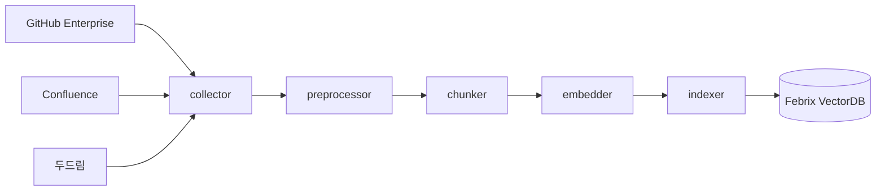
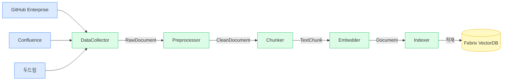
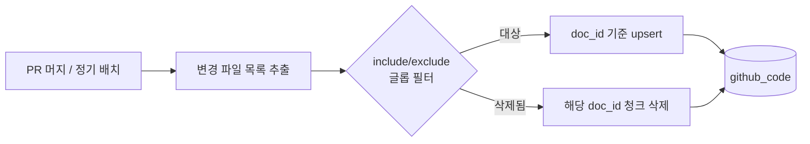
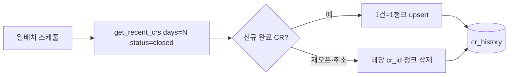

# T2-1. 데이터 수집 및 전처리 구현 가이드

> **Task**: T2-1 · **환경**: Windows 11 / Python 3.11 / Samsung SCP-VDI  
> **선행 조건**: T1-1(환경 셋업) · T1-2(커넥터 인터페이스) 완료  
> **참조**: `docs/과제정의서.md` · `docs/AI-Agent_TASK.md` · `CLAUDE.md`

---

## 1. 개요

### 1.1 목적

RAG(Retrieval-Augmented Generation) 기반 AI Agent가 사내 지식을 활용하여 CR(Change Request)을
자동 처리하려면 **검색 가능한 형태의 지식 베이스**가 먼저 구축되어야 한다.

T2-1은 3개 사내 시스템(GitHub Enterprise, Confluence, 두드림)에서 원시 데이터를 수집하고,
노이즈 제거·정규화·청킹·임베딩 과정을 거쳐 Febrix VectorDB 3개 컬렉션에 적재하는
**데이터 파이프라인** 전 구간을 구현한다.



### 1.2 데이터 소스 및 적재 대상

| 소스 | 데이터 유형 | 규모 | 인덱싱 전략 | 갱신 방식 | 컬렉션 |
|------|------------|------|-----------|-----------|--------|
| GitHub Enterprise | Python · SQL · 설정 파일 | 120여 repo · 수만 화면 | **선별** 인덱싱(활성 repo 운영 소스) | 커밋 diff 증분 | `dev_agent_github_code` |
| Confluence | 운영 문서 · 설계서 · 매뉴얼 | 수천 문서 | **하이브리드**(핵심 Space 사전 + MCP 온디맨드) | `last_modified` 비교 증분 | `dev_agent_confluence_docs` |
| 두드림 | 과거 CR 처리 이력 | 10년 약 2.6만 건 | **최근 3년 + 완료(closed)만** | 일배치 `get_recent_crs` 폴링 | `dev_agent_cr_history` |

> 청킹 전략: 코드는 AST 함수/클래스 단위, 문서는 헤딩(##) 기준 섹션, CR은 1건=1청크.
> 규모·전략의 근거는 **§1.5 운영 규모와 인덱싱 전략**, 갱신 절차는 **§9-A 소스별 갱신·동기화 프로세스** 참조.

### 1.3 처리 파이프라인 (전체 흐름)



| # | 단계 | 클래스 | 입력 | 출력 |
|---|------|--------|------|------|
| 1 | 수집 | `DataCollector` | GitHub · Confluence · 두드림 커넥터 | `RawDocument` |
| 2 | 전처리 | `Preprocessor` | `RawDocument` | `CleanDocument` |
| 3 | 청킹 | `Chunker` | `CleanDocument` | `TextChunk` |
| 4 | 임베딩 | `Embedder` | `TextChunk` | `Document` (벡터 포함) |
| 5 | 적재 | `Indexer` | `Document` | Febrix 3-컬렉션 |

### 1.4 완료 기준

- [ ] GitHub · Confluence · 두드림 3-소스 수집 파이프라인 구현
- [ ] 원시 데이터 → 정제 데이터 변환 로직 완성 (노이즈 제거, 메타데이터 정규화)
- [ ] 소스별 청킹 전략 구현 (코드: AST, 문서: 헤딩, CR: 레코드 단위)
- [ ] 임베딩 배치 처리 + TTL 캐시 구현
- [ ] Febrix 3-컬렉션 적재 구현
- [ ] Mock 기반 단위·통합 테스트 전원 통과 (`pytest tests/rag/ -v`)
- [ ] `src/rag/` GitHub push 완료

### 1.5 운영 규모와 인덱싱 전략 (현실 제약 반영)

"모든 소스를 전량 사전 인덱싱(build-once)" 가정은 운영 규모에서 성립하지 않는다.
소스별로 **전량 사전 인덱싱 가능 여부**와 **채택 전략**을 명시한다.

| 소스 | 규모 | 전량 사전 인덱싱? | 채택 전략 | 근거 |
|------|------|------------------|-----------|------|
| GitHub | 120 repo · 수만 화면 | ❌ 비현실적 | **선별 + 증분** | 임베딩 비용·시간·스토리지 폭증. 운영 소스만 가치 있음 |
| Confluence | 수천 문서 | ⚠️ 가능하나 비효율 | **하이브리드** | 전량 임베딩 고비용 + stale 위험. MCP로 실시간 보완 |
| 두드림 CR | 2.6만 건 | ✅ 수용 가능 | **최근 3년 + 완료만** | 건당 1청크라 부담 적음. 단 미완료/노이즈 제외로 품질 확보 |

**전략 요약**

- **GitHub — 선별 + 증분**: `rag.github_include`/`github_exclude` 글롭으로 활성 repo의
  운영 소스만 인덱싱(생성물·vendor·테스트 제외). 이후 변경분만 증분 갱신(§9-A).
  수만 화면 전량 임베딩은 비용 대비 효용이 낮고, 검색 노이즈만 늘린다.
- **Confluence — 하이브리드**: `rag.confluence_curated_spaces`에 지정한 핵심 가이드 Space만
  사전 인덱싱하여 빠른 의미 검색을 제공하고, 그 외 수천 문서는 **사내 Confluence MCP로
  질의 시점에 온디맨드 조회**한다. 사전 임베딩 비용을 핵심 문서로 한정하면서 커버리지는
  MCP로 확장한다. (MCP 연동 자체는 후속 — 본 단계는 전략·인터페이스 설계까지.)
- **두드림 — 최근 3년 + 완료만**: `rag.cr_history_years`(기본 3) 기간 내 `status=closed`
  CR만 적재한다. 진행 중·취소 건은 few-shot 참조 가치가 낮고 검색 노이즈가 되므로 제외한다.

---

## 2. 디렉토리 구조

```
src/rag/
├── __init__.py          ← 공개 API export
├── collector.py         ← 3-소스 수집 (RawDocument)
├── preprocessor.py      ← 노이즈 제거 + 정규화 (CleanDocument)
├── chunker.py           ← 소스별 청킹 전략 (TextChunk)
├── embedder.py          ← AI Pro 임베딩 + 캐시
├── indexer.py           ← Febrix 3-컬렉션 적재
└── pipeline.py          ← 전체 파이프라인 오케스트레이터

tests/rag/
├── __init__.py
├── test_collector.py
├── test_preprocessor.py
└── test_pipeline.py
```

---

## 3. 공통 메타데이터 스키마

모든 청크에 공통으로 부착되는 메타데이터. Febrix payload에 저장되어 검색 후 필터링에 활용된다.

```python
# 청크 메타데이터 필드 정의 (TextChunk.metadata에 저장)
{
    "source":    str,   # "github" | "confluence" | "doodream"
    "type":      str,   # "code"   | "document"   | "cr_record"
    "doc_id":    str,   # repo/파일경로, page_id, cr_id
    "title":     str,   # 파일명, 페이지 제목, CR 제목
    "url":       str,   # 원본 URL
    "date":      str,   # ISO 8601 (없으면 "")
    "language":  str,   # "python", "ko", "en", "unknown"
    "chunk_type": str,  # "code_block" | "section" | "cr_record" | "fixed_size"
    # 증분·신선도 필드 (§9-B, §9-C)
    "last_modified": str,  # 원본 최종 수정 시각 (ISO 8601) — 신선도 판정 기준
    "content_hash":  str,  # md5(text) — 변경 감지·멱등 upsert 키
    "indexed_at":    str,  # 적재 시각 (ISO 8601)
    "is_stale":      bool, # last_modified 가 stale_months 초과 시 true
    # 소스별 추가 필드
    "symbol":    str,   # (코드 청크) 함수/클래스명
    "lineno":    int,   # (코드 청크) 시작 라인
    "cr_type":   str,   # (CR 청크) new_dev | feature_change | db_change
    "status":    str,   # (CR 청크) 두드림 CR 상태 (예: closed)
    "requester": str,   # (CR 청크) 요청자
    "assignee":  str,   # (CR 청크) 담당자
}
```

> **두드림 CR 메타데이터 정합성**: `affected_systems`·`tags`·`actual_hours`·`estimated_hours`는
> 두드림이 관리하지 않는 항목이므로 CR 청크 메타데이터에 **포함하지 않는다**(§4.3 노트 참조).

### 소스별 매핑 규칙

| 필드 | GitHub (CodeFile) | Confluence (ConfluencePage) | 두드림 (CRRecord) |
|------|-------------------|-----------------------------|--------------------|
| `doc_id` | `{repo}/{path}` | `page_id` | `cr_id` |
| `title` | `path` | `title` | `title` |
| `date` | `""` (GitHub API 미제공) | `last_modified` | `created_at` |
| `language` | `language` 필드 | `"ko"` | `"ko"` |
| `last_modified` | 커밋 시각(증분 시 확보) | `last_modified` | `closed_at` 또는 `created_at` |

---

## 4. 데이터 수집 (`src/rag/collector.py`)

### 4.1 RawDocument 데이터 클래스

```python
@dataclass
class RawDocument:
    source: str          # "github" | "confluence" | "doodream"
    doc_type: str        # "code" | "document" | "cr_record"
    doc_id: str
    title: str
    content: str
    url: str
    date: str
    language: Optional[str] = None
    extra: dict = field(default_factory=dict)
```

### 4.2 DataCollector 설계 원칙

- `ConnectorFactory`를 통해 실/Mock 자동 전환 (`USE_MOCK_CONNECTORS` 환경변수)
- 각 소스 수집 메서드는 독립적으로 실패해도 빈 리스트를 반환 (파이프라인 중단 없음)
- CR 레코드는 여러 필드를 하나의 자연어 텍스트로 통합

### 4.3 전체 구현 코드

```python
# src/rag/collector.py
from __future__ import annotations
from dataclasses import dataclass, field
from typing import Dict, List, Optional

from src.connectors.factory import ConnectorFactory
from src.utils.logger import get_logger

logger = get_logger(__name__)


@dataclass
class RawDocument:
    """3-소스 수집 원시 문서 (전처리 전)"""
    source: str
    doc_type: str
    doc_id: str
    title: str
    content: str
    url: str
    date: str
    language: Optional[str] = None
    extra: dict = field(default_factory=dict)


class DataCollector:
    """GitHub · Confluence · 두드림 원시 데이터 수집"""

    def __init__(self) -> None:
        self._github = ConnectorFactory.github()
        self._confluence = ConnectorFactory.confluence()
        self._doodream = ConnectorFactory.doodream()

    # ── GitHub ───────────────────────────────────────────────────────

    def collect_github_code(self, query: str, top_k: int = 20) -> List[RawDocument]:
        """GitHub Enterprise 코드 검색 + RawDocument 변환"""
        result = self._github.search_code(query, top_k=top_k)
        if not result.success:
            logger.warning("github_collect_failed", error=result.error)
            return []

        docs = []
        for code_file in (result.data or []):
            docs.append(RawDocument(
                source="github",
                doc_type="code",
                doc_id=f"{code_file.repo}/{code_file.path}",
                title=code_file.path,
                content=code_file.content,
                url=code_file.url,
                date="",
                language=code_file.language,
                extra={
                    "repo": code_file.repo,
                    "branch": code_file.branch,
                    "sha": code_file.sha,
                },
            ))

        logger.info("github_collected", count=len(docs), query=query)
        return docs

    # ── Confluence ───────────────────────────────────────────────────

    def collect_confluence_docs(
        self, query: str, space_key: Optional[str] = None, top_k: int = 20
    ) -> List[RawDocument]:
        """Confluence 페이지 검색 + RawDocument 변환"""
        result = self._confluence.search_pages(query, space_key=space_key, top_k=top_k)
        if not result.success:
            logger.warning("confluence_collect_failed", error=result.error)
            return []

        docs = []
        for page in (result.data or []):
            docs.append(RawDocument(
                source="confluence",
                doc_type="document",
                doc_id=page.page_id,
                title=page.title,
                content=page.content,
                url=page.url,
                date=page.last_modified,
                language="ko",
                extra={"space_key": page.space_key, "labels": page.labels},
            ))

        logger.info("confluence_collected", count=len(docs), query=query)
        return docs

    # ── 두드림 ───────────────────────────────────────────────────────

    def collect_cr_history(
        self,
        query: str = "",
        cr_type: Optional[str] = None,
        top_k: int = 50,
        since_days: Optional[int] = None,
        status: Optional[str] = None,
    ) -> List[RawDocument]:
        """두드림 CR 이력 검색 + 자연어 텍스트 통합 + RawDocument 변환.

        since_days 지정 시 증분 경로(get_recent_crs)로 최근 N일 CR만 수집.
        status 지정 시 해당 상태(예: closed)로 필터링.
        두드림 실제 관리 필드만 직렬화한다(§4.3 노트 참조).
        """
        if since_days is not None:
            result = self._doodream.get_recent_crs(days=since_days, status=status)
        else:
            result = self._doodream.search_cr_history(query, cr_type=cr_type, top_k=top_k)
        if not result.success:
            logger.warning("doodream_collect_failed", error=result.error)
            return []

        docs = []
        for cr in (result.data or []):
            if status and cr.status != status:
                continue
            content = (
                f"CR ID: {cr.cr_id}\n"
                f"제목: {cr.title}\n"
                f"설명: {cr.description}\n"
                f"유형: {cr.cr_type}\n"
                f"상태: {cr.status}\n"
                f"요청자: {cr.requester}\n"
                f"담당자: {cr.assignee}"
            )
            docs.append(RawDocument(
                source="doodream",
                doc_type="cr_record",
                doc_id=cr.cr_id,
                title=cr.title,
                content=content,
                url=f"doodream://cr/{cr.cr_id}",
                date=cr.created_at,
                language="ko",
                extra={
                    "cr_type": cr.cr_type,
                    "status": cr.status,
                    "requester": cr.requester,
                    "assignee": cr.assignee,
                },
            ))

        logger.info("doodream_collected", count=len(docs), cr_type=cr_type, since_days=since_days)
        return docs

    # ── 전체 수집 ────────────────────────────────────────────────────

    def collect_all(self, query: str = "") -> Dict[str, List[RawDocument]]:
        """3-소스 일괄 수집. 소스별 독립 실행 — 일부 실패해도 계속 진행."""
        github_docs = self.collect_github_code(query)
        confluence_docs = self.collect_confluence_docs(query)
        cr_docs = self.collect_cr_history(query)

        total = len(github_docs) + len(confluence_docs) + len(cr_docs)
        logger.info(
            "collect_all_complete",
            github=len(github_docs),
            confluence=len(confluence_docs),
            doodream=len(cr_docs),
            total=total,
        )
        return {
            "github": github_docs,
            "confluence": confluence_docs,
            "doodream": cr_docs,
        }
```

> **⚠️ 두드림 스키마 정합성 (중요)**
> 초기 설계의 CR 직렬화에는 두드림이 **실제로 관리하지 않는 필드**가 포함되어 있었다.
> 두드림이 신뢰 가능하게 관리하는 필드는 다음뿐이다:
> `cr_id · title · description · cr_type · status · requester · assignee · created_at` (+ `closed_at`).
>
> | 제거된 필드 | 사유 | 대체 출처 |
> |------------|------|-----------|
> | `affected_systems` | 두드림 미관리 | Oracle 영향분석(T3-2)에서 도출 |
> | `actual_hours` / `estimated_hours` | 두드림 미관리 | 공수 산정(T3-5) 별도 실적 소스 (§15 데이터 공백 리스크) |
> | `tags` | 두드림 미관리 | 분류 스킬이 생성 |
>
> collector·CRChunker·CR 청크 메타데이터는 위 신뢰 필드만 사용한다.
> `src/connectors/base.py`의 `CRRecord`에는 호환을 위해 4개 필드가 남아 있으나 기본값이
> 비어 있고(미관리), RAG 적재 경로는 이를 직렬화하지 않는다.

---

## 5. 전처리 (`src/rag/preprocessor.py`)

### 5.1 전처리 목표

| 소스 | 처리 내용 |
|------|-----------|
| GitHub 코드 | shebang 제거, 연속 빈 줄 정규화, 바이너리 파일 필터 |
| Confluence 문서 | HTML 태그 제거, HTML 엔티티 변환, 연속 공백 정규화 |
| CR 레코드 | 연속 공백 정규화, 날짜 ISO 8601 표준화 |
| 공통 | 최소 길이(50자) 미만 문서 제거 |

### 5.2 CleanDocument 데이터 클래스

```python
@dataclass
class CleanDocument:
    source: str
    doc_type: str
    doc_id: str
    title: str
    content: str       # 정제된 텍스트
    url: str
    date: str          # ISO 8601 정규화됨
    language: str
    char_count: int = 0
    extra: dict = field(default_factory=dict)
```

### 5.3 전체 구현 코드

```python
# src/rag/preprocessor.py
from __future__ import annotations
import re
from dataclasses import dataclass, field
from typing import List, Optional

from .collector import RawDocument
from src.utils.logger import get_logger

logger = get_logger(__name__)

BINARY_EXTENSIONS = {
    ".png", ".jpg", ".jpeg", ".gif", ".bmp", ".ico", ".svg",
    ".pdf", ".zip", ".tar", ".gz", ".jar", ".class",
    ".exe", ".dll", ".so", ".pyc", ".pyo", ".bin",
}


@dataclass
class CleanDocument:
    """전처리 완료 문서"""
    source: str
    doc_type: str
    doc_id: str
    title: str
    content: str
    url: str
    date: str
    language: str
    char_count: int = 0
    extra: dict = field(default_factory=dict)


class Preprocessor:
    """소스 유형별 노이즈 제거 + 메타데이터 정규화"""

    MIN_CONTENT_LENGTH = 50

    def process(self, doc: RawDocument) -> Optional[CleanDocument]:
        """단일 문서 전처리. 필터 대상이면 None 반환."""
        if doc.doc_type == "code":
            return self._process_code(doc)
        elif doc.doc_type == "document":
            return self._process_document(doc)
        elif doc.doc_type == "cr_record":
            return self._process_cr(doc)
        return None

    def process_all(self, docs: List[RawDocument]) -> List[CleanDocument]:
        """문서 목록 전처리. 필터링된 문서는 결과에서 제외."""
        clean_docs = []
        skip_count = 0
        for doc in docs:
            result = self.process(doc)
            if result:
                clean_docs.append(result)
            else:
                skip_count += 1
        logger.info(
            "preprocess_complete",
            input=len(docs),
            output=len(clean_docs),
            skipped=skip_count,
        )
        return clean_docs

    # ── 소스별 전처리 ────────────────────────────────────────────────

    def _process_code(self, doc: RawDocument) -> Optional[CleanDocument]:
        # 바이너리 확장자 필터
        if "." in doc.doc_id:
            ext = "." + doc.doc_id.rsplit(".", 1)[-1].lower()
            if ext in BINARY_EXTENSIONS:
                return None

        content = doc.content or ""
        if not content.strip():
            return None

        # shebang, 인코딩 선언 제거 (파이썬)
        if doc.language == "python" or doc.doc_id.endswith(".py"):
            content = self._remove_shebangs(content)

        content = re.sub(r'\n{3,}', '\n\n', content).strip()

        if len(content) < self.MIN_CONTENT_LENGTH:
            return None

        return CleanDocument(
            source=doc.source,
            doc_type=doc.doc_type,
            doc_id=doc.doc_id,
            title=doc.title,
            content=content,
            url=doc.url,
            date=self._normalize_date(doc.date),
            language=doc.language or "unknown",
            char_count=len(content),
            extra=doc.extra or {},
        )

    def _process_document(self, doc: RawDocument) -> Optional[CleanDocument]:
        content = doc.content or ""

        # HTML 태그 제거
        content = re.sub(r'<[^>]+>', ' ', content)
        # HTML 엔티티 변환
        content = (
            content
            .replace('&nbsp;', ' ')
            .replace('&lt;', '<')
            .replace('&gt;', '>')
            .replace('&amp;', '&')
            .replace('&quot;', '"')
            .replace('&#39;', "'")
        )
        content = re.sub(r'[ \t]{2,}', ' ', content)
        content = re.sub(r'\n{3,}', '\n\n', content).strip()

        if len(content) < self.MIN_CONTENT_LENGTH:
            return None

        return CleanDocument(
            source=doc.source,
            doc_type=doc.doc_type,
            doc_id=doc.doc_id,
            title=doc.title,
            content=content,
            url=doc.url,
            date=self._normalize_date(doc.date),
            language=doc.language or "ko",
            char_count=len(content),
            extra=doc.extra or {},
        )

    def _process_cr(self, doc: RawDocument) -> Optional[CleanDocument]:
        content = doc.content or ""
        content = re.sub(r'[ \t]{2,}', ' ', content).strip()

        if len(content) < self.MIN_CONTENT_LENGTH:
            return None

        return CleanDocument(
            source=doc.source,
            doc_type=doc.doc_type,
            doc_id=doc.doc_id,
            title=doc.title,
            content=content,
            url=doc.url,
            date=self._normalize_date(doc.date),
            language=doc.language or "ko",
            char_count=len(content),
            extra=doc.extra or {},
        )

    # ── 공통 헬퍼 ────────────────────────────────────────────────────

    @staticmethod
    def _remove_shebangs(code: str) -> str:
        lines = code.split('\n')
        while lines and (lines[0].startswith('#!') or '# -*-' in lines[0]):
            lines.pop(0)
        return '\n'.join(lines)

    @staticmethod
    def _normalize_date(date_str: str) -> str:
        """ISO 8601 형식이면 그대로, 아니면 빈 문자열 반환."""
        if not date_str:
            return ""
        if re.match(r'\d{4}-\d{2}-\d{2}', date_str):
            return date_str
        return ""
```

---

## 6. 청킹 전략 (`src/rag/chunker.py`)

### 6.1 소스별 청킹 전략

| 소스 | 전략 | 이유 |
|------|------|------|
| Python 코드 | AST 기반 함수/클래스 단위 | 의미 단위 보존, 임베딩 품질 향상 |
| 기타 코드 | 고정 크기 (1,500자, 100자 오버랩) | 범용 fallback |
| Confluence 문서 | `##` 헤딩 기준 섹션 분할 | 논리 단위 보존 |
| CR 레코드 | 1 레코드 = 1 청크 | 비교 대상이 건 단위이므로 분할 불필요 |

### 6.2 전체 구현 코드

```python
# src/rag/chunker.py
from __future__ import annotations
import ast
import re
from dataclasses import dataclass, field
from typing import List

from langchain_core.documents import Document

from .preprocessor import CleanDocument
from src.utils.logger import get_logger

logger = get_logger(__name__)


@dataclass
class TextChunk:
    """단일 청크 — text + metadata"""
    text: str
    metadata: dict = field(default_factory=dict)

    def to_langchain_doc(self) -> Document:
        return Document(page_content=self.text, metadata=self.metadata)


# ── 소스별 청커 ──────────────────────────────────────────────────────


class CodeChunker:
    """Python 코드 → AST 함수/클래스 단위 청킹"""

    def __init__(self, max_chars: int = 1500, overlap: int = 100) -> None:
        self.max_chars = max_chars
        self.overlap = overlap

    def chunk(self, doc: CleanDocument) -> List[TextChunk]:
        meta_base = _base_meta(doc)
        code = doc.content

        if doc.language == "python" or doc.doc_id.endswith(".py"):
            chunks = self._chunk_python(code, meta_base)
            if chunks:
                return chunks

        # fallback: 고정 크기 분할
        return self._chunk_by_size(code, meta_base)

    def _chunk_python(self, code: str, meta_base: dict) -> List[TextChunk]:
        try:
            tree = ast.parse(code)
        except SyntaxError:
            return []

        lines = code.split('\n')
        chunks = []
        seen_ranges = set()

        for node in ast.walk(tree):
            if not isinstance(node, (ast.FunctionDef, ast.AsyncFunctionDef, ast.ClassDef)):
                continue
            if not hasattr(node, 'end_lineno'):
                continue

            start, end = node.lineno - 1, node.end_lineno
            key = (start, end)
            if key in seen_ranges:
                continue
            seen_ranges.add(key)

            snippet = '\n'.join(lines[start:end]).strip()
            if len(snippet) < 10:
                continue

            if len(snippet) > self.max_chars:
                for i, part in enumerate(_split_by_size(snippet, self.max_chars, self.overlap)):
                    chunks.append(TextChunk(
                        text=part,
                        metadata={**meta_base, "chunk_type": "code_block", "chunk_index": i},
                    ))
            else:
                chunks.append(TextChunk(
                    text=snippet,
                    metadata={
                        **meta_base,
                        "chunk_type": "code_block",
                        "symbol": getattr(node, 'name', ''),
                        "lineno": node.lineno,
                    },
                ))

        return chunks

    def _chunk_by_size(self, text: str, meta_base: dict) -> List[TextChunk]:
        return [
            TextChunk(
                text=part,
                metadata={**meta_base, "chunk_type": "fixed_size", "chunk_index": i},
            )
            for i, part in enumerate(_split_by_size(text, self.max_chars, self.overlap))
        ]


class DocumentChunker:
    """Confluence 문서 → 헤딩(#~###) 기준 섹션 청킹"""

    def __init__(self, max_chars: int = 1000, overlap: int = 100) -> None:
        self.max_chars = max_chars
        self.overlap = overlap

    def chunk(self, doc: CleanDocument) -> List[TextChunk]:
        meta_base = _base_meta(doc)
        sections = self._split_by_heading(doc.content)

        chunks = []
        for i, section in enumerate(sections):
            section = section.strip()
            if not section:
                continue
            if len(section) <= self.max_chars:
                chunks.append(TextChunk(
                    text=section,
                    metadata={**meta_base, "chunk_type": "section", "section_index": i},
                ))
            else:
                for j, part in enumerate(_split_by_size(section, self.max_chars, self.overlap)):
                    chunks.append(TextChunk(
                        text=part,
                        metadata={
                            **meta_base,
                            "chunk_type": "section",
                            "section_index": i,
                            "part_index": j,
                        },
                    ))

        if not chunks:
            # 헤딩 없음: 크기 기반 분할
            chunks = [
                TextChunk(
                    text=part,
                    metadata={**meta_base, "chunk_type": "fixed_size", "chunk_index": i},
                )
                for i, part in enumerate(_split_by_size(doc.content, self.max_chars, self.overlap))
            ]

        return chunks

    @staticmethod
    def _split_by_heading(text: str) -> List[str]:
        """# ~ ### 헤딩을 구분자로 분할"""
        pattern = r'(?=^#{1,3} )'
        sections = re.split(pattern, text, flags=re.MULTILINE)
        return [s for s in sections if s.strip()]


class CRChunker:
    """CR 레코드 → 1건 1청크"""

    def chunk(self, doc: CleanDocument) -> List[TextChunk]:
        meta = _base_meta(doc)
        meta["chunk_type"] = "cr_record"
        # 두드림 실제 관리 필드만 메타데이터로 승격(검색 후 필터에 활용).
        # actual_hours / affected_systems / tags 는 두드림 미관리라 사용하지 않는다.
        for key in ("cr_type", "status", "requester", "assignee"):
            if key in doc.extra:
                meta[key] = doc.extra[key]
        return [TextChunk(text=doc.content, metadata=meta)]


class Chunker:
    """소스 유형별 청킹 전략 디스패처"""

    def __init__(
        self,
        chunk_size_code: int = 1500,
        chunk_size_doc: int = 1000,
        overlap: int = 100,
    ) -> None:
        self._code = CodeChunker(max_chars=chunk_size_code, overlap=overlap)
        self._doc = DocumentChunker(max_chars=chunk_size_doc, overlap=overlap)
        self._cr = CRChunker()

    def chunk(self, doc: CleanDocument) -> List[TextChunk]:
        if doc.doc_type == "code":
            return self._code.chunk(doc)
        elif doc.doc_type == "document":
            return self._doc.chunk(doc)
        elif doc.doc_type == "cr_record":
            return self._cr.chunk(doc)
        return []

    def chunk_all(self, docs: List[CleanDocument]) -> List[TextChunk]:
        all_chunks: List[TextChunk] = []
        for doc in docs:
            all_chunks.extend(self.chunk(doc))
        logger.info("chunk_complete", input_docs=len(docs), output_chunks=len(all_chunks))
        return all_chunks


# ── 공통 헬퍼 ────────────────────────────────────────────────────────


def _base_meta(doc: CleanDocument) -> dict:
    return {
        "source": doc.source,
        "type": doc.doc_type,
        "doc_id": doc.doc_id,
        "title": doc.title,
        "url": doc.url,
        "date": doc.date,
        "language": doc.language,
    }


def _split_by_size(text: str, max_chars: int, overlap: int) -> List[str]:
    """고정 크기 분할 with overlap"""
    if len(text) <= max_chars:
        return [text]
    parts = []
    start = 0
    while start < len(text):
        end = min(start + max_chars, len(text))
        parts.append(text[start:end])
        if end == len(text):
            break
        start = end - overlap
    return parts
```

---

## 7. 임베딩 파이프라인 (`src/rag/embedder.py`)

### 7.1 설계 포인트

- **배치 처리**: `AiProEmbeddings.embed_documents(batch)` — `batch_size=32` 단위로 분할 (config 기반)
- **TTL 캐시**: 동일 텍스트의 반복 API 호출 방지. 키 = `md5(text)`, TTL = 3,600초
- **캐시 HIT/MISS 로깅**: 임베딩 효율 모니터링

### 7.2 전체 구현 코드

```python
# src/rag/embedder.py
from __future__ import annotations
import hashlib
import time
from dataclasses import dataclass
from typing import Dict, List, Optional, Tuple

from langchain_core.documents import Document

from .chunker import TextChunk
from src.llm.embedding_client import AiProEmbeddings
from src.utils.logger import get_logger

logger = get_logger(__name__)


class EmbeddingCache:
    """TTL 기반 인메모리 임베딩 캐시"""

    def __init__(self, ttl_seconds: int = 3600) -> None:
        self._store: Dict[str, Tuple[List[float], float]] = {}
        self._ttl = ttl_seconds

    def get(self, key: str) -> Optional[List[float]]:
        if key not in self._store:
            return None
        vector, ts = self._store[key]
        if time.time() - ts > self._ttl:
            del self._store[key]
            return None
        return vector

    def set(self, key: str, vector: List[float]) -> None:
        self._store[key] = (vector, time.time())

    @staticmethod
    def make_key(text: str) -> str:
        return hashlib.md5(text.encode("utf-8")).hexdigest()


class Embedder:
    """TextChunk → LangChain Document (AI Pro 임베딩 + 캐시)"""

    def __init__(self, batch_size: int = 32, ttl_seconds: int = 3600) -> None:
        self._model = AiProEmbeddings()
        self._cache = EmbeddingCache(ttl_seconds=ttl_seconds)
        self._batch_size = batch_size

    def embed_chunks(self, chunks: List[TextChunk]) -> List[Document]:
        """TextChunk 리스트를 임베딩하여 LangChain Document로 반환.

        Document.metadata['_vector']에 임베딩 벡터를 저장한다.
        Indexer에서 이 필드를 제거한 후 Febrix에 텍스트 + 메타데이터만 전달한다.
        (FebrixVectorStore.add_texts가 내부적으로 재임베딩 — 이중 임베딩 방지를 위해
         _vector는 참고용으로만 저장하며 실제 적재는 Indexer에서 텍스트 기준으로 수행)
        """
        if not chunks:
            return []

        texts = [c.text for c in chunks]
        vectors = self._embed_with_cache(texts)

        docs = []
        for chunk, vector in zip(chunks, vectors):
            meta = dict(chunk.metadata)
            meta["_vector"] = vector
            docs.append(Document(page_content=chunk.text, metadata=meta))

        logger.info("embed_complete", chunks=len(chunks))
        return docs

    def _embed_with_cache(self, texts: List[str]) -> List[List[float]]:
        keys = [EmbeddingCache.make_key(t) for t in texts]
        result_map: Dict[int, List[float]] = {}
        miss_indices: List[int] = []
        miss_texts: List[str] = []

        for i, (key, text) in enumerate(zip(keys, texts)):
            cached = self._cache.get(key)
            if cached is not None:
                result_map[i] = cached
            else:
                miss_indices.append(i)
                miss_texts.append(text)

        if miss_texts:
            all_vectors: List[List[float]] = []
            for bs in range(0, len(miss_texts), self._batch_size):
                batch = miss_texts[bs: bs + self._batch_size]
                all_vectors.extend(self._model.embed_documents(batch))

            for idx, vector, text in zip(miss_indices, all_vectors, miss_texts):
                self._cache.set(keys[idx], vector)
                result_map[idx] = vector

        logger.info(
            "embed_cache_stats",
            total=len(texts),
            cache_hits=len(texts) - len(miss_texts),
            api_calls=len(miss_texts),
        )
        return [result_map[i] for i in range(len(texts))]
```

---

## 8. 벡터 DB 적재 (`src/rag/indexer.py`)

### 8.1 소스 → 컬렉션 매핑

```
github     →  dev_agent_github_code
confluence →  dev_agent_confluence_docs
doodream   →  dev_agent_cr_history
```

### 8.2 전체 구현 코드

```python
# src/rag/indexer.py
from __future__ import annotations
from dataclasses import dataclass
from typing import Dict, List

from langchain_core.documents import Document

from src.vectordb.febrix_client import FebrixVectorStore
from src.vectordb.collections import COLLECTIONS
from src.llm.embedding_client import AiProEmbeddings
from src.utils.logger import get_logger

logger = get_logger(__name__)

SOURCE_TO_COLLECTION: Dict[str, str] = {
    "github": "github_code",
    "confluence": "confluence_docs",
    "doodream": "cr_history",
}


@dataclass
class IndexResult:
    """단일 컬렉션 적재 결과"""
    collection: str
    indexed_count: int
    success: bool
    error: str = ""


class Indexer:
    """LangChain Document → Febrix VectorStore 3-컬렉션 분류 적재"""

    def __init__(self) -> None:
        embedding = AiProEmbeddings()
        self._stores: Dict[str, FebrixVectorStore] = {
            col_key: FebrixVectorStore(
                collection_name=COLLECTIONS[col_key]["name"],
                embedding=embedding,
            )
            for col_key in SOURCE_TO_COLLECTION.values()
        }

    def ensure_collections(self) -> None:
        """3-컬렉션 존재 확인 후 없으면 자동 생성"""
        for col_key, store in self._stores.items():
            dim = COLLECTIONS[col_key]["dimension"]
            store.get_or_create_collection(dimension=dim)
            logger.info("collection_ready", collection=COLLECTIONS[col_key]["name"])

    def index_documents(self, docs: List[Document]) -> List[IndexResult]:
        """소스별 분류 후 해당 컬렉션에 적재"""
        buckets: Dict[str, List[Document]] = {k: [] for k in SOURCE_TO_COLLECTION.values()}

        for doc in docs:
            source = doc.metadata.get("source", "")
            col_key = SOURCE_TO_COLLECTION.get(source)
            if col_key:
                buckets[col_key].append(doc)
            else:
                logger.warning("unknown_source_skipped", source=source)

        results = []
        for col_key, col_docs in buckets.items():
            if not col_docs:
                continue
            results.append(self._index_to_collection(col_key, col_docs))

        total = sum(r.indexed_count for r in results if r.success)
        logger.info("index_complete", total=total, collections=len(results))
        return results

    def _index_to_collection(self, col_key: str, docs: List[Document]) -> IndexResult:
        store = self._stores[col_key]
        col_name = COLLECTIONS[col_key]["name"]
        try:
            texts = [doc.page_content for doc in docs]
            metadatas = [
                {k: v for k, v in doc.metadata.items() if k != "_vector"}
                for doc in docs
            ]
            store.add_texts(texts, metadatas=metadatas)
            logger.info("indexed", collection=col_name, count=len(docs))
            return IndexResult(collection=col_name, indexed_count=len(docs), success=True)
        except Exception as exc:
            logger.error("index_failed", collection=col_name, error=str(exc))
            return IndexResult(collection=col_name, indexed_count=0, success=False, error=str(exc))
```

---

## 9. 파이프라인 오케스트레이터 (`src/rag/pipeline.py`)

### 9.1 설계 원칙

- 각 단계(수집/전처리/청킹/임베딩/적재)는 독립 try-except로 감쌈
- 임베딩/적재 실패 시 경고 로그 후 계속 진행 (Mock 환경에서 네트워크 없이도 청킹까지 검증 가능)
- `source` 파라미터로 특정 소스만 선택적 실행 가능

### 9.2 전체 구현 코드

```python
# src/rag/pipeline.py
from __future__ import annotations
import time
from dataclasses import dataclass, field
from typing import Dict, List, Optional

from .collector import DataCollector, RawDocument
from .preprocessor import Preprocessor, CleanDocument
from .chunker import Chunker, TextChunk
from .embedder import Embedder
from .indexer import Indexer, IndexResult
from src.utils.logger import get_logger

logger = get_logger(__name__)


@dataclass
class PipelineResult:
    """파이프라인 전체 실행 결과 요약"""
    collected: Dict[str, int] = field(default_factory=dict)
    preprocessed: int = 0
    chunked: int = 0
    indexed: List[IndexResult] = field(default_factory=list)
    elapsed_sec: float = 0.0
    errors: List[str] = field(default_factory=list)


class RAGPipeline:
    """수집 → 전처리 → 청킹 → 임베딩 → 적재 전 단계 오케스트레이터"""

    def __init__(
        self,
        chunk_size_code: int = 1500,
        chunk_size_doc: int = 1000,
        overlap: int = 100,
        batch_size: int = 32,
        cache_ttl: int = 3600,
    ) -> None:
        self._collector = DataCollector()
        self._preprocessor = Preprocessor()
        self._chunker = Chunker(
            chunk_size_code=chunk_size_code,
            chunk_size_doc=chunk_size_doc,
            overlap=overlap,
        )
        self._embedder = Embedder(batch_size=batch_size, ttl_seconds=cache_ttl)
        self._indexer = Indexer()

    def run(
        self,
        query: str = "",
        source: Optional[str] = None,
    ) -> PipelineResult:
        """전체 파이프라인 실행.

        Args:
            query: 수집 검색어 (빈 문자열이면 기본 검색)
            source: "github" | "confluence" | "doodream" | None (전체)
        """
        start_t = time.monotonic()
        result = PipelineResult()
        logger.info("pipeline_start", query=query, source=source)

        # 1. 수집
        try:
            raw_map = self._collector.collect_all(query)
            if source:
                raw_map = {k: v for k, v in raw_map.items() if k == source}
            result.collected = {k: len(v) for k, v in raw_map.items()}
            raw_docs: List[RawDocument] = [doc for docs in raw_map.values() for doc in docs]
            logger.info("collect_done", counts=result.collected)
        except Exception as exc:
            result.errors.append(f"collect: {exc}")
            logger.error("collect_error", error=str(exc))
            return result

        # 2. 전처리
        try:
            clean_docs: List[CleanDocument] = self._preprocessor.process_all(raw_docs)
            result.preprocessed = len(clean_docs)
        except Exception as exc:
            result.errors.append(f"preprocess: {exc}")
            logger.error("preprocess_error", error=str(exc))
            return result

        # 3. 청킹
        try:
            chunks: List[TextChunk] = self._chunker.chunk_all(clean_docs)
            result.chunked = len(chunks)
        except Exception as exc:
            result.errors.append(f"chunk: {exc}")
            logger.error("chunk_error", error=str(exc))
            return result

        # 4. 임베딩 (네트워크 필요 — 실패 시 경고 후 계속)
        try:
            self._indexer.ensure_collections()
            lc_docs = self._embedder.embed_chunks(chunks)
        except Exception as exc:
            result.errors.append(f"embed: {exc}")
            logger.warning("embed_error_skipped", error=str(exc))
            lc_docs = [c.to_langchain_doc() for c in chunks]

        # 5. 적재
        try:
            index_results = self._indexer.index_documents(lc_docs)
            result.indexed = index_results
        except Exception as exc:
            result.errors.append(f"index: {exc}")
            logger.error("index_error", error=str(exc))

        result.elapsed_sec = time.monotonic() - start_t
        logger.info(
            "pipeline_complete",
            collected=sum(result.collected.values()),
            preprocessed=result.preprocessed,
            chunked=result.chunked,
            elapsed_sec=round(result.elapsed_sec, 2),
            errors=len(result.errors),
        )
        return result
```

> 위 `run()`은 **초기 전체 적재(initial bulk)** 경로다. 운영 단계의 **증분 갱신**은
> §9-A의 동기화 프로세스를 따르며, 증분 엔진의 완전 구현(스케줄러·webhook·삭제 전파)은
> **T2-3(벡터 인덱싱 파이프라인)** 소관이다. 본 단계는 프로세스·인터페이스 설계까지를 범위로 한다.

---

## 9-A. 소스별 갱신·동기화 프로세스

소스는 한 번 적재하고 끝나는 정적 데이터가 아니다. 코드는 CR로 수시 수정되고, 문서는 현행화되며,
CR은 계속 신규 발생한다. 소스별 갱신 절차를 정의한다. (**전진참조: T2-3**)

### 9-A.1 GitHub 코드 — 커밋 diff 증분



1. **트리거**: PR 머지 webhook(권장) 또는 정기 배치(야간).
2. **변경 추출**: `git diff --name-status` 또는 GitHub API로 변경/삭제 파일 목록 확보.
3. **필터**: `rag.github_include`/`github_exclude` 글롭으로 운영 소스만 통과(생성물·vendor·test 제외).
4. **반영**: 수정·추가 파일은 `doc_id={repo}/{path}` 기준 **upsert**, 삭제 파일은 해당 doc_id 청크 **삭제**.
5. **전량 재인덱싱 금지**: 수만 화면 전량 재처리는 비현실적 — 변경분만 처리한다.

### 9-A.2 Confluence 문서 — 하이브리드 갱신

- **사전 인덱싱분(핵심 Space)**: 큐레이션 목록을 주기적으로 스캔하여 각 페이지의
  `last_modified`가 마지막 인덱싱 시각보다 최신이면 재인덱싱(변경분만). 삭제된 페이지는 청크 삭제.
- **MCP 온디맨드분(그 외 전체)**: 사전 적재하지 않는다. 질의 시점에 MCP로 검색·본문 fetch하므로
  **항상 최신**이며 별도 동기화가 불필요하다. → stale 문제의 구조적 회피책.

### 9-A.3 두드림 CR — 일배치 폴링



- **초기 bulk**: 최근 `cr_history_years`년 + `status=closed` CR을 일괄 적재.
- **증분**: 일배치로 `collect_cr_history(since_days=1, status="closed")` 폴링 → 신규 완료 건 upsert.
- **상태 전이 처리**: 진행 중→완료(closed) 전이 시 신규 적재. 완료→재오픈/취소 시 해당 `cr_id` 청크 삭제.
- CR은 1건=1청크라 `doc_id=cr_id`로 멱등 처리가 단순하다.

---

## 9-B. 문서 신선도(Freshness)와 잘못된 가이드 방지

현행화가 지연된 문서는 **오히려 잘못된 가이드**를 제공할 위험이 있다. 4중 안전장치를 둔다.

1. **갱신일 메타데이터 필수화 + 명시**: 모든 문서 청크에 `last_modified`를 부착하고,
   검색 결과·LLM 컨텍스트에 **출처 + 갱신일**을 함께 노출한다. (LLM·사용자가 신뢰도를 판단)
2. **stale 라벨 + 가중치 감점**: `last_modified`가 `rag.stale_months`(기본 12개월)를 초과하면
   `is_stale=true`로 표시하고 검색 점수에 페널티를 적용한다(하이브리드 검색 T2-4에서 반영).
3. **LLM 프롬프트 경고 지시**: "오래된(stale) 문서는 현행과 다를 수 있으니 코드·최신 문서를 우선하라"는
   지시를 컨텍스트에 포함한다.
4. **MCP 교차확인**: 하이브리드 구조에서 답변 직전 핵심 가이드를 **MCP로 원본 최신본과 교차확인**한다.

**신뢰도 우선순위**: 실제 코드(GitHub) > 최신 문서 > stale 문서. 충돌 시 상위 소스를 따른다.

---

## 9-C. 증분 업데이트 메커니즘 (upsert / 삭제)

§9-A의 모든 경로는 **멱등 upsert**와 **삭제 전파**를 전제로 한다. 이를 위한 설계 규칙:

- **결정적 chunk ID**: `chunk_id = md5(doc_id + "#" + chunk_index)`. 같은 doc의 같은 청크는
  항상 같은 ID → 재적재 시 덮어쓰기(upsert)되어 중복이 생기지 않는다.
- **변경 감지**: 청크 메타에 `content_hash = md5(text)`를 저장. 해시가 동일하면 재임베딩·재적재를 건너뛴다(비용 절감).
- **삭제 전파**: 소스에서 사라진 doc(파일 삭제, 페이지 삭제, CR 취소)은 해당 `doc_id`의 모든 청크를 제거한다.

> **⚠️ 선결 의존성 (T2-3)**: 현재 `FebrixVectorStore.add_texts()`는 ID 미지정 시
> `uuid.uuid4()`로 **랜덤 ID**를 부여하며 **삭제 API가 없다**. 따라서 위 멱등 upsert/삭제는
> ① `add_texts(ids=...)`로 결정적 ID 전달, ② `FebrixVectorStore.delete(ids|filter)` 메서드 추가가
> **T2-3 선결 과제**다. 본 단계에서는 ID 생성 규칙과 메타데이터(`content_hash`)까지 설계·적재한다.

---

## 10. 공개 API (`src/rag/__init__.py`)

```python
# src/rag/__init__.py
from .collector import DataCollector, RawDocument
from .preprocessor import Preprocessor, CleanDocument
from .chunker import Chunker, TextChunk
from .embedder import Embedder
from .indexer import Indexer, IndexResult
from .pipeline import RAGPipeline, PipelineResult

__all__ = [
    "DataCollector", "RawDocument",
    "Preprocessor", "CleanDocument",
    "Chunker", "TextChunk",
    "Embedder",
    "Indexer", "IndexResult",
    "RAGPipeline", "PipelineResult",
]
```

---

## 11. 테스트

### 11.1 실행 명령

```bash
# 단위 테스트 (네트워크 불필요)
pytest tests/rag/test_collector.py -v
pytest tests/rag/test_preprocessor.py -v

# 통합 테스트 (임베딩/적재 mock)
USE_MOCK_CONNECTORS=true pytest tests/rag/test_pipeline.py -v

# 전체
pytest tests/rag/ -v

# 기존 커넥터 테스트와 함께
pytest -v
```

### 11.2 `tests/rag/__init__.py`

```python
# 빈 파일
```

### 11.3 `tests/rag/test_collector.py`

```python
# tests/rag/test_collector.py
import os
os.environ["USE_MOCK_CONNECTORS"] = "true"

import pytest
from src.rag.collector import DataCollector, RawDocument


def test_collect_github_returns_raw_docs():
    collector = DataCollector()
    docs = collector.collect_github_code("프로그램마스터")
    assert isinstance(docs, list)
    assert len(docs) > 0
    doc = docs[0]
    assert isinstance(doc, RawDocument)
    assert doc.source == "github"
    assert doc.doc_type == "code"
    assert doc.content


def test_collect_confluence_returns_raw_docs():
    collector = DataCollector()
    docs = collector.collect_confluence_docs("선박 관리")
    assert isinstance(docs, list)
    assert len(docs) > 0
    doc = docs[0]
    assert doc.source == "confluence"
    assert doc.doc_type == "document"
    assert doc.content


def test_collect_cr_history_returns_raw_docs():
    collector = DataCollector()
    docs = collector.collect_cr_history()
    assert isinstance(docs, list)
    assert len(docs) > 0
    doc = docs[0]
    assert doc.source == "doodream"
    assert doc.doc_type == "cr_record"
    assert "CR ID:" in doc.content


def test_collect_cr_content_has_required_fields():
    collector = DataCollector()
    docs = collector.collect_cr_history()
    content = docs[0].content
    for field_name in ["CR ID:", "제목:", "설명:", "유형:", "담당자:"]:
        assert field_name in content, f"'{field_name}' 필드 누락"


def test_collect_cr_history_filter_by_type():
    collector = DataCollector()
    docs = collector.collect_cr_history(cr_type="new_dev")
    assert all(doc.extra.get("cr_type") == "new_dev" for doc in docs)


def test_collect_all_returns_all_sources():
    collector = DataCollector()
    result = collector.collect_all("test")
    assert set(result.keys()) == {"github", "confluence", "doodream"}
    assert sum(len(v) for v in result.values()) > 0
```

### 11.4 `tests/rag/test_preprocessor.py`

```python
# tests/rag/test_preprocessor.py
import pytest
from src.rag.collector import RawDocument
from src.rag.preprocessor import Preprocessor, CleanDocument


def _code_doc(**kw) -> RawDocument:
    d = dict(
        source="github", doc_type="code",
        doc_id="src/main.py", title="main.py",
        content="def hello():\n    print('hello world')\n\n\n\n\ndef bye():\n    pass\n",
        url="http://ghe/main.py", date="2026-06-01T00:00:00", language="python",
    )
    d.update(kw)
    return RawDocument(**d)


def _doc_doc(**kw) -> RawDocument:
    d = dict(
        source="confluence", doc_type="document",
        doc_id="P-123", title="API 가이드",
        content="<h2>소개</h2><p>이 문서는 API 가이드입니다.&nbsp;참고하세요.</p>",
        url="http://confluence/P-123", date="2026-05-01", language="ko",
    )
    d.update(kw)
    return RawDocument(**d)


def _cr_doc(**kw) -> RawDocument:
    d = dict(
        source="doodream", doc_type="cr_record",
        doc_id="CR-2026-0001", title="테스트 CR",
        content="CR ID: CR-2026-0001\n제목: 테스트\n설명: 충분한 내용입니다 " * 2,
        url="doodream://cr/CR-2026-0001", date="2026-06-10T09:00:00", language="ko",
    )
    d.update(kw)
    return RawDocument(**d)


class TestPreprocessor:
    def setup_method(self):
        self.pp = Preprocessor()

    def test_process_code_returns_clean_doc(self):
        result = self.pp.process(_code_doc())
        assert result is not None
        assert isinstance(result, CleanDocument)
        assert result.source == "github"
        assert result.char_count > 0

    def test_process_code_normalizes_blank_lines(self):
        result = self.pp.process(_code_doc())
        assert "\n\n\n" not in result.content

    def test_binary_file_filtered(self):
        result = self.pp.process(_code_doc(doc_id="assets/logo.png", content="binary"))
        assert result is None

    def test_empty_content_filtered(self):
        result = self.pp.process(_code_doc(content="   \n\n  "))
        assert result is None

    def test_short_content_filtered(self):
        result = self.pp.process(_code_doc(content="hi"))
        assert result is None

    def test_process_document_removes_html_tags(self):
        result = self.pp.process(_doc_doc())
        assert result is not None
        assert "<" not in result.content
        assert ">" not in result.content

    def test_process_document_converts_entities(self):
        result = self.pp.process(_doc_doc())
        assert "&nbsp;" not in result.content

    def test_process_cr_returns_clean_doc(self):
        result = self.pp.process(_cr_doc())
        assert result is not None
        assert result.doc_id == "CR-2026-0001"
        assert result.language == "ko"

    def test_process_all_returns_all_valid(self):
        docs = [_code_doc(), _doc_doc(), _cr_doc()]
        results = self.pp.process_all(docs)
        assert len(results) == 3

    def test_process_all_skips_invalid(self):
        docs = [_code_doc(content="x"), _doc_doc(), _cr_doc()]
        results = self.pp.process_all(docs)
        assert len(results) == 2

    def test_normalize_date_iso(self):
        assert Preprocessor._normalize_date("2026-06-01T09:00:00") == "2026-06-01T09:00:00"

    def test_normalize_date_empty(self):
        assert Preprocessor._normalize_date("") == ""

    def test_normalize_date_invalid(self):
        assert Preprocessor._normalize_date("오늘") == ""
```

### 11.5 `tests/rag/test_pipeline.py`

```python
# tests/rag/test_pipeline.py
import os
os.environ["USE_MOCK_CONNECTORS"] = "true"

import pytest
from unittest.mock import patch
from src.rag.pipeline import RAGPipeline, PipelineResult
from src.rag.chunker import Chunker
from src.rag.preprocessor import CleanDocument


def _make_pipeline() -> RAGPipeline:
    return RAGPipeline()


def _noop_embed(chunks):
    from src.rag.chunker import TextChunk
    from langchain_core.documents import Document
    return [Document(page_content=c.text, metadata=c.metadata) for c in chunks]


class TestPipeline:
    def test_pipeline_collect_and_preprocess(self):
        pipeline = _make_pipeline()
        with patch.object(pipeline._embedder, 'embed_chunks', side_effect=_noop_embed), \
             patch.object(pipeline._indexer, 'ensure_collections'), \
             patch.object(pipeline._indexer, 'index_documents', return_value=[]):
            result = pipeline.run()

        assert isinstance(result, PipelineResult)
        assert sum(result.collected.values()) > 0
        assert result.preprocessed > 0

    def test_pipeline_source_filter_doodream(self):
        pipeline = _make_pipeline()
        with patch.object(pipeline._embedder, 'embed_chunks', side_effect=_noop_embed), \
             patch.object(pipeline._indexer, 'ensure_collections'), \
             patch.object(pipeline._indexer, 'index_documents', return_value=[]):
            result = pipeline.run(source="doodream")

        assert "doodream" in result.collected
        assert result.collected.get("github", 0) == 0
        assert result.collected.get("confluence", 0) == 0

    def test_pipeline_elapsed_time_recorded(self):
        pipeline = _make_pipeline()
        with patch.object(pipeline._embedder, 'embed_chunks', side_effect=_noop_embed), \
             patch.object(pipeline._indexer, 'ensure_collections'), \
             patch.object(pipeline._indexer, 'index_documents', return_value=[]):
            result = pipeline.run()

        assert result.elapsed_sec > 0


class TestChunker:
    def test_cr_one_chunk_per_record(self):
        doc = CleanDocument(
            source="doodream", doc_type="cr_record", doc_id="CR-001",
            title="테스트", content="CR ID: CR-001\n제목: 테스트\n설명: 충분한 내용입니다",
            url="doodream://cr/CR-001", date="2026-06-01", language="ko",
            extra={"cr_type": "new_dev", "actual_hours": 8.0},
        )
        chunker = Chunker()
        chunks = chunker.chunk(doc)
        assert len(chunks) == 1
        assert chunks[0].metadata["source"] == "doodream"
        assert chunks[0].metadata["cr_type"] == "new_dev"

    def test_python_code_ast_chunking(self):
        content = "def foo():\n    return 1\n\ndef bar():\n    return 2\n"
        doc = CleanDocument(
            source="github", doc_type="code", doc_id="test.py",
            title="test.py", content=content,
            url="http://ghe/test.py", date="", language="python",
        )
        chunker = Chunker()
        chunks = chunker.chunk(doc)
        assert len(chunks) >= 2

    def test_document_section_chunking(self):
        content = "## 소개\n내용입니다.\n## 설치\n설치 방법입니다.\n## 사용법\n사용법입니다."
        doc = CleanDocument(
            source="confluence", doc_type="document", doc_id="P-001",
            title="가이드", content=content,
            url="http://confluence/P-001", date="2026-01-01", language="ko",
        )
        chunker = Chunker()
        chunks = chunker.chunk(doc)
        assert len(chunks) >= 3

    def test_chunk_metadata_has_required_fields(self):
        doc = CleanDocument(
            source="doodream", doc_type="cr_record", doc_id="CR-002",
            title="CR", content="CR ID: CR-002\n제목: 테스트\n설명: 내용이 충분합니다 여기",
            url="doodream://cr/CR-002", date="", language="ko",
        )
        chunker = Chunker()
        chunks = chunker.chunk(doc)
        meta = chunks[0].metadata
        for key in ["source", "type", "doc_id", "title", "url"]:
            assert key in meta, f"'{key}' 키 누락"
```

---

## 12. `config/config.yaml` 추가 항목

기존 `rag:` 섹션 하위에 청킹 파라미터를 추가한다.

```yaml
rag:
  bm25_weight: 0.3
  dense_weight: 0.7
  reranker_top_k: 10
  final_top_k: 5
  # T2-1 신규 추가 (청킹)
  chunk_size_code: 1500      # 코드 청크 최대 문자 수
  chunk_size_doc: 1000       # 문서 청크 최대 문자 수
  chunk_overlap: 100         # 청크 오버랩 문자 수
  min_chunk_length: 50       # 최소 청크 길이 (미만 제거)
  # T2-1 신규 추가 (인덱싱 범위 — §1.5)
  cr_history_years: 3        # 두드림 CR 인덱싱 기간 (최근 N년)
  cr_history_status: closed  # 인덱싱 대상 CR 상태 (완료 건만)
  stale_months: 12           # 문서 신선도 임계 (초과 시 stale, §9-B)
  github_include:            # GitHub 선별 인덱싱 대상 (glob)
    - "src/**"
    - "**/*.sql"
  github_exclude:            # 제외 (생성물·vendor·테스트)
    - "**/test/**"
    - "**/generated/**"
    - "**/vendor/**"
  confluence_curated_spaces: []  # 사전 인덱싱 핵심 Space (그 외 MCP 온디맨드)
```

### `.env` 선택적 오버라이드 변수 (`.env.sample`에도 추가)

```bash
# RAG Pipeline 튜닝 (선택, 기본값은 config.yaml)
CHUNK_SIZE_CODE=1500
CHUNK_SIZE_DOC=1000
CHUNK_OVERLAP=100
RAG_CACHE_TTL=3600
```

---

## 13. 트러블슈팅

| 증상 | 원인 | 해결 |
|------|------|------|
| `ModuleNotFoundError: src.rag.collector` | `PYTHONPATH` 미설정 | `pytest.ini`에 `pythonpath = .` 확인 |
| `AttributeError: end_lineno` | Python 3.7 이하 AST | Python 3.8+ 사용 (`python --version` 확인) |
| Mock 커넥터에서 빈 결과 반환 | `USE_MOCK_CONNECTORS` 임포트 후 설정 | 테스트 파일 최상단 `os.environ["USE_MOCK_CONNECTORS"] = "true"` 임포트 전에 위치 |
| Febrix `verify=False` 경고 | urllib3 InsecureRequestWarning | `pytest.ini`에 `filterwarnings = ignore::urllib3.exceptions.InsecureRequestWarning` 추가 |
| `ast.parse` SyntaxError | 대상 코드가 Python이 아님 | `CodeChunker._chunk_python`에서 SyntaxError catch → fallback 고정 크기 분할 |
| `httpx.ConnectError` on embed/index | 사내망 미연결 | `USE_MOCK_CONNECTORS=true` 상태에서는 임베딩·적재 단계가 실패해도 테스트 통과 (pipeline.py Step 4 참고) |
| 청크 수 0 | min_chunk_length로 모두 필터링 | `Preprocessor.MIN_CONTENT_LENGTH` 확인, Mock 샘플 데이터 내용 확인 |
| 대용량 인덱싱 timeout / 메모리 초과 | GitHub 전량 적재 시도 | 전량 금지 — `github_include`/`exclude`로 선별, 배치 단위로 분할 적재 (§1.5, §9-A.1) |
| 동일 문서 중복 적재 | 랜덤 ID로 재적재 시 누적 | 결정적 chunk ID(`md5(doc_id#index)`) + upsert 사용 (§9-C, T2-3 선결) |
| 오래된 가이드로 잘못된 답변 | stale 문서 미표시 | `last_modified`/`is_stale` 부착 + 가중치 감점 + 코드 우선 (§9-B) |
| 증분 누락(변경분 미반영) | 동기화 트리거 미작동 | webhook/배치 로그 점검, `content_hash`로 변경 재확인 (§9-A) |
| Confluence MCP 호출 실패 | MCP 서버 장애·미연동 | 사전 인덱싱분으로 폴백, MCP 복구 후 온디맨드 재개 (§9-A.2) |

---

## 14. Task 완료 체크리스트

```
□ src/rag/collector.py       — DataCollector + RawDocument
□ src/rag/preprocessor.py    — Preprocessor + CleanDocument
□ src/rag/chunker.py         — Chunker (Code/Document/CR)
□ src/rag/embedder.py        — Embedder + EmbeddingCache
□ src/rag/indexer.py         — Indexer + IndexResult
□ src/rag/pipeline.py        — RAGPipeline + PipelineResult
□ src/rag/__init__.py        — 공개 API export

□ tests/rag/__init__.py
□ tests/rag/test_collector.py
□ tests/rag/test_preprocessor.py
□ tests/rag/test_pipeline.py

□ config/config.yaml         — 청킹 파라미터 추가
□ .env.sample                — RAG 오버라이드 변수 추가

□ pytest tests/rag/ -v       — 전체 통과
□ pytest -v                  — 기존 25개 포함 전체 통과

□ docs/work-history/T2-1_데이터수집전처리_작업이력.md 작성
□ git commit & push
```

---

## 15. 데이터 공백 리스크 (교차 작업 영향)

두드림 스키마 정합성 교정(§4.3)으로 드러난 **후속 과제 데이터 공백**을 명시한다.

| 공백 항목 | 영향 받는 과제 | 내용 | 대응(결정 보류) |
|-----------|---------------|------|-----------------|
| 실적/예상 공수 부재 | **T3-5 공수 산정**, T5-2 이력 루프 | 두드림에 `actual_hours`/`estimated_hours`가 없어 "유사 CR 실적공수 few-shot"이 두드림만으로는 불가 | 별도 실적 소스(공수관리 시스템/타임시트) 연동 또는 이력 루프에서 자체 축적 — **추가 의사결정 필요** |
| 영향 시스템 부재 | T3-2 영향도 분석 | CR에 `affected_systems`가 없어 CR 텍스트만으로 영향 범위 특정 곤란 | Oracle 딕셔너리·코드베이스 검색으로 런타임 도출(설계대로) |

> 위 항목은 본 단계 범위가 아니며, T3 진입 전 별도 의사결정·소스 확보가 필요하다.

---

*작성일: 2026-06-24 (개정: 2026-06-25 운영 현실 반영) | T2-1 데이터 수집 및 전처리 | 다음: T2-2 하이브리드 검색 (BM25 + Dense)*
