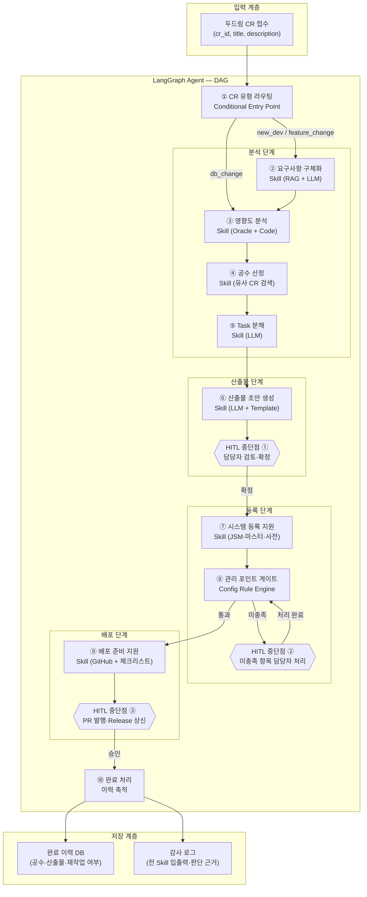
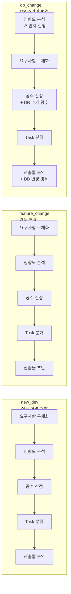
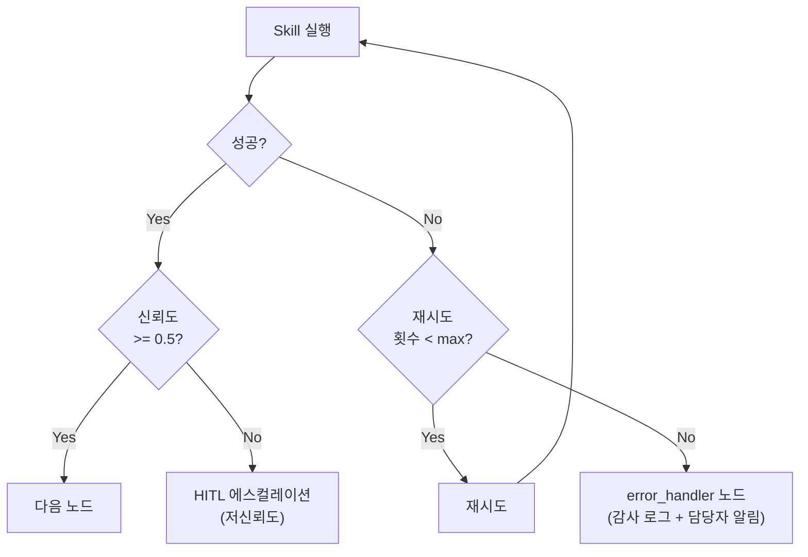

# 프로그램 개발 전주기 지원 AI Agent — 아키텍처 설계 문서

> **Task**: T1-3. LangGraph DAG 구조, State 스키마, Skill 인터페이스 정의  
> **환경**: 삼성SDS 사내망 (SCP/VDI) · AI Pro LLM · LangGraph 0.2+  
> **작성일**: 2026-06 | **버전**: v1.0 | **담당**: 중공업IT파트

---

## 1. 시스템 구성도



---

## 2. CR 유형별 처리 흐름



> **`db_change` 특이사항**: DB 스키마 변경은 영향도 분석을 요구사항 구체화보다 먼저 수행하여, 변경 영향 범위를 파악한 후 요구사항을 확정한다.

---

## 3. 오류 처리 전략



---

## 4. 핵심 산출물

### 4.1 파일 구조

```
src/
├── agent/
│   ├── state.py          # AgentState TypedDict + 하위 데이터 모델
│   ├── workflow.py       # LangGraph DAG 조립
│   ├── nodes.py          # 노드 함수 (Skill 래퍼)
│   └── router.py         # Conditional Routing 함수

├── skills/
│   ├── base.py               # BaseSkill ABC + SkillResult
│   ├── s01_requirement.py    # T3-3에서 구현
│   ├── s02_impact.py         # T3-4에서 구현
│   ├── s03_estimation.py     # T3-5에서 구현
│   ├── s04_task_breakdown.py # T3-6에서 구현
│   ├── s05_artifact.py       # T3-7에서 구현
│   ├── s06_registration.py   # T3-8에서 구현
│   ├── s07_gate.py           # GateEngine 호출 (T1-3 완성)
│   └── s08_deploy.py         # T3-10에서 구현

├── gate/
│   ├── engine.py         # Config 기반 Rule Engine
│   └── loader.py         # gate_rules.yaml 로더·캐시

└── utils/
    ├── error_handler.py  # 오류 처리·에스컬레이션
    └── metrics.py        # 완료 이력 기록

config/
└── gate_rules.yaml       # 게이트 완료 조건 15개 정의

tests/
└── agent/
    ├── test_workflow.py  # DAG 구조·Routing·HITL·BaseSkill 검증
    ├── test_state.py     # State 스키마 검증
    └── test_gate.py      # 게이트 엔진 검증
```

### 4.2 AgentState 필드 목록

| 필드 | 타입 | 설명 |
|------|------|------|
| `messages` | `List[BaseMessage]` | LangGraph 메시지 이력 (add_messages reducer) |
| `cr_id` | `str` | CR 고유 식별자 (불변) |
| `cr_type` | `CRType` | CR 유형 (불변) |
| `cr_info` | `Optional[CRInfo]` | 두드림 CR 원본 정보 (불변) |
| `current_step` | `StepName` | 현재 처리 단계 |
| `completed_steps` | `List[StepName]` | 완료된 단계 목록 |
| `step_count` | `int` | 무한루프 방지 카운터 |
| `hitl_status` | `HITLStatus` | HITL 중단점 상태 |
| `hitl_point` | `Optional[str]` | 현재 HITL 중단점 이름 |
| `hitl_feedback` | `Optional[str]` | 담당자 피드백 |
| `requirement_result` | `Optional[RequirementResult]` | 요구사항 구체화 결과 |
| `impact_result` | `Optional[ImpactAnalysisResult]` | 영향도 분석 결과 |
| `estimation_result` | `Optional[EstimationResult]` | 공수 산정 결과 |
| `task_breakdown_result` | `Optional[TaskBreakdownResult]` | Task 분해 결과 |
| `artifact_result` | `Optional[ArtifactResult]` | 산출물 초안 결과 |
| `registration_result` | `Optional[RegistrationResult]` | 시스템 등록 초안 결과 |
| `gate_result` | `Optional[GateResult]` | 게이트 판별 결과 |
| `deploy_result` | `Optional[DeployResult]` | 배포 준비 결과 |
| `gate_attempts` | `int` | 게이트 재시도 횟수 |
| `gate_history` | `List[GateResult]` | 게이트 이력 |
| `error_step` | `Optional[StepName]` | 오류 발생 단계 |
| `error_message` | `Optional[str]` | 오류 메시지 |
| `retry_count` | `int` | Skill 재시도 횟수 |
| `execution_logs` | `List[SkillExecutionLog]` | Skill 감사 로그 |
| `artifacts` | `Dict[str, Any]` | 최종 산출물 레지스트리 |

---

## 5. 설계 원칙

1. **State 중심 설계**: Skill 간 데이터 전달은 반드시 `AgentState`를 통해서만 이루어짐. Skill끼리 직접 참조 금지
2. **Skill = 순수 함수**: `(AgentState) → AgentState`. 부작용(외부 시스템 쓰기)은 HITL 승인 후에만 허용
3. **게이트 = Config Rule**: 게이트 판별은 LLM에 위임하지 않고 `gate_rules.yaml`의 확정적 조건으로 처리
4. **HITL 명시적 중단**: 담당자 확인이 필요한 지점에서 LangGraph `interrupt()`를 호출하여 흐름을 중단
5. **오류 격리**: 개별 Skill 실패가 전체 Agent 중단으로 이어지지 않도록 Retry + Fallback 패턴 적용

---

## 6. 완료 기준 (T1-3 DoD)

- [x] `AgentState` TypedDict 전체 스키마 확정 및 코드 작성 완료
- [x] `BaseSkill` ABC 및 `SkillResult` 데이터 모델 정의 완료
- [x] LangGraph DAG 전체 노드·엣지 구현 완료 (13개 노드)
- [x] CR 유형 3가지(`new_dev` / `feature_change` / `db_change`) Conditional Routing 동작 확인
- [x] 게이트 노드 Config 기반 판별 로직 구현 완료 (15개 규칙)
- [x] HITL `interrupt()` 지점 3개 이상 구현 (`hitl_artifact`, `hitl_gate`, `hitl_deploy`)
- [x] 아키텍처 단위 테스트 (`tests/agent/test_workflow.py`, `test_state.py`, `test_gate.py`)
- [x] `docs/architecture.md` 문서 작성

---

*참고: [T1-1_환경셋업_가이드.md](./T1-1_환경셋업_가이드.md) · [T1-2_시스템연동인터페이스_가이드.md](./T1-2_시스템연동인터페이스_가이드.md) · [T1-3_GUIDE.md](./T1-3_GUIDE.md)*
